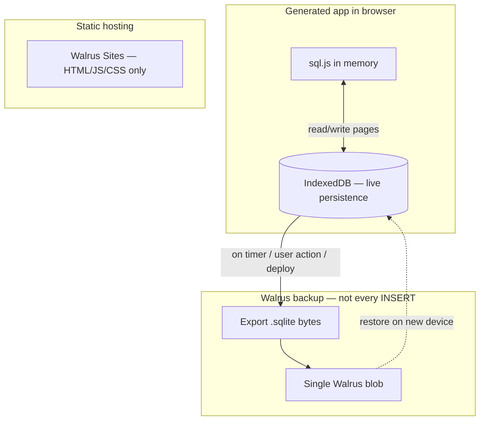

# App builder platform — master TODO

Single roadmap for everything discussed: **Next.js artifacts**, **platform APIs**, **Inngest deploy queue**, **Walrus Sites hosting**, **Phase 5 explorer**, and **Option B app storage** (browser SQLite + IndexedDB + Walrus blob snapshots).

**Companion docs**

- [app-builder-deploy-TODO.md](./app-builder-deploy-TODO.md) — E2B, deploy pipeline, Phase 3–7 detail
- [walrus-local-setup.md](./walrus-local-setup.md) — testnet CLI, portal, `WALRUS_DEPLOY_MOCK=false`
- [backend/.agents/skills/walrus-sites/](../backend/.agents/skills/walrus-sites/) — publish + testnet portal
- [backend/.agents/skills/inngest-radiant/](../backend/.agents/skills/inngest-radiant/SKILL.md) — deploy job queue
- [Walrus getting started](https://docs.wal.app/docs/getting-started) — blobs vs sites

**North star:** User builds a swap/app in chat → preview works → deploy static UI to Walrus Sites → app data lives in the browser (SQLite) with **IndexedDB** persistence → **periodic snapshots** of the whole `.sqlite` file uploaded to Walrus as **one blob** (not per-row).

---

## Architecture (target)

```text
┌─────────────────────────────────────────────────────────────────┐
│ Radiant product (Next.js client + Express backend + Postgres)   │
│  • Chat, artifacts, projects, agent tools                       │
│  • Platform APIs: swap quote, pool info, (future) db snapshot   │
│  • Postgres: users, projects, artifact files, deploy jobs       │
└────────────────────────────┬────────────────────────────────────┘
                             │
         ┌───────────────────┼───────────────────┐
         ▼                   ▼                   ▼
   Artifact preview     Deploy pipeline      Snapshot API
   (iframe Babel)      (Inngest/BullMQ)     (optional proxy)
         │                   │                   │
         ▼                   ▼                   ▼
   sql.js + IndexedDB   E2B Next build      walrus store
   (live app data)      → static out/       (one .sqlite blob)
                             │
                             ▼
                      Walrus Sites
                      (site-builder → *.walrus.site)
```



---

## Option B storage — how it works (your chosen path)

### Live layer (browser)

| Piece | Role |
| ----- | ---- |
| **sql.js** | SQLite engine in WASM — `INSERT` / `SELECT` / `UPDATE` without downloading Walrus |
| **IndexedDB** | Persists the `.sqlite` **file bytes** (or sql.js export) locally in the browser |
| **When writes happen** | Every transaction (or debounced flush) → **IndexedDB only** — fast, no network |

### Walrus layer (snapshot backup)

| Piece | Role |
| ----- | ---- |
| **One blob** | Whole `project-{id}.sqlite` file uploaded via `walrus store` (or Radiant proxy) |
| **When snapshots happen** | **Not on every row write.** Triggers below. |
| **Restore** | Download blob → load bytes into sql.js → repopulate IndexedDB |

### Planned snapshot triggers

| Trigger | Purpose |
| ------- | ------- |
| **Interval** (e.g. every 5–15 min while app is open) | Background durability |
| **Debounced idle** (e.g. 30s after last write) | Avoid spamming Walrus |
| **User action** (“Save to Walrus” / “Backup”) | Explicit control |
| **Before deploy** | Ship DB state alongside site publish metadata |
| **`visibilitychange` / `pagehide`** | Best-effort flush when user leaves tab |
| **Optional: on deploy success** | Link `walrus_blob_id` on `Project` row in Postgres |

**Important:** Each snapshot is still a **full blob upload** (read-modify-write of the whole file at the Walrus API level). The win is you do that **occasionally**, while **IndexedDB + sql.js** handle thousands of small writes locally.

### Deployed Walrus Site vs Radiant preview

| Context | sql.js + IndexedDB | Walrus snapshot |
| ------- | ------------------ | --------------- |
| **Artifact preview** (Radiant origin) | ✅ Same origin, easy | ✅ Via Radiant API + backend wallet |
| **Deployed `*.walrus.site`** | ✅ Static JS can run sql.js | ⚠️ Needs **Radiant snapshot API** (browser cannot hold publisher keys) or user wallet flow |

**Open design (TODO):** `POST /api/v1/projects/:id/db/snapshot` accepts authenticated export bytes → backend runs `walrus store` → saves `walrus_blob_id` on project.

---

## Status summary

| Area | Status | Notes |
| ---- | ------ | ----- |
| Next.js `generate_app` + `ensureAppEntry` | ✅ Done | `app/page.tsx`, `components/`, `lib/radiant-client.ts` |
| Artifact preview (multi-file, API bridge) | ✅ Done | Not real Next dev server — Babel iframe |
| Preview module resolution (`app/` paths) | ✅ Done | Fixed `../components/` from `app/page.tsx` |
| `generate_app` validation + streaming UX | ✅ Done | Normalize input, `ensureAppEntry` on stream preview |
| Project platform APIs (swap quote, pool info) | ✅ Done | DeepBook on Radiant backend |
| Inngest deploy queue | ✅ Done | BullMQ fallback; `INNGEST_DEV=1` in `.env` |
| E2B Next scaffold + `out/` export | ✅ Done | Rebuild template: `npm run e2b:template:build` |
| Walrus Sites deploy (Phase 3 code) | 🟡 Partial | Client UI + docs; set `WALRUS_DEPLOY_MOCK=false` for real URLs |
| Real Walrus testnet/mainnet QA | ❌ TODO | Manual checklist in `docs/walrus-local-setup.md` |
| Deploy progress UI / Projects page | ✅ Done | Deploy tab polls API; Projects lists `walrus_url` |
| Option B sql.js + IndexedDB | ❌ TODO | New workstream |
| Walrus `.sqlite` snapshot API | ❌ TODO | Depends on Option B |
| Phase 5 Move + AppRegistry + Explorer | ❌ TODO | After Phase 3 stable |
| Per-project Postgres API (Option A) | ⏸️ Deferred | You chose Option B |

---

## Workstream 1 — Finish chat / artifact builder

| Status | Task | Owner |
| ------ | ---- | ----- |
| [x] | Next.js artifact paths + preview entry | Backend + Client |
| [x] | `lib/radiant-client.ts` template + preview API proxy | Backend + Client |
| [x] | `generate_app` arg normalization + higher token limit | Backend |
| [x] | Streaming artifact state fixes (editing stuck) | Client |
| [x] | Agent prompts: always `files[]` array + `app/page.tsx` | Backend |
| [x] | Deploy tab: real progress from `GET /api/v1/deploy/:id` | Client |
| [x] | Projects page: list projects + `walrus_url` | Client |

---

## Workstream 2 — Walrus Sites hosting (Phase 3)

Use skill: `backend/.agents/skills/walrus-sites/publishing/` and `portal/` for testnet.

| Status | Task | Detail |
| ------ | ---- | ------ |
| [x] | `deployWalrusSite()` + pipeline integration | `sites.client.ts` |
| [x] | Fixed template deploy (no E2B) | `none` provider |
| [x] | Custom template → E2B → `out/` → Walrus | Phase 4 path |
| [x] | **Local Walrus setup** | `docs/walrus-local-setup.md`, `npm run walrus:check` |
| [x] | Set `WALRUS_DEPLOY_MOCK=false` | `.env.example` + `WALRUS_SITES_CONFIG_PATH`, `WALRUS_CONFIG_PATH` |
| [x] | Raise default epochs | Default **30** in `walrus.ts` (was 5) |
| [x] | `ws-resources.json` SPA fallback | `ws-resources.ts` → `"/*": "/index.html"` |
| [x] | Testnet local portal | Documented in `docs/walrus-local-setup.md` + portal skill |
| [ ] | Manual QA: deploy → URL opens | Checklist in `docs/walrus-local-setup.md` §9 |
| [x] | Cursor rule: load `walrus-sites` skill on deploy/walrus files | `.cursor/rules/walrus-sites.mdc` |

---

## Workstream 3 — Inngest (deploy orchestration)

| Status | Task | Detail |
| ------ | ---- | ------ |
| [x] | Inngest SDK + `deploy-app-pipeline` function | `backend/src/inngest/` |
| [x] | Express `/api/inngest` serve | `app.ts` |
| [x] | Queue selection: Inngest vs BullMQ | `DEPLOY_QUEUE_PROVIDER=auto` |
| [x] | Agent skills + `.cursorrules` | inngest-skills vendored |
| [ ] | Document: daily dev = `npm run dev` only; Inngest dev server only when testing deploy | README |
| [ ] | Optional: `npm run dev:all` (concurrently API + inngest-cli) | DX |

---

## Workstream 4 — Option B: browser SQLite + IndexedDB + Walrus snapshots

### 4.1 Client library (generated apps)

| Status | Task | Detail |
| ------ | ---- | ------ |
| [ ] | Add `sql.js` (WASM) to artifact preview allowlist | CDN or bundled in preview iframe |
| [ ] | `lib/radiant-db.ts` template | init schema, `exec`, `query`, export bytes |
| [ ] | IndexedDB adapter | Store `{ projectId, sqliteBytes, updatedAt }` |
| [ ] | Debounced persist IDB after SQL mutations | e.g. 500ms debounce |
| [ ] | Snapshot scheduler | interval + idle + `visibilitychange` |
| [ ] | `lib/radiant-client.ts`: `snapshotDb()`, `restoreDb()` | Calls Radiant API |
| [ ] | Agent prompts: use `radiant-db` for todos/forms/counters | Not raw Walrus |

### 4.2 Radiant backend (snapshot proxy)

| Status | Task | Detail |
| ------ | ---- | ------ |
| [ ] | Prisma: `project.walrus_db_blob_id`, `walrus_db_object_id`, `db_snapshot_at` | Optional columns |
| [ ] | `POST /api/v1/projects/:id/db/snapshot` | Auth + size limit + `walrus store` |
| [ ] | `GET /api/v1/projects/:id/db/snapshot` | Return blob id or presigned read path |
| [ ] | Rate limit snapshots (e.g. 1/min per project) | Protect WAL spend |
| [ ] | Integration test with mock Walrus blob client | No mainnet in CI |

### 4.3 Restore flow

| Status | Task | Detail |
| ------ | ---- | ------ |
| [ ] | On app load: try IndexedDB first | Fast path |
| [ ] | If empty + `walrus_db_blob_id`: fetch blob → import sql.js | New browser / cleared storage |
| [ ] | UI: “Restored from Walrus backup” / conflict if IDB newer | UX |

### 4.4 Deployed static app on Walrus Sites

| Status | Task | Detail |
| ------ | ---- | ------ |
| [ ] | Embed `projectId` + Radiant API base in build config | Same as preview bridge |
| [ ] | CORS: allow `*.walrus.site` or portal origins for snapshot API | Security review |
| [ ] | Document: deployed app data stays in **user browser** unless snapshotted | Privacy note |

---

## Workstream 5 — Phase 5 (Move + Explorer)

| Status | Task | Owner |
| ------ | ---- | ----- |
| [ ] | Move templates `packages/move/templates/` | Move |
| [ ] | Publish Move packages via agent wallet | Backend |
| [ ] | `register_app` tool + on-chain tx | Backend |
| [ ] | `GET /api/v1/apps` public explorer | Backend |
| [ ] | Explorer UI (replace mocks) | Client |
| [ ] | “Launch to explorer” on project page | Client |

Walrus hosts the UI; Phase 5 adds **discovery/registry** — separate from Option B DB snapshots.

---

## Workstream 6 — Agent skills & rules

| Status | Skill / rule | Path |
| ------ | ------------ | ---- |
| [x] | Inngest | `backend/.agents/skills/inngest/` + `inngest-radiant/` |
| [x] | Walrus Sites | `backend/.agents/skills/walrus-sites/` |
| [x] | `.cursorrules` | Repo root |
| [ ] | Cursor rule: Walrus Sites | `.cursor/rules/walrus-sites.mdc` |
| [ ] | Cursor rule: project DB / Option B | `.cursor/rules/project-db.mdc` (after 4.1 starts) |
| [ ] | `radiant-db` section in agent system prompt | `prompts.ts` |

---

## Environment checklist

### Already in `.env.example`

- `INNGEST_*`, `DEPLOY_QUEUE_PROVIDER`
- `WALRUS_*`, `WALRUS_DEPLOY_MOCK`

### Add when implementing Option B + real Walrus

```env
# Real Walrus Sites deploy
WALRUS_DEPLOY_MOCK=false
WALRUS_SITES_CONFIG_PATH=~/.config/walrus/sites-config.yaml
WALRUS_CONFIG_PATH=~/.config/walrus/client_config.yaml
WALRUS_SITE_EPOCHS=30

# Option B snapshots (future)
PROJECT_DB_SNAPSHOT_MAX_BYTES=5242880
PROJECT_DB_SNAPSHOT_MIN_INTERVAL_SEC=60
```

---

## Testing matrix

| Test | Type | Real Walrus? |
| ---- | ---- | ------------ |
| sql.js init + IDB roundtrip | unit (client) | No |
| Snapshot debounce fires once | unit | No |
| `POST .../db/snapshot` auth + size limit | integration | Mock |
| Full: write locally → snapshot → restore in new IDB | e2e manual | Testnet optional |
| Deploy site + snapshot before deploy | integration | Mock / testnet |
| Phase 3 real `site-builder` | manual QA | **Yes (testnet)** |

---

## Recommended build order

1. **Phase 3 real Walrus** — real deploy links (unblocks “publish app” story)
2. **Deploy UI + Projects page** — user-visible progress
3. **Option B 4.1** — sql.js + IndexedDB in preview only
4. **Option B 4.2** — snapshot API + periodic backup to Walrus blob
5. **Option B 4.3–4.4** — restore + deployed-site CORS
6. **Phase 5** — explorer/registry

---

## FAQ (from discussion)

**Do I run Inngest dev server every day?**  
No. Only `npm run dev` for normal work. Run `npm run inngest:dev` when testing Inngest deploy jobs. Set `INNGEST_DEV=1` in `.env` once.

**Is Walrus my SQL database?**  
No. Walrus holds **whole blobs** (including a `.sqlite` **file snapshot**). Live queries run in **sql.js + IndexedDB** in the browser.

**Will IndexedDB randomly snapshot to Walrus?**  
Not random — **scheduled + debounced + explicit triggers** (see table above). Each snapshot uploads the **entire** sqlite file as one object; local writes stay in IndexedDB between snapshots.

**Can I avoid fetching the whole blob on every INSERT?**  
Yes — that’s the point of Option B. **INSERT/SELECT** hit IndexedDB/sql.js locally; Walrus only sees periodic **full-file** backups.

---

Tracked alongside [app-builder-deploy-TODO.md](./app-builder-deploy-TODO.md) and [backend/docs/TODO.md](../backend/docs/TODO.md).
