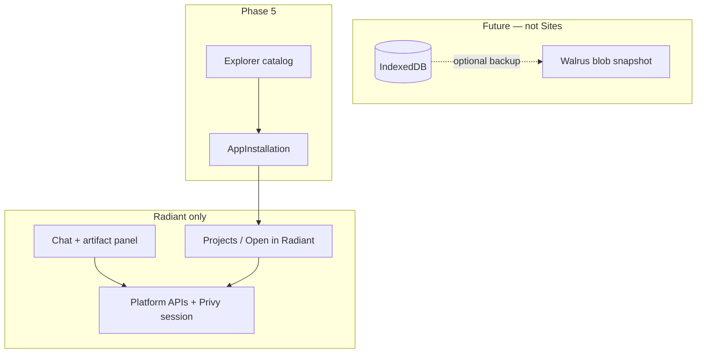

# App builder platform — master TODO

Single roadmap for **Next.js artifacts**, **Radiant-only app runtime**, **platform APIs**, **optional build verification (E2B)**, **Phase 5 explorer + install**, and **Option B app storage** (browser SQLite + IndexedDB — optional Walrus **blob** snapshots later, not Sites hosting).

**Companion docs**

- [app-builder-deploy-TODO.md](./app-builder-deploy-TODO.md) — E2B, build-verify pipeline, client artifact panel
- [backend/.agents/skills/inngest-radiant/](../backend/.agents/skills/inngest-radiant/SKILL.md) — deploy job queue (build verify only)
- Walrus Sites skill/docs — **not used for app builder**; kept in repo for possible future blob backup work only

**North star:** User builds an app in chat → preview works inside Radiant → project saves to Postgres → user opens it from **Projects** or chat (**no external URL**) → optional later: **install from explorer** for other Radiant users/agents → optional later: IndexedDB + periodic blob backup.

---

## Decision log (2026-06)

| Decision | Rationale |
| -------- | --------- |
| **Remove Walrus Sites from app builder** | Personal apps should run only inside Radiant (auth, agent wallet, platform APIs). Public `*.walrus.site` links fight that model. |
| **`generate_app` → `status: live`** | Saving the artifact is enough to “ship” for personal use. No deploy step required. |
| **Deploy tab removed from UI** | Preview + Projects **Open** are the product surface. |
| **Explorer “Use app” → install in Radiant** | Marketplace apps are referenced installs, not Walrus URLs (Phase 5). |
| **Walrus blob snapshots (Option B)** | Still optional **future** work for `.sqlite` backup — separate from Sites hosting. |

---

## Architecture (current + target)

```text
┌─────────────────────────────────────────────────────────────────┐
│ Radiant (Next.js client + Express backend + Postgres)           │
│  • Chat + artifact panel (preview iframe, code tab)             │
│  • Projects: list + /app/projects/:id/run (full-screen player)  │
│  • Platform APIs: swap quote, pool info (project-scoped)        │
│  • Postgres: users, projects, artifact_files                    │
└────────────────────────────┬────────────────────────────────────┘
                             │
         ┌───────────────────┼───────────────────┐
         ▼                   ▼                   ▼
   Artifact preview     Optional build job    Explorer (Phase 5)
   (Babel iframe)       (E2B verify only)     install + run in Radiant
         │                   │
         ▼                   ▼
   sql.js + IndexedDB   Next static build
   (Option B — TODO)    (no Walrus upload)
```



---

## What “live” means now

| Term | Meaning |
| ---- | ------- |
| **`live` project status** | Artifact saved and runnable in Radiant (preview or `/run`). |
| **Not live** | Draft / failed build verify — still editable in chat. |
| **`walrus_url` column** | Legacy — **not set** by app builder; may be removed in a later migration. |

---

## Status summary

| Area | Status | Notes |
| ---- | ------ | ----- |
| Next.js `generate_app` + `ensureAppEntry` | ✅ Done | `app/page.tsx`, Tailwind in globals, `lib/radiant-client.ts` |
| Artifact preview (multi-file, API bridge) | ✅ Done | Babel iframe — not Next dev server |
| `generate_app` → `status: live` | ✅ Done | No Walrus deploy required |
| Project platform APIs (swap quote, pool info) | ✅ Done | DeepBook on Radiant backend |
| Projects page + **Open in Radiant** | ✅ Done | `/app/projects/:id/run` |
| Artifact panel Preview + Code only | ✅ Done | Deploy tab removed |
| Walrus Sites deploy (app builder) | ❌ **Removed** | Pipeline no longer uploads; UI removed |
| Optional E2B build verify (`deploy_app`) | 🟡 Backend only | Agent tool for sandbox build check — not user-facing deploy |
| Option B sql.js + IndexedDB | ❌ TODO | New workstream |
| Walrus `.sqlite` blob snapshot API | ❌ TODO | Optional; **not** Sites hosting |
| Phase 5: `GET /api/v1/apps` + **install** | ❌ TODO | Replace explorer mocks |
| Per-project Postgres API (Option A) | ⏸️ Deferred | Chose Option B for app data |

---

## Workstream 1 — Chat / artifact builder

| Status | Task | Owner |
| ------ | ---- | ----- |
| [x] | Next.js artifact paths + preview entry | Backend + Client |
| [x] | `lib/radiant-client.ts` + preview API proxy | Backend + Client |
| [x] | `generate_app` normalization + streaming UX | Backend + Client |
| [x] | Agent prompts: `files[]` + `app/page.tsx` + Radiant-only runtime | Backend |
| [x] | Tailwind in E2B scaffold + `ensureAppEntry` globals | Backend |
| [x] | Remove Deploy tab / Walrus URL UI | Client |
| [x] | Projects page: Open + Details (no Walrus links) | Client |
| [x] | Full-screen runner `/app/projects/:id/run` | Client |
| [ ] | Link from chat session → project when artifact reopens | Client polish |

---

## Workstream 2 — ~~Walrus Sites hosting~~ (removed from app builder)

**Status: cancelled for app builder.** Code under `backend/src/services/walrus/` remains for possible Option B blob work but is **not** called from the deploy pipeline or product UI.

| Was | Now |
| --- | --- |
| Deploy → `*.walrus.site` | Open in Radiant |
| Deploy tab + portal setup | Removed |
| `WALRUS_DEPLOY_MOCK` QA | Not required for app builder |

Do **not** prioritize `docs/walrus-local-setup.md` or site-builder for personal apps.

---

## Workstream 3 — Build verify queue (optional)

Inngest/BullMQ job runs E2B **build only** when agent calls `deploy_app` — marks project `live` on success. **No Walrus step.**

| Status | Task | Detail |
| ------ | ---- | ------ |
| [x] | Pipeline: sandbox → build → mark live | `pipeline.ts` |
| [x] | Inngest + BullMQ worker | `backend/src/inngest/`, `worker:deploy` |
| [ ] | Hide or remove `POST /api/v1/deploy` from product docs | API may stay for agent tool |
| [ ] | Document: normal users never need deploy — `generate_app` is enough | README / prompts |

---

## Workstream 4 — Option B: browser SQLite + IndexedDB (+ optional blob backup)

Live app data stays in the **browser**. Walrus (if used) is **one blob snapshot** of the whole `.sqlite` file — **not** per-row and **not** Sites hosting.

### Live layer (browser)

| Piece | Role |
| ----- | ---- |
| **sql.js** | SQLite in WASM — local reads/writes |
| **IndexedDB** | Persists `.sqlite` bytes between sessions |
| **Radiant preview / runner** | Same origin — easy API + IDB access |

### Optional blob backup (future)

| Piece | Role |
| ----- | ---- |
| **`POST .../db/snapshot`** | Authenticated export → backend `walrus store` → `walrus_db_blob_id` |
| **Triggers** | Interval, idle debounce, user “Backup”, `pagehide` — not every INSERT |

### 4.1 Client library

| Status | Task |
| ------ | ---- |
| [ ] | `sql.js` in preview allowlist |
| [ ] | `lib/radiant-db.ts` + IndexedDB adapter |
| [ ] | `snapshotDb()` / `restoreDb()` via Radiant API |
| [ ] | Agent prompts: use `radiant-db` for forms/todos |

### 4.2 Backend snapshot proxy

| Status | Task |
| ------ | ---- |
| [ ] | Prisma: `walrus_db_blob_id`, `db_snapshot_at` |
| [ ] | `POST/GET .../db/snapshot` + rate limits |
| [ ] | Mock Walrus blob client in CI |

---

## Workstream 5 — Explorer + install (Phase 5)

Public discovery **inside Radiant** — not Walrus URLs.

| Status | Task | Detail |
| ------ | ---- | ------ |
| [ ] | `POST .../projects/:id/publish` | Sets `is_public`, `fee_bps`, `category` |
| [ ] | `GET /api/v1/apps` | Public catalog (`is_public=true`) |
| [ ] | `AppInstallation` model | User B installs → reference to source project |
| [ ] | `POST /api/v1/apps/:id/install` | Creates installation for authenticated user |
| [ ] | Installation-scoped platform APIs | Caller wallet + creator fee |
| [ ] | Explorer UI wired to real API | Replace `explorer-data.ts` mocks |
| [ ] | “Use this agent” → install + open in Radiant | Not external link |
| [ ] | Agent tools: `install_app`, `call_app_action` | See [agent-app-actions-TODO.md](./agent-app-actions-TODO.md) Phase 7 |
| [ ] | Move + on-chain registry (optional) | `package_id`, `registry_object_id` |

---

## Workstream 6 — Agent skills & rules

| Status | Skill / rule | Notes |
| ------ | ------------ | ----- |
| [x] | Inngest | `inngest-radiant/` |
| [x] | `.cursorrules` | Repo root |
| [ ] | Deprecate walrus-sites rule for app builder paths | Keep for blob work only |
| [ ] | Cursor rule: project DB / Option B | After 4.1 starts |
| [ ] | `radiant-db` in system prompt | `prompts.ts` |

---

## Recommended build order

1. ✅ **Radiant-only runtime** — generate → live, Projects Open, runner page (done)
2. **Phase 5 catalog + install** — explorer real data, `AppInstallation`, open in Radiant
3. **Option B 4.1** — sql.js + IndexedDB in preview/runner
4. **Option B 4.2** — optional blob snapshot API (not Sites)
5. **Move + on-chain registry** — fees, reputation (optional)

---

## FAQ

**Where do I open my app?**  
Chat artifact **Preview**, or **Projects → Open** (`/app/projects/:id/run`).

**Do I need Walrus CLI / portal for app builder?**  
No. That path was removed.

**What about the explorer mock Walrus URLs?**  
Placeholder only — Phase 5 replaces with install + run inside Radiant.

**Is Walrus my SQL database?**  
No. If Option B ships, Walrus holds occasional **full-file backups**; live queries use sql.js + IndexedDB locally.

**Do I run Inngest every day?**  
No — only when testing optional `deploy_app` build verification. Normal dev: `npm run dev` only.

---

Tracked alongside [app-builder-deploy-TODO.md](./app-builder-deploy-TODO.md), [agent-app-actions-TODO.md](./agent-app-actions-TODO.md), and [backend/docs/TODO.md](../backend/docs/TODO.md).
