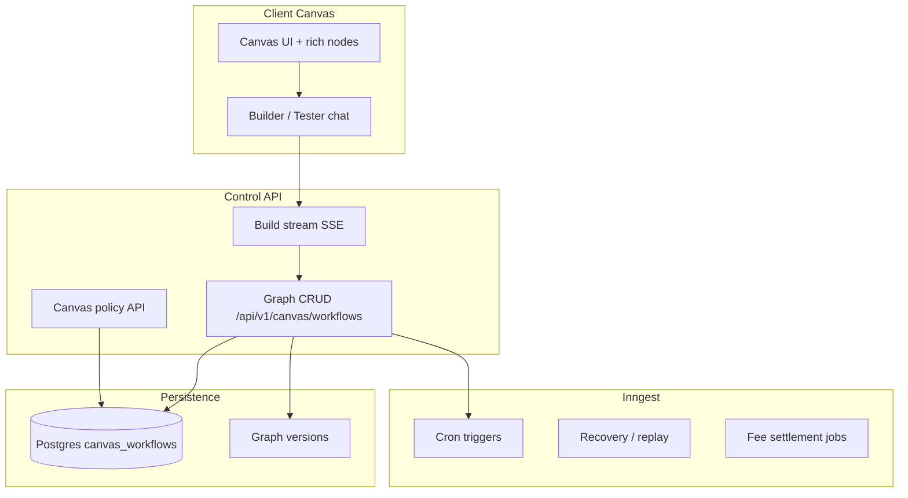
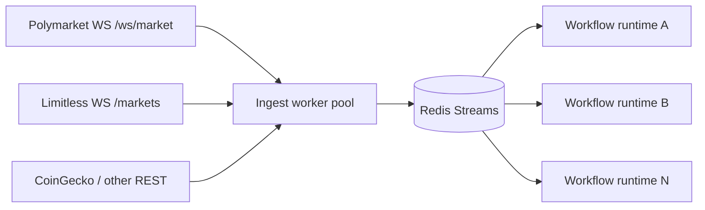
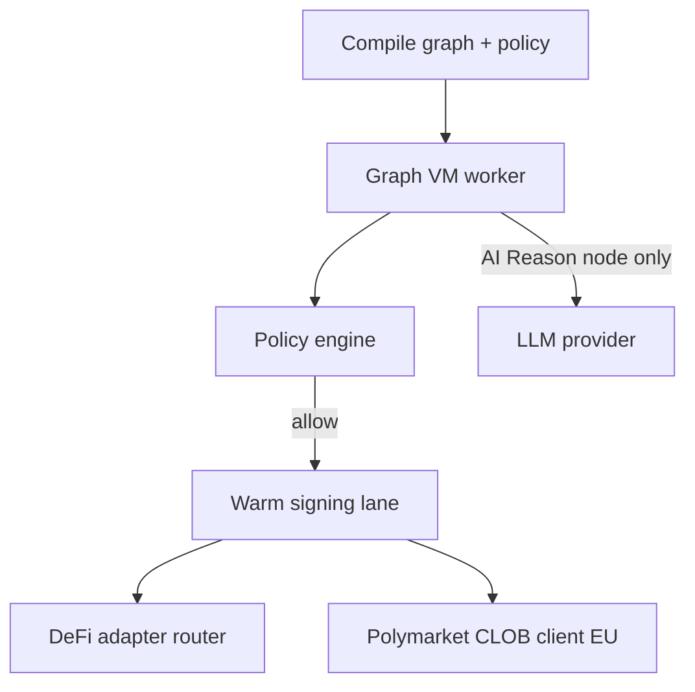

# Canvas workflows — architecture & implementation TODO

Single source of truth for Radiant's **Canvas plane**: node-based workflow automation with a compiled runtime, shared market-data ingest, and a separate policy layer from chat. Chat stays conversational; Canvas is explicit, fast, and graph-native.

**References**

- Chat workflow types (session plane): `backend/src/services/agent/workflow/workflow.types.ts`
- **Node catalog (this doc):** [Node catalog](#node-catalog) — v1/v2/future node list
- SSE / artifact streaming: `backend/src/services/agent/execution-progress-context.ts`, `execution-progress.types.ts`
- Chat permissions (separate from Canvas): `backend/src/services/agent/agent-permissions.types.ts`
- DeFi routing matrix: `docs/swap-bridge-routing-schema.json`, `docs/defi-providers-integration-TODO.md`
- Polymarket stub adapter: `backend/src/services/protocols/polymarket-app.adapter.ts`, `docs/protocol-extension-kit.md`
- Rate-limit pattern: `backend/src/config/coingecko.ts` (token bucket + per-route caps)
- Format/style reference: `docs/squid-protocol-integration-TODO.md`, `docs/app-builder-platform-TODO.md`
- Inngest durable jobs: `backend/.agents/skills/inngest-radiant/SKILL.md`

**North star:** User switches to **Canvas** explicitly → Builder agent assembles a rich node graph from natural language (live SSE) → Tester dry-runs with real previews → user enables **Live** with per-workflow policy compiled into the runtime → sub-ms logic in dedicated stream workers, tens–hundreds ms sign+submit via warm Privy lane, shared WebSocket ingest fan-out to N workflows.

**Design principles**

1. **Two planes, one wallet stack** — Chat and Canvas share Privy wallets and `execute_transaction` adapters; they do **not** share permission models or execution schedulers.
2. **LLM at graph edges only** — Builder/Tester agents use LLM; runtime invokes LLM **only** when execution reaches an **AI Reasoning** node.
3. **Inngest for durability, not ticks** — schedules, recovery, fee settlement, long polls; hot path uses dedicated stream workers + Redis streams.
4. **Latency honesty** — Document and enforce budgets; no marketing HFT claims through cold Privy per order.
5. **One WebSocket per market** — Radiant ingests once, normalizes to Redis streams, fans out to subscribed workflows.

---

## Executive summary

Radiant today runs **session workflows** in chat: linear `WorkflowPlan` steps (`query` | `execute` | `build` | `agent` | `app_action`), LLM on every turn, approval bar, and `SessionWorkflowState` in memory/Postgres. That plane remains unchanged.

**Canvas** adds a second product surface: a visual workflow builder where users compose **large rich nodes** (Price Chart, Polymarket feed, Copy Trade, Place Order, AI Reason, …) connected by typed ports. Two agent roles assist:

| Role | When | LLM? |
| ---- | ---- | ---- |
| **Builder** | User describes intent in Canvas | Yes — emits graph patches over SSE |
| **Tester** | Dry-run before Live | Yes — simulates actions, uses live data previews |
| **Runtime** | Live execution | Only at **AI Reasoning** nodes |

Backend splits into **control** (graph CRUD, agent build, Inngest schedules), **data** (shared WS ingest → Redis streams), and **execution** (compiled graph VM, Canvas policy engine, warm signing lane, DeFi adapters). Phased delivery: Chat (existing) → Canvas v1 (graph + dry-run + limited live nodes) → shared data plane → Pro execution lane (EU CLOB workers, pre-auth signing).

---

## Chat vs Canvas comparison

| Dimension | Chat plane (existing) | Canvas plane (new) |
| --------- | --------------------- | ------------------- |
| Entry | Default; conversational | User explicitly opens Canvas |
| Plan shape | Linear `WorkflowStep[]` | Directed graph (nodes + edges + ports) |
| LLM usage | Every turn | Builder/Tester only; runtime at AI Reason nodes |
| Permissions | `AgentPermissions` (auto-approve, allow_predict, …) | Per-workflow **Canvas policy** (max spend, kill switch, …) |
| Persistence | `SessionWorkflowState` per chat session | `CanvasWorkflow` + versions in Postgres |
| Streaming UX | `step`, `artifact`, `reply` SSE | + `workflow.node.*`, `workflow.edge.*`, `workflow.build.complete` |
| Scheduler | Agent loop + approval pauses | Compiled runtime + stream workers; Inngest for cron/recovery |
| Node UI | N/A (timeline + approval bar) | Large cards: header, live preview, config strip, ports |
| Target latency | Human-paced (seconds) | Logic µs–ms; sign+submit tens–hundreds ms (warm lane) |
| DeFi execution | `execute_transaction` tools | Same adapters via action nodes |
| Fee model | Per transaction / existing | Per **action node execution** (live mode) |

---

## Node catalog

Canonical list of Canvas nodes: what ships in **v1** (Phases 0–5, **36 canonical slugs** + 3 generic aliases), what follows in **v2**, and what stays in the backlog. Compiler `CanvasNodeType` slugs use **snake_case** in TypeScript; this catalog uses **kebab-case** `node_type` ids for product/docs — map 1:1 (`price-chart` → `price_chart`).

**Cross-links:** Graph schema types → [Graph schema](#graph-schema); preview ingest → [Market data service](#market-data-service); Live execution → [Runtime engine design](#runtime-engine-design); Builder tools → [Phase 1](#phase-1--builder-agent--live-graph-sse).

---

### A. Node taxonomy

| Category | Role | Examples |
| -------- | ---- | -------- |
| **Workflow control** | Graph entry, human gates, terminal / branch kill | Start, Approve, Stop |
| **Data / Feed** | Subscribe to market, chain, or wallet streams; emit normalized events | Polymarket feed, Price Chart, Whale tracker |
| **Protocol (family)** | Venue-specific nodes grouped by adapter (Polymarket, Li-Fi, Limitless) | `polymarket-place-limit`, `lifi-quote`, `limitless-feed` |
| **Logic / Control** | Pure in-worker evaluation; no sign/submit | IF, Compare, Threshold, Policy gate |
| **Action / Execution** | Sign + submit txs or CLOB orders (cold/warm path) | Place Order, Swap, Bridge, Copy Trade |
| **UI / Preview** | Rich card with live preview region (often overlaps Data nodes) | Price Chart, Polymarket feed book pane |
| **UI / Display** | Manipulable Canvas cards bound to runtime data; user clicks drive branches | UI Button, UI Table, UI Panel |
| **AI / Agent** | Runtime LLM invocation (only allowed hot-path LLM) | AI Reasoning |
| **Utility / Workflow** | Triggers, delays, queries, notifications, dry-run gates | Schedule/Cron, Wallet Balance, Notify, Dry-run gate |

Most **Data / Feed** nodes are also **UI / Preview** nodes — the large card shows live data when min config is met. **Protocol node families** (§ C) expand venue coverage beyond one feed node each; generic v1 slugs (`place-order`, `swap`, `bridge`) remain Builder aliases where noted.

---

### B. Workflow control nodes

Runtime graph boundaries — not market data or DeFi adapters. Every Live workflow should have exactly one **`workflow-start`** (or **`schedule-cron`** / external trigger) and at least one reachable terminal path via **`workflow-stop`** or action completion.

| `node_type` | Display name | Purpose | Ports (summary) | Phase | Notes |
| ----------- | ------------ | ------- | ----------------- | ----- | ----- |
| `workflow-start` | Start | Entry point when a workflow run begins (manual Live, deploy, or upstream trigger). Emits initial `trigger` to downstream subgraph. | **Out:** `trigger` | **3** (dry-run); **4** (Live) | Compiler requires ≥1 start or schedule entry per connected component |
| `workflow-approve` | Approve | Human-in-the-loop gate — pauses run until user approves in Canvas (approval bar / node card). Mirrors chat approval UX but graph-native. | **In:** `trigger`, `data`, `order_intent` · **Out:** `trigger` (approved), `data` (rejected reason) | **3** (dry-run sim); **4** (Live) | Uses `step.waitForEvent` / Inngest durable pause; SSE `workflow.approve.pending` |
| `workflow-stop` | Stop | Terminal node — ends current branch or entire run; optional kill message. Downstream ports on same branch are not evaluated. | **In:** `trigger`, `signal` · **Out:** — | **3** | Distinct from global **kill switch** (policy); local branch termination |
| `workflow-pause` | Pause | Optional — pause run at checkpoint without user decision (operator/debug). | **In:** `trigger` · **Out:** `trigger` (on resume) | **v2** | Pairs with **`workflow-resume`** or manual resume API |
| `workflow-resume` | Resume | Optional — explicit resume after **`workflow-pause`** or external signal. | **In:** `trigger` · **Out:** `trigger` | **v2** | Prefer **`delay`** + Inngest for timed pause in v1 |

**Builder default:** wire **`workflow-start`** → logic/feed → **`workflow-approve`** before first Live action → **`policy-gate`** → action → **`workflow-stop`** on success or deny paths.

---

### C. Protocol node families

Venue-specific node slugs beyond generic action aliases. Reference adapters and routing schema; expand v1/v2 catalog per protocol.

#### Polymarket (CLOB V2 — Polygon)

Stub today: `backend/src/services/protocols/polymarket-app.adapter.ts` → full Canvas adapter under `backend/src/services/canvas/adapters/polymarket/`. V1 CLOB sunset **2026-04-28** — V2 only.

| `node_type` | Display name | Purpose | Tier | Phase | Adapter / notes |
| ----------- | ------------ | ------- | ---- | ----- | ----------------- |
| `polymarket-feed` | Market Data Feed | WS + REST price, trade, book events for configured asset IDs | v1 | **2** / **4** | Same as § E **`polymarket-feed`**; MDS ingest |
| `polymarket-orderbook` | Order Book / Spread | L2 book snapshot + spread metrics (top N levels, mid, imbalance) | v1 | **2** (preview); **4** (trigger) | REST `GET /book` + WS `book`; may share preview region with feed |
| `polymarket-place-limit` | Place Limit Order | GTC / GTD limit CLOB order | v1 | **4** | `polymarket-order.service.ts`; warm Privy EIP-712 + L2 HMAC |
| `polymarket-place-market` | Place Market Order | Marketable limit / FOK-style market order | v1 | **4** | Same adapter; distinct policy class sizing rules |
| `polymarket-cancel-order` | Cancel Order | Cancel open order by id or filter | v1 | **4** | REST cancel; no new exposure |
| `polymarket-positions` | Positions / Balances | Agent wallet positions, open orders, collateral (pUSD) allowance state | v1 | **3** (read); **4** (gate) | REST balance-allowance + user WS (v2 **`polymarket-user-feed`**) |
| `polymarket-user-feed` | User Channel Feed | Private fills, orders, positions stream | v2 | Post–5 | User WS + L2 auth |
| `place-order` | Place Order (generic alias) | Builder shorthand → maps to **`polymarket-place-limit`** or **`polymarket-place-market`** from config | v1 | **4** | **Keep for § E**; compiler resolves to protocol slug |

#### Li-Fi (cross-chain + same-chain routing)

Align with `docs/swap-bridge-routing-schema.json` and `backend/src/services/defi/lifi/` (`lifi-quote.service.ts`, `lifi-routes.service.ts`, `lifi-execute.service.ts`, `lifi-status-tracker.service.ts`). Generic **`swap`** / **`bridge`** remain v1 aliases.

| `node_type` | Display name | Purpose | Tier | Phase | Adapter / notes |
| ----------- | ------------ | ------- | ---- | ----- | ----------------- |
| `lifi-quote` | Quote / Routes | Fetch Li-Fi routes for swap or bridge corridor per routing schema | v1 | **3** (dry-run); **4** (Live) | `lifi-quote.service.ts`, `lifi-routes.service.ts` |
| `lifi-swap` | Same-chain Swap | Execute same-chain swap leg via Li-Fi (or DeepBook/Soroswap when schema says so) | v1 | **4** | `lifi-same-chain-execute.service.ts`; corridor from schema |
| `lifi-bridge` | Bridge / Cross-chain Swap | Cross-chain route execution (primary Li-Fi) | v1 | **4** | `lifi-execute.service.ts`; policy corridor allowlist |
| `lifi-route-status` | Route Status / Tracking | Poll or subscribe to in-flight route / tx status | v1 | **4** | `lifi-status-tracker.service.ts`, `lifi-tracking.ts` |
| `lifi-liquidity-fallback` | Liquidity Fallback Offer | When Li-Fi has no route, offer Squid fallback per existing agent flow; requires policy opt-in for unattended Live | v1 | **4** | Links to `backend/src/services/defi/squid/`; default **disallow** in policy |
| `swap` | Swap (generic alias) | Builder shorthand → **`lifi-swap`** or schema provider | v1 | **4** | § E entry retained |
| `bridge` | Bridge (generic alias) | Builder shorthand → **`lifi-bridge`** | v1 | **4** | § E entry retained |

#### Limitless Exchange (Base prediction market)

Phase 2 adapter (`backend/src/services/canvas/adapters/limitless/`). API research incomplete for trading — mark tier clearly.

| `node_type` | Display name | Purpose | Tier | Phase | Adapter / notes |
| ----------- | ------------ | ------- | ---- | ----- | ----------------- |
| `limitless-feed` | Market Feed / WS | Public book + AMM/CLOB prices via WS `/markets` or REST | v2 | Post–5 | `limitless-ws-ingest.worker.ts`; Socket.IO |
| `limitless-quote` | Quote | REST quote / price for configured market slug | v2 | Post–5 | Public REST; rate limits TBD |
| `limitless-place-order` | Place Order | GTC / FAK / FOK when delegated signing adapter exists | **future** | Post–5+ | Blocked on partner scopes + adapter spike |
| `limitless-cancel-order` | Cancel Order | Cancel open Limitless order | **future** | Post–5+ | Same blocker as place |
| `limitless-positions` | Positions | HMAC-authenticated position stream | v2 | Post–5 | WS `subscribe_positions`; read-only v2 first |

---

### D. UI / Display nodes (manipulable Canvas cards)

Large preview cards the user can interact with on the board. Agent configures appearance (labels, colors, layout) and **data bindings** from upstream `data` / `market` ports. Distinct from passive feed previews — these nodes participate in workflow control when clicked.

| `node_type` | Display name | Purpose | Binding | Phase |
| ----------- | ------------ | ------- | ------- | ----- |
| `ui-button` | UI Button | Clickable control; fires `trigger` on downstream branch bound to workflow runtime | **In:** `data` (label/state) · **Out:** `trigger` | **2** (Build UI); **3** (runtime click) |
| `ui-label` | UI Label / Text | Display bound scalar or formatted string (price, status, approve message) | **In:** `data`, `signal` · **Out:** — | **2** |
| `ui-table` | UI Table | Tabular bind — whale tracker rows, open orders, route steps | **In:** `data` (array payload) · **Out:** `signal` (row select, optional) | **2** / **3** |
| `ui-chart` | UI Chart | Generic chart binding (series from upstream); overlaps **`price-chart`** but protocol-agnostic | **In:** `data`, `signal` · **Out:** `data` (hover/selection) | **2** |
| `ui-panel` | UI Panel | Container node for grouping display nodes on board (layout region, no execution logic) | **In:** — (groups child nodes visually) · **Out:** — | **2** |

**Builder rules:** prefer **`ui-table`** ← **`whale-tx-tracker`** / **`polymarket-positions`**; **`ui-button`** → **`workflow-approve`** bypass path or manual trigger; **`ui-panel`** for dashboard-style layouts.

---

### E. v1 nodes (implement first)

Ship in Phases 0–5. Each entry: `node_type`, display name, category, purpose, preview behavior, ports, path class, adapter dependency, phase target.

See also **§ B** (workflow control), **§ C** (protocol families), **§ D** (UI display). Protocol-specific slugs (`polymarket-*`, `lifi-*`) are canonical for Live compile; generic aliases below remain for Builder ergonomics.

#### Workflow control

##### `workflow-start` — Start

| Field | Value |
| ----- | ----- |
| **Category** | Workflow control |
| **Purpose** | Single entry point when a workflow run starts; emits initial `trigger` to downstream nodes. |
| **Preview** | Last run id, started-at timestamp, entry source (manual / cron / UI button). |
| **Ports** | **Out:** `trigger` · **In:** — |
| **Path** | **Hot** — graph VM dispatch |
| **Adapter** | None |
| **Phase** | **3** |

##### `workflow-approve` — Approve (human-in-the-loop)

| Field | Value |
| ----- | ----- |
| **Category** | Workflow control |
| **Purpose** | Pause execution until user approves or rejects in Canvas; surfaces payload preview on node card. |
| **Preview** | Pending / approved / rejected chip; summary of gated `order_intent` or upstream `data`. |
| **Ports** | **In:** `trigger`, `data`, `order_intent` · **Out:** `trigger` (approved), `data` (rejection) |
| **Path** | **Cold** — durable pause (Inngest `step.waitForEvent`); resumes on user action |
| **Adapter** | Canvas approval service; SSE `workflow.approve.pending` |
| **Phase** | **3** (simulated); **4** (Live) |

##### `workflow-stop` — Stop

| Field | Value |
| ----- | ----- |
| **Category** | Workflow control |
| **Purpose** | Terminate branch or mark run complete; optional user-visible stop reason. |
| **Preview** | Stopped-at timestamp, reason string, branch id. |
| **Ports** | **In:** `trigger`, `signal` · **Out:** — |
| **Path** | **Hot** |
| **Adapter** | None |
| **Phase** | **3** |

#### Data / Feed

##### `polymarket-feed` — Polymarket Market Data

| Field | Value |
| ----- | ----- |
| **Category** | Data / Feed · UI / Preview |
| **Purpose** | Subscribe to a Polymarket CLOB market (asset IDs) and emit book, trade, and price events for downstream logic and preview. |
| **Preview** | Live L2 book snippet (top N levels), last trade price/size, spread, 24h volume if available; status chip for WS connection. |
| **Ports** | **Out:** `market` (normalized book/trade stream), `data` (scalar mid/best bid/ask) · **In:** — |
| **Path** | **Hot** — Redis stream consumer; no LLM, no chain tx |
| **Adapter** | Polymarket WS ingest (`polymarket-ws-ingest.worker.ts`), REST read client |
| **Phase** | **2** (preview); **4** (Live trigger source) |

##### `price-chart` — Price Chart

| Field | Value |
| ----- | ----- |
| **Category** | Data / Feed · UI / Preview |
| **Purpose** | Display spot/perp price history for a configured pair and interval; optional overlay markers from upstream signals. |
| **Preview** | TradingView widget embed (or lightweight-charts fallback per product decision); updates pair/interval from config strip. |
| **Ports** | **Out:** `data` (last close, % change window) · **In:** `signal` (optional marker annotations) |
| **Path** | **Cold** — REST poll / CoinGecko; preview-only reads |
| **Adapter** | CoinGecko (`coingecko.ts` rate limits); TradingView widget config |
| **Phase** | **2** |

##### `whale-tx-tracker` — Whale / Largest Tx Tracker

| Field | Value |
| ----- | ----- |
| **Category** | Data / Feed · UI / Preview |
| **Purpose** | Watch labeled wallets or chain-wide large transfers for a token/market; emit when size exceeds threshold. |
| **Preview** | Scrollable last-N txs table (time, wallet, size USD, tx link); highlight when above whale threshold. |
| **Ports** | **Out:** `trigger` (on large tx), `data` (last tx payload) · **In:** — |
| **Path** | **Hot** — indexer / RPC stream; no LLM |
| **Adapter** | Chain indexer ingest (`market-data/ingest/chain-indexer.ts`); optional Polymarket user WS for labeled PM wallets |
| **Phase** | **5** |

##### `wallet-balance` — Wallet Balance

| Field | Value |
| ----- | ----- |
| **Category** | Data / Feed |
| **Purpose** | Query agent or specified wallet balances (native + allowlisted tokens) for gating logic before actions. |
| **Preview** | Token rows with symbol, amount, USD equiv; refresh interval indicator. |
| **Ports** | **Out:** `data` (balance map) · **In:** `trigger` (optional refresh on upstream) |
| **Path** | **Cold** — RPC / existing wallet asset service |
| **Adapter** | Privy wallet stack, existing portfolio/balance reads |
| **Phase** | **3** (dry-run reads); **4** (Live refresh) |

#### Logic / Control

##### `if-condition` — IF

| Field | Value |
| ----- | ----- |
| **Category** | Logic / Control |
| **Purpose** | Branch execution on boolean expression over upstream `data` / `signal` payloads (e.g. "if true → place order path"). |
| **Preview** | Last eval result (true/false), expression summary, timestamp of last firing. |
| **Ports** | **In:** `data`, `signal`, `trigger` · **Out:** `trigger` (true branch), `trigger` (false branch, optional) |
| **Path** | **Hot** — in-worker µs–ms |
| **Adapter** | None (graph VM) |
| **Phase** | **3** |

##### `compare` — Compare

| Field | Value |
| ----- | ----- |
| **Category** | Logic / Control |
| **Purpose** | Compare two numeric or enum inputs (A vs B) with operators (`>`, `<`, `==`, `crosses_above`, …). |
| **Preview** | Side-by-side A/B values, operator, result chip. |
| **Ports** | **In:** `data` (A), `data` (B) · **Out:** `signal` (boolean), `trigger` |
| **Path** | **Hot** |
| **Adapter** | None |
| **Phase** | **3** |

##### `threshold` — Threshold

| Field | Value |
| ----- | ----- |
| **Category** | Logic / Control |
| **Purpose** | Fire when a single metric crosses a configured bound (e.g. BTC −5% on 1h, Polymarket mid < 0.40). |
| **Preview** | Sparkline or last value vs threshold line; armed/triggered state. |
| **Ports** | **In:** `data` · **Out:** `trigger`, `signal` |
| **Path** | **Hot** |
| **Adapter** | None |
| **Phase** | **3** |

##### `policy-gate` — Policy Gate

| Field | Value |
| ----- | ----- |
| **Category** | Logic / Control · Utility / Workflow |
| **Purpose** | Hard stop before action nodes: enforce compiled `CanvasPolicy` (spend cap, allow-list, forbidden corridors) on `order_intent` payloads. |
| **Preview** | Pass/deny chip, reason code, rolling 24h spend vs cap bar. |
| **Ports** | **In:** `order_intent`, `trigger` · **Out:** `trigger` (allowed), `data` (deny reason) |
| **Path** | **Hot** — policy engine (< 2 ms) |
| **Adapter** | `canvas-policy.service.ts` |
| **Phase** | **4** |

##### `dry-run-gate` — Dry-run Gate

| Field | Value |
| ----- | ----- |
| **Category** | Logic / Control · Utility / Workflow |
| **Purpose** | In Dry Run mode, route action intents to simulator instead of signing lane; in Live, pass through unchanged. |
| **Preview** | Mode badge (Dry / Live); last routed path (simulated vs real). |
| **Ports** | **In:** `order_intent`, `trigger` · **Out:** `trigger`, `order_intent` |
| **Path** | **Hot** |
| **Adapter** | `dry-run-simulator.ts` |
| **Phase** | **3** |

#### Action / Execution

##### `place-order` — Place Order (Polymarket CLOB — generic alias)

| Field | Value |
| ----- | ----- |
| **Category** | Action / Execution · Protocol (Polymarket) |
| **Purpose** | Build, sign, and submit Polymarket CLOB orders from upstream `order_intent` or inline config. Compiler maps to **`polymarket-place-limit`** or **`polymarket-place-market`** (§ C). |
| **Preview** | Order preview: side, size, price, est. cost, allowance status; last submit result / order id. |
| **Ports** | **In:** `trigger`, `market`, `order_intent` · **Out:** `data` (fill ack / order id) |
| **Path** | **Cold** — warm Privy sign + CLOB REST (100–500 ms typical) |
| **Adapter** | Polymarket CLOB (`adapters/polymarket/`), warm signing lane |
| **Phase** | **4** |

##### `swap` — Swap (Li-Fi generic alias)

| Field | Value |
| ----- | ----- |
| **Category** | Action / Execution · Protocol (Li-Fi) |
| **Purpose** | Same-chain or primary-route token swap via Li-Fi / DeepBook / Soroswap per routing schema. Prefer explicit **`lifi-swap`** / **`lifi-quote`** in compiled graphs (§ C). |
| **Preview** | Quote summary: in/out amounts, route, slippage, gas est.; last tx hash on Live. |
| **Ports** | **In:** `trigger`, `order_intent` · **Out:** `data` (tx receipt) |
| **Path** | **Cold** — quote + sign + chain submit |
| **Adapter** | Li-Fi (primary), DeepBook (Sui), Soroswap (Stellar); `docs/swap-bridge-routing-schema.json` |
| **Phase** | **4** |

##### `bridge` — Bridge (Li-Fi generic alias)

| Field | Value |
| ----- | ----- |
| **Category** | Action / Execution · Protocol (Li-Fi) |
| **Purpose** | Cross-chain bridge using Li-Fi / Squid (policy must pre-authorize Squid fallback for unattended Live). Prefer **`lifi-bridge`** + **`lifi-route-status`** (§ C). |
| **Preview** | Corridor, fees, ETA, destination address; progress steps on Live. |
| **Ports** | **In:** `trigger`, `order_intent` · **Out:** `data` (bridge status / tx ids) |
| **Path** | **Cold** |
| **Adapter** | Li-Fi, Squid (policy opt-in) |
| **Phase** | **4** |

##### `transfer` — Transfer

| Field | Value |
| ----- | ----- |
| **Category** | Action / Execution |
| **Purpose** | Simple token/native transfer from agent wallet to configured recipient (within policy allow-list). |
| **Preview** | Amount, token, recipient, est. fee; last tx link. |
| **Ports** | **In:** `trigger`, `order_intent` · **Out:** `data` (tx receipt) |
| **Path** | **Cold** |
| **Adapter** | Privy + chain RPC via existing `execute_transaction` patterns |
| **Phase** | **4** |

##### `copy-trade` — Copy Trade

| Field | Value |
| ----- | ----- |
| **Category** | Action / Execution |
| **Purpose** | Mirror trades from a leader wallet (size %, max slippage, allowlist) when whale/feed nodes fire. |
| **Preview** | Leader last action, mirrored intent, policy caps remaining; simulated vs executed badge. |
| **Ports** | **In:** `trigger`, `data` (leader tx), `market` · **Out:** `order_intent`, `data` |
| **Path** | **Cold** — sign + submit per mirrored action |
| **Adapter** | Polymarket CLOB and/or DeFi router depending on leader venue; copy-trade policy limits |
| **Phase** | **5** |

#### UI / Display

##### `ui-button` — UI Button

| Field | Value |
| ----- | ----- |
| **Category** | UI / Display |
| **Purpose** | Manipulable button on Canvas; user click emits `trigger` to bound downstream branch (manual start, approve shortcut, reset). |
| **Preview** | Configurable label, icon, disabled state from bound `data`. |
| **Ports** | **In:** `data` (label/enabled) · **Out:** `trigger` |
| **Path** | **Hot** — client click → runtime API → graph VM |
| **Adapter** | Canvas UI binding layer |
| **Phase** | **2** (render); **3** (runtime) |

##### `ui-label` — UI Label / Text

| Field | Value |
| ----- | ----- |
| **Category** | UI / Display |
| **Purpose** | Display formatted text bound to upstream scalars (price, status, error message). |
| **Preview** | Live text with optional template (`{{mid}}`, `{{spread_bps}}`). |
| **Ports** | **In:** `data`, `signal` · **Out:** — |
| **Path** | **Hot** — render-only |
| **Adapter** | None |
| **Phase** | **2** |

##### `ui-table` — UI Table

| Field | Value |
| ----- | ----- |
| **Category** | UI / Display |
| **Purpose** | Tabular view of array payloads — whale txs, open orders, Li-Fi route steps, positions. |
| **Preview** | Scrollable table with column config; optional row click → `signal`. |
| **Ports** | **In:** `data` (rows) · **Out:** `signal` (row selection, optional) |
| **Path** | **Hot** — render; optional click → trigger |
| **Adapter** | None |
| **Phase** | **2** / **3** |

##### `ui-chart` — UI Chart

| Field | Value |
| ----- | ----- |
| **Category** | UI / Display · UI / Preview |
| **Purpose** | Generic chart binding (line/bar) from upstream series; complements venue-specific **`price-chart`**. |
| **Preview** | Lightweight chart region; series from `data` binding. |
| **Ports** | **In:** `data`, `signal` · **Out:** `data` (selection) |
| **Path** | **Cold** — client render |
| **Adapter** | Chart lib TBD (may reuse TradingView or lightweight-charts) |
| **Phase** | **2** |

##### `ui-panel` — UI Panel

| Field | Value |
| ----- | ----- |
| **Category** | UI / Display |
| **Purpose** | Visual container grouping display nodes on board (title bar, background); no execution logic. |
| **Preview** | Panel chrome; child nodes nested in layout slots. |
| **Ports** | **In:** — · **Out:** — |
| **Path** | **Hot** — layout only |
| **Adapter** | None |
| **Phase** | **2** |

#### AI / Agent

##### `ai-reason` — AI Reasoning

| Field | Value |
| ----- | ----- |
| **Category** | AI / Agent |
| **Purpose** | Bounded LLM step at runtime — summarize context, classify signal, or emit structured decision JSON for downstream logic (only runtime LLM entry point). |
| **Preview** | Last model output snippet, token usage, latency; redact secrets. |
| **Ports** | **In:** `trigger`, `data` (context bundle) · **Out:** `signal`, `data` (structured JSON) |
| **Path** | **Cold** — LLM API (100 ms–several s); optional `max_llm_tokens_per_run` in policy |
| **Adapter** | OpenAI runtime (mirror chat patterns) |
| **Phase** | **5** |

#### Utility / Workflow

##### `schedule-cron` — Schedule / Cron

| Field | Value |
| ----- | ----- |
| **Category** | Utility / Workflow |
| **Purpose** | Time-based workflow entry: cron expression or interval triggers downstream subgraph (Inngest schedules resume, not busy-wait). |
| **Preview** | Next run time, last run status, cron human-readable string. |
| **Ports** | **Out:** `trigger` · **In:** — |
| **Path** | **Cold** — Inngest cron → `canvas/workflow.trigger` |
| **Adapter** | Inngest (`backend/src/inngest/functions/canvas-*`) |
| **Phase** | **4** |

##### `notify` — Alert / Notify

| Field | Value |
| ----- | ----- |
| **Category** | Utility / Workflow |
| **Purpose** | Send user notification (in-app, email, webhook URL) when upstream logic fires — no chain tx. |
| **Preview** | Last message preview, delivery status, channel icons. |
| **Ports** | **In:** `trigger`, `data` · **Out:** `data` (delivery ack) |
| **Path** | **Cold** — outbound HTTP / notification service |
| **Adapter** | Radiant notification service; optional user webhook (policy allow-list) |
| **Phase** | **3** (dry-run log); **4** (Live delivery) |

##### `delay` — Delay

| Field | Value |
| ----- | ----- |
| **Category** | Utility / Workflow |
| **Purpose** | Pause subgraph for duration or until timestamp; durable resume via Inngest (not in-worker sleep). |
| **Preview** | Countdown / resume-at timestamp, paused state chip. |
| **Ports** | **In:** `trigger` · **Out:** `trigger` |
| **Path** | **Cold** — Inngest scheduled resume |
| **Adapter** | Inngest |
| **Phase** | **4** |

---

### F. v2 nodes (next wave)

After v1 Live is stable. Implement shared ingest/adapters before enabling Live on these nodes.

| `node_type` | Display name | Category | Purpose (summary) | Preview | Adapter / dependency | Phase target |
| ----------- | ------------ | -------- | ----------------- | ------- | -------------------- | ------------ |
| `limitless-feed` | Limitless Exchange Feed | Data / Feed | Base prediction-market book + AMM/CLOB prices | Live book + price tape | Limitless WS `/markets`, REST | Post–5 |
| `cross-chain-compare` | Cross-chain Compare | Logic / Control | Compare same asset price/state across chains (spread arb signal) | Multi-chain price table + spread % | Li-Fi quotes, CoinGecko, MDS | Post–5 |
| `flash-loan-detect` | Flash Loan Detect | Data / Feed | Detect flash-loan patterns on configured pools/markets | Alert list + tx graph snippet | Chain indexer, DeepBook events | Post–5 |
| `deepbook-predict` | DeepBook Predict | Data / Feed · UI | Order-flow / book imbalance signal for Sui DeepBook pairs | Book depth heatmap + signal strength | DeepBook WS / registry | Post–5 |
| `limit-order` | Limit Order (generic) | Action / Execution | Non-Polymarket limit orders (DeepBook, CEX-style APIs) | Open orders table + fill % | DeepBook, future CEX adapters | Post–5 |
| `polymarket-user-feed` | Polymarket User Channel | Data / Feed | Private fills, orders, positions for agent wallet | Positions + open orders | Polymarket user WS + L2 auth | Post–5 |
| `pnl-snapshot` | PnL Snapshot | Data / Feed · UI | Portfolio PnL across PM + DeFi positions | Chart + breakdown table | Polymarket + wallet reads | Post–5 |
| `requote` | Re-quote | Logic / Control | Force fresh DeFi quote before stale action | Quote age + delta vs last | Li-Fi / Squid | Post–5 |
| `workflow-pause` | Pause | Workflow control | Operator checkpoint pause | Paused chip + resume-at | Inngest durable pause | Post–5 |
| `workflow-resume` | Resume | Workflow control | Resume after pause | Resumed timestamp | Inngest event | Post–5 |
| `limitless-quote` | Limitless Quote | Protocol (Limitless) | REST quote for market slug | Price + liquidity hint | Limitless REST | Post–5 |
| `limitless-positions` | Limitless Positions | Protocol (Limitless) | HMAC position stream | Positions table | Limitless WS | Post–5 |

---

### G. Future / possible nodes (backlog)

Not scheduled. Require product, legal, or infra decisions before promotion to v2.

| `node_type` | Display name | Category | Notes |
| ----------- | ------------ | -------- | ----- |
| `leverage-open` | Open Leverage | Action / Execution | Perp/margin venues; policy class `high_risk` |
| `margin-call-guard` | Margin Call Guard | Logic / Control | Monitor health factor; kill switch integration |
| `multi-market-arb` | Multi-market Arb | Action / Execution | Coordinated legs across PM + CEX + DEX |
| `social-sentiment` | Social Sentiment | Data / Feed | X/Telegram/Discord NLP feed; rate + ToS risk |
| `webhook-trigger` | Webhook Trigger | Utility / Workflow | Inbound HTTP starts subgraph; auth + abuse limits |
| `external-api` | External API | Data / Feed · Action | Generic REST fetch or POST; SSRF guards required |
| `options-chain` | Options Chain | Data / Feed | Traditional options data providers |
| `liquidation-tracker` | Liquidation Tracker | Data / Feed | DeFi lending protocol liquidations |
| `nft-floor-feed` | NFT Floor Feed | Data / Feed | Collection floor + sales |
| `custom-app-action` | Custom App Action | Action / Execution | `call_app_action` bridge to Radiant apps (schema exists) |
| `batch-orders` | Batch Orders | Action / Execution | Polymarket batch POST; advanced sizing |
| `soroswap-node` | Soroswap (Stellar) | Action / Execution | Stellar-specific swap; Phase 3 in DeFi doc |
| `limitless-place-order` | Limitless Place Order | Protocol (Limitless) | GTC/FAK/FOK when adapter + delegated signing ready |
| `limitless-cancel-order` | Limitless Cancel Order | Protocol (Limitless) | Cancel open Limitless order |

---

### H. Node matrix

Compact reference: tier, Live requirement, and policy class.

| Node | Category | Tier | Requires Live | Policy class |
| ---- | -------- | ---- | ------------- | ------------ |
| `workflow-start` | Workflow control | v1 | Yes (Live run) | `none` |
| `workflow-approve` | Workflow control | v1 | Yes (gate) | `approve` |
| `workflow-stop` | Workflow control | v1 | No | `none` |
| `workflow-pause` | Workflow control | v2 | Yes | `none` |
| `workflow-resume` | Workflow control | v2 | Yes | `none` |
| `polymarket-feed` | Data / Feed · Protocol | v1 | No (preview); Yes (trigger) | `read_only` |
| `polymarket-orderbook` | Data / Feed · Protocol | v1 | No (preview); Yes (trigger) | `read_only` |
| `polymarket-place-limit` | Action · Protocol | v1 | Yes | `clob_order` |
| `polymarket-place-market` | Action · Protocol | v1 | Yes | `clob_order` |
| `polymarket-cancel-order` | Action · Protocol | v1 | Yes | `clob_cancel` |
| `polymarket-positions` | Data / Feed · Protocol | v1 | No (read); Yes (gate) | `read_only` |
| `lifi-quote` | Action · Protocol | v1 | Optional | `defi_quote` |
| `lifi-swap` | Action · Protocol | v1 | Yes | `defi_swap` |
| `lifi-bridge` | Action · Protocol | v1 | Yes | `defi_bridge` |
| `lifi-route-status` | Data / Feed · Protocol | v1 | Optional | `read_only` |
| `lifi-liquidity-fallback` | Logic · Protocol | v1 | Yes (if Squid used) | `defi_bridge` |
| `ui-button` | UI / Display | v1 | Optional (click in Live) | `none` |
| `ui-label` | UI / Display | v1 | No | `none` |
| `ui-table` | UI / Display | v1 | No | `none` |
| `ui-chart` | UI / Display | v1 | No | `read_only` |
| `ui-panel` | UI / Display | v1 | No | `none` |
| `price-chart` | Data / Feed | v1 | No | `read_only` |
| `whale-tx-tracker` | Data / Feed | v1 | No (preview); Yes (trigger) | `read_only` |
| `wallet-balance` | Data / Feed | v1 | No | `read_only` |
| `if-condition` | Logic / Control | v1 | No | `none` |
| `compare` | Logic / Control | v1 | No | `none` |
| `threshold` | Logic / Control | v1 | No | `none` |
| `policy-gate` | Logic / Control | v1 | Yes (enforce) | `none` |
| `dry-run-gate` | Utility / Workflow | v1 | No | `none` |
| `place-order` | Action (alias) | v1 | Yes | `clob_order` |
| `swap` | Action (alias) | v1 | Yes | `defi_swap` |
| `bridge` | Action (alias) | v1 | Yes | `defi_bridge` |
| `transfer` | Action / Execution | v1 | Yes | `transfer` |
| `copy-trade` | Action / Execution | v1 | Yes | `copy_trade` |
| `ai-reason` | AI / Agent | v1 | Optional | `llm` |
| `schedule-cron` | Utility / Workflow | v1 | Yes (trigger) | `schedule` |
| `notify` | Utility / Workflow | v1 | Optional | `notify` |
| `delay` | Utility / Workflow | v1 | Yes | `schedule` |
| `limitless-feed` | Protocol (Limitless) | v2 | No / Yes | `read_only` |
| `limitless-quote` | Protocol (Limitless) | v2 | No | `read_only` |
| `limitless-positions` | Protocol (Limitless) | v2 | No | `read_only` |
| `polymarket-user-feed` | Protocol (Polymarket) | v2 | Yes | `read_only` |
| `cross-chain-compare` | Logic / Control | v2 | No | `none` |
| `flash-loan-detect` | Data / Feed | v2 | No | `read_only` |
| `deepbook-predict` | Data / Feed | v2 | No | `read_only` |
| `limit-order` | Action / Execution | v2 | Yes | `limit_order` |
| `limitless-place-order` | Protocol (Limitless) | future | Yes | `clob_order` |
| `limitless-cancel-order` | Protocol (Limitless) | future | Yes | `clob_cancel` |
| `leverage-open` | Action / Execution | future | Yes | `high_risk` |
| `multi-market-arb` | Action / Execution | future | Yes | `high_risk` |
| `webhook-trigger` | Utility / Workflow | future | Yes | `inbound_webhook` |
| `external-api` | Data / Feed | future | Optional | `external_fetch` |
| `social-sentiment` | Data / Feed | future | No | `read_only` |

**Policy classes** map to `CanvasPolicy.allowed_actions` and compile-time deny rules. Action nodes (`clob_order`, `clob_cancel`, `defi_swap`, `defi_bridge`, `transfer`, `copy_trade`) require Live mode + spend caps; `approve` gates human confirmation; `llm` adds token budget.

---

### I. Agent-builder defaults

The **Builder** agent system prompt and tool schema should expose **v1 nodes only** (v2/future hidden unless feature flag). Minimum catalog for `add_node` tool — **prioritized slugs** in bold:

```text
Workflow:        workflow-start, workflow-stop, workflow-approve
Data / Feed:     polymarket-feed, polymarket-orderbook, polymarket-positions, price-chart, whale-tx-tracker, wallet-balance
Protocol PM:     polymarket-place-limit, polymarket-place-market, polymarket-cancel-order  (+ alias place-order)
Protocol Li-Fi:  lifi-quote, lifi-bridge, lifi-swap, lifi-route-status, lifi-liquidity-fallback  (+ alias swap, bridge)
Logic / Control: if-condition, compare, threshold, policy-gate, dry-run-gate
Action (other):  transfer, copy-trade
UI / Display:    ui-button, ui-table, ui-label, ui-chart, ui-panel
AI / Agent:      ai-reason
Utility:         schedule-cron, notify, delay
```

**Builder rules (prompt bullets):**

1. Every Live graph needs **`workflow-start`** (or **`schedule-cron`**) and a reachable **`workflow-stop`** or terminal action path.
2. Insert **`workflow-approve`** before first irreversible Live action when user did not pre-authorize unattended execution.
3. Prefer **typed ports** — connect `market` → Polymarket actions, `trigger` → action nodes, `order_intent` → **`policy-gate`** → action.
4. Insert **`policy-gate`** before every Live action node; insert **`dry-run-gate`** when user asks for testable flows.
5. Default prediction-market flows: **`workflow-start`** → **`polymarket-feed`** + **`polymarket-orderbook`** → **`ui-table`** (optional) → **`threshold`** / **`if-condition`** → **`workflow-approve`** → **`polymarket-place-limit`** or **`polymarket-place-market`** → **`workflow-stop`**.
6. Default DeFi flows: **`wallet-balance`** → **`lifi-quote`** → **`lifi-bridge`** or **`lifi-swap`** per `docs/swap-bridge-routing-schema.json`; add **`lifi-route-status`** on long bridge legs; **`lifi-liquidity-fallback`** only when policy allows Squid.
7. Use **`ui-button`** for manual triggers; **`ui-table`** bound to **`whale-tx-tracker`** or **`polymarket-positions`** output.
8. Use **`schedule-cron`** for time-based entry; **`whale-tx-tracker`** + **`copy-trade`** for follow-wallet strategies.
9. **`ai-reason`** only when user explicitly asks for classification/summary — never as default control flow.
10. Emit **`workflow.node.focus`** after adding nodes that need config (feeds, charts, protocol actions, approve gate).

**Tester agent** should recognize the same v1 set; simulate all action nodes, real-read all Data / Feed previews; simulate **`workflow-approve`** with auto-approve in dry-run.

**Compiler validation:** reject unknown `node_type` at compile time; resolve generic aliases (`place-order`, `swap`, `bridge`) to protocol slugs; v2 nodes gated by `CANVAS_V2_NODES_ENABLED`.

---

## UI/UX vision

### Layout (build mode)

```text
┌─────────────────────────────────────────────────────────────────────────────┐
│ Canvas toolbar: [Build] [Dry Run] [Live ●]   Policy ⚙   Kill switch ⛔      │
├──────────────────────────────┬──────────────────────────────────────────────┤
│ Agent chat (Builder/Tester)│ Infinite canvas (pan/zoom)                   │
│ "When BTC drops 5% on 1h     │  ┌─────────────────────┐                     │
│  chart, copy whale buy on    │  │ Price Chart         │──►┌──────────────┐  │
│  Polymarket if odds < 40¢"   │  │ TradingView preview │   │ IF threshold │  │
│                              │  │ [pair][interval]    │   └──────┬───────┘  │
│ [Send]                       │  └─────────────────────┘          │         │
│                              │                                     ▼         │
│ Live build log:              │                          ┌─────────────────┐  │
│  + node price_chart          │                          │ Place Order     │  │
│  + edge …                    │                          │ Polymarket CLOB │  │
│  ✓ build complete            │                          └─────────────────┘  │
└──────────────────────────────┴──────────────────────────────────────────────┘
```

### Rich node anatomy

```text
┌─ Copy Trade ────────────────────────────────────────────────┐
│ HEADER: icon · title · status chip · overflow menu          │
├─────────────────────────────────────────────────────────────┤
│ PREVIEW (activates when min config met)                     │
│   live feed / chart / order book snippet / last N txs       │
├─────────────────────────────────────────────────────────────┤
│ CONFIG STRIP: key fields inline (wallet, % size, slippage)  │
├─────────────────────────────────────────────────────────────┤
│ PORTS  ● in: trigger   ● in: market   ○ out: signal         │
└─────────────────────────────────────────────────────────────┘
```

### Modes

| Mode | User intent | Backend behavior |
| ---- | ----------- | ---------------- |
| **Build** | Describe graph in NL | Builder agent streams node/edge SSE; graph persisted as draft |
| **Dry Run** | Validate logic + previews | Tester agent; simulated actions; live market reads; no sign/submit |
| **Live** | Run with real execution | Compiled runtime; policy enforced; warm signing; fees charged |

### Real-time agent building (client)

Mirror `emitArtifactPreview` pattern from chat (`execution-progress-context.ts`): Canvas build stream adds typed workflow events on the same SSE transport (or dedicated `POST /api/v1/canvas/workflows/:id/build/stream`).

Client focuses camera on `workflow.node.focus` events; applies incremental patches without full graph reload.

---

## System architecture

### Three planes

```text
┌──────────────── CONTROL PLANE ────────────────────────────────────────────┐
│ Next.js Canvas UI · Builder/Tester agents · Graph API · Postgres            │
│ Inngest: cron triggers, recovery, fee batching, long-running polls          │
│ NOT used for: sub-ms tick loops, order book fan-out                         │
└───────────────────────────────┬─────────────────────────────────────────────┘
                                │ compile + deploy
                                ▼
┌──────────────── DATA PLANE ─────────────────────────────────────────────────┐
│ Market ingest workers (EU for Polymarket CLOB WS)                           │
│ Normalize → Redis Streams (per market / channel)                            │
│ Fan-out subscriptions: workflowId → stream consumer groups                │
└───────────────────────────────┬─────────────────────────────────────────────┘
                                │ events
                                ▼
┌──────────────── EXECUTION PLANE ────────────────────────────────────────────┐
│ Stream runtime workers · Compiled graph executor · Canvas policy engine     │
│ Warm Privy signing lane · DeFi adapters (Li-Fi, Squid, DeepBook, …)         │
│ EU CLOB workers (Polymarket REST + WS colocated near eu-west-2)             │
└─────────────────────────────────────────────────────────────────────────────┘
```

### Mermaid — control plane



### Mermaid — data plane



### Mermaid — execution plane



### Reuse vs new

| Reuse (existing) | New (Canvas) |
| ---------------- | ------------ |
| Privy agent wallets | Graph DB schema + versioned compiler |
| `execute_transaction` / Li-Fi / Squid / DeepBook | Stream runtime + Redis consumer groups |
| SSE `step` / `artifact` patterns | `workflow.node.*` event catalog |
| Execution timeline UI components | Rich node components + preview regions |
| `AgentPermissions` for **chat only** | `CanvasPolicy` per workflow |
| Inngest deploy/recovery patterns | Market data ingest service |
| `coingecko.ts` rate-limit pattern | EU CLOB worker region |
| `polymarket-app.adapter.ts` stub | Full CLOB adapter + WS ingest |

---

## Graph schema

Persisted as JSONB with explicit `schema_version`. Compiler produces immutable `CompiledWorkflow` artifact referenced at Live deploy.

### Top-level document

```typescript
type CanvasWorkflowDocument = {
  schema_version: "1.0.0";
  workflow_id: string;
  user_id: string;
  name: string;
  status: "draft" | "dry_run_ready" | "live" | "paused" | "archived";
  revision: number; // monotonic; each Builder patch increments
  nodes: CanvasNode[];
  edges: CanvasEdge[];
  viewport?: { x: number; y: number; zoom: number };
  policy_id: string; // FK → canvas_workflow_policies
  created_at: string;
  updated_at: string;
};
```

### Node

```typescript
type CanvasNode = {
  id: string; // stable UUID
  type: CanvasNodeType;
  position: { x: number; y: number };
  size?: { w: number; h: number };
  config: Record<string, unknown>; // Zod-validated per type
  preview_state?: "idle" | "loading" | "ready" | "error";
  meta?: { label?: string; builder_note?: string };
};

type CanvasNodeType =
  // Workflow control
  | "workflow_start"
  | "workflow_approve"
  | "workflow_stop"
  | "workflow_pause"        // v2
  | "workflow_resume"       // v2
  // Data / feed & UI
  | "price_chart"           // TradingView widget config
  | "polymarket_feed"       // market / token subscription
  | "polymarket_orderbook"
  | "polymarket_positions"
  | "limitless_feed"        // Phase 2
  | "whale_tx_tracker"      // on-chain + labeled wallets
  // Protocol actions — Polymarket
  | "polymarket_place_limit"
  | "polymarket_place_market"
  | "polymarket_cancel_order"
  | "place_order"           // alias → polymarket_place_*
  // Protocol actions — Li-Fi
  | "lifi_quote"
  | "lifi_swap"
  | "lifi_bridge"
  | "lifi_route_status"
  | "lifi_liquidity_fallback"
  | "swap_bridge"           // legacy alias; prefer lifi_*
  // UI / display
  | "ui_button"
  | "ui_label"
  | "ui_table"
  | "ui_chart"
  | "ui_panel"
  // Logic / action / agent
  | "copy_trade"            // mirror target wallet
  | "if_condition"          // pure logic
  | "delay"                 // Inngest-scheduled resume (not busy-wait)
  | "ai_reason"             // runtime LLM (optional path)
  | "notify"                // push / webhook
  | "custom_app_action";    // call_app_action bridge
```

### Edge & ports

```typescript
type PortKind = "trigger" | "signal" | "market" | "order_intent" | "data";

type CanvasEdge = {
  id: string;
  source: { node_id: string; port: PortKind };
  target: { node_id: string; port: PortKind };
  /** Compiler validates type compatibility */
};
```

### Versioning

| Artifact | Storage | Purpose |
| -------- | ------- | ------- |
| Draft graph | `canvas_workflows.graph` JSONB | Mutable during Build |
| Revision snapshot | `canvas_workflow_revisions` | Undo + audit |
| Compiled bundle | `canvas_workflow_compiled` | Immutable at Live deploy; hash for policy binding |
| Runtime lease | `canvas_workflow_runtimes` | Active worker assignment, kill switch |

**Suggested paths**

- Types: `backend/src/services/canvas/graph/canvas-graph.types.ts`
- Zod per node: `backend/src/services/canvas/graph/node-schemas/`
- Compiler: `backend/src/services/canvas/compiler/compile-workflow.ts`
- Prisma models: `CanvasWorkflow`, `CanvasWorkflowRevision`, `CanvasWorkflowPolicy`, `CanvasWorkflowRuntime`

---

## SSE event catalog (agent building)

Transport: extend chat stream sender or dedicated Canvas build endpoint. Event names are stable API contracts.

| Event | Payload (summary) | Client action |
| ----- | ----------------- | ------------- |
| `workflow.node.add` | `{ node: CanvasNode }` | Insert node on canvas |
| `workflow.node.update` | `{ node_id, patch: Partial<CanvasNode> }` | Merge node fields |
| `workflow.node.patch` | `{ node_id, json_patch: RFC6902[] }` | Fine-grained config edits |
| `workflow.edge.add` | `{ edge: CanvasEdge }` | Draw edge |
| `workflow.edge.remove` | `{ edge_id }` | Remove edge |
| `workflow.node.focus` | `{ node_id, reason? }` | Pan/zoom + highlight |
| `workflow.build.complete` | `{ revision, summary, warnings[] }` | Enable Dry Run CTA |
| `workflow.approve.pending` | `{ node_id, run_id, payload_preview }` | Show Approve node bar / card actions |
| `workflow.build.error` | `{ code, message }` | Show error state |

Implementation pattern (mirror chat):

```typescript
// backend/src/services/canvas/build/canvas-build-progress-context.ts
export function emitWorkflowNodeAdd(node: CanvasNode): void { /* AsyncLocalStorage → SSE */ }
```

Wire Builder agent tool calls to emitters; persist to Postgres **after** each coherent patch (or debounced 200ms batches with revision bump).

---

## Canvas policy schema

**Separate from** `AgentPermissions` (`agent-permissions.types.ts`). Chat permissions continue to gate conversational auto-approve; Canvas policy gates compiled runtime only.

```typescript
type CanvasPolicy = {
  policy_version: "1.0.0";
  workflow_id: string;
  /** Hard spend cap per rolling 24h (USD equiv) */
  max_spend_usd_24h: number;
  /** Per-action cap (USD equiv) */
  max_single_action_usd: number;
  /** Allow-list of action node types enabled for Live */
  allowed_actions: CanvasNodeType[];
  /** Explicit deny (e.g. bridge to chain X) */
  forbidden_transfers: Array<{
    from_chain?: string;
    to_chain?: string;
    token_symbol?: string;
  }>;
  copy_trade_limits?: {
    max_follow_usd_per_trade: number;
    max_slippage_bps: number;
    allowed_leader_wallets?: string[];
  };
  /** Region profile for CLOB routing */
  region_profile: "auto" | "eu-west-2" | "us-east-1";
  /** Instant halt — runtime checks each tick */
  kill_switch: boolean;
  /** Optional: require manual approve for first Live deploy */
  require_deploy_approval: boolean;
};
```

Policy is **compiled into** the runtime bundle at Live deploy; changes while Live require pause → recompile → redeploy.

**API:** `GET/PATCH /api/v1/canvas/workflows/:id/policy`

---

## Runtime engine design

### Compiled executor

1. **Validate** graph (DAG checks, port types, policy allow-list).
2. **Topological sort** + split into **supersteps**: pure logic nodes run in-process; I/O nodes enqueue to adapter lanes.
3. **State store**: run-scoped context in Redis (`canvas:run:{runId}`) with node outputs keyed by port.
4. **Triggers**: stream events (price, book, whale tx), cron (Inngest → `canvas/workflow.trigger`), manual API.

### Dry run mode

| Behavior | Dry run | Live |
| -------- | ------- | ---- |
| Market data reads | Real (shared ingest) | Real |
| Order placement | Simulated fill model | Real sign+submit |
| Copy trade | Log intended mirror tx | Execute |
| AI Reason | Real LLM (optional cap) | Real LLM |
| Policy engine | Enforced (warnings) | Enforced (hard stop) |
| Fees | Not charged | Charged per action node |

Tester agent annotates run with `simulated: true` on each action record.

### Live mode

- Worker claims workflow lease from Redis.
- Each firing evaluates **only** affected subgraph (incremental recompute, not full graph scan unless trigger requires).
- Kill switch checked from Redis (cached 500ms TTL + pub/sub invalidation).

**Paths**

- VM: `backend/src/services/canvas/runtime/graph-executor.ts`
- Dry run simulator: `backend/src/services/canvas/runtime/dry-run-simulator.ts`
- Run records: `backend/src/services/canvas/runtime/workflow-run.service.ts`

---

## Market data service

Shared ingest — **one WebSocket per market/channel**, normalized fan-out.

### Ingest layout

```text
backend/src/services/canvas/market-data/
  ingest/
    polymarket-ws-ingest.worker.ts    # eu-west-2 deployment
    limitless-ws-ingest.worker.ts     # Phase 2
    coingecko-poller.ts               # REST backfill
  normalize/
    stream-keys.ts                    # redis key conventions
    event-normalizer.ts
  fanout/
    subscription-registry.ts          # workflowId → assetIds
  cache/
    book-snapshot-cache.ts
```

### Redis stream keys (proposed)

| Key pattern | Content | TTL / trim |
| ----------- | ------- | ---------- |
| `mds:pm:book:{asset_id}` | Normalized L2 updates | MAXLEN ~1000 |
| `mds:pm:trade:{asset_id}` | Last trade events | MAXLEN ~500 |
| `mds:lm:book:{market_slug}` | Limitless orderbook | MAXLEN ~1000 |
| `mds:cg:price:{coin_id}` | Spot prices | 90s cache (align COINGECKO_PRICE_TTL) |

### Caching tiers

| Tier | Use | TTL |
| ---- | --- | --- |
| In-process LRU | Hot book top-of-book per worker | 1–5s |
| Redis | Cross-worker snapshots + streams | See above |
| Postgres | Not for tick data | — |

**Do NOT cache:** signed order payloads, Privy session handles, user API secrets, pre-signed txs awaiting submit.

---

## Signing lane (warm Privy)

Chat path may cold-sign per approval; Canvas Live targets **warm lane** for repeated action nodes.

### Latency budget (honest)

| Stage | Target | Notes |
| ----- | ------ | ----- |
| Graph condition eval | < 5 ms | In worker memory |
| Redis stream read → dispatch | 1–20 ms | Depends on load |
| Policy check | < 2 ms | Compiled allow-list |
| Privy sign (warm session) | 50–300 ms | **Not** HFT; batch when possible |
| CLOB REST `POST /order` | 20–150 ms | eu-west-2 colocated |
| On-chain submit (DeFi) | 1–30 s | Chain-dependent |
| End-to-end signal → order ack | 100–500 ms typical | Excludes chain confirmation |

### Warm lane tactics

- Pre-auth delegated signing where Privy supports scoped session for agent wallet.
- Credential cache in Redis with short TTL + encryption at rest.
- Single-flight per `(userId, walletId)` to avoid nonce races.
- **Pre-compile** order templates at deploy; fill size/price at runtime.

**Not in v1:** co-location inside Polymarket matching engine (requires separate KYC/KYB with Polymarket).

---

## Polymarket adapter

Primary prediction-market integration for Canvas v1. Existing stub: `backend/src/services/protocols/polymarket-app.adapter.ts`.

### Infrastructure (from Polymarket docs)

| Item | Value |
| ---- | ----- |
| REST base | `https://clob.polymarket.com` |
| Market WS | `wss://ws-subscriptions-clob.polymarket.com/ws/market` |
| User WS | `wss://ws-subscriptions-clob.polymarket.com/ws/user` |
| Primary matching region | **eu-west-2** |
| Closest non-georestricted | eu-west-1 |
| Collateral (V2) | pUSD (ERC-20 on Polygon) |
| SDK (V2) | `@polymarket/clob-client-v2` |

V1 CLOB API sunset: **2026-04-28** — implement V2 only.

### Authentication

| Level | Method | Use |
| ----- | ------ | --- |
| **L1** | EIP-712 (wallet private key via Privy) | Create/derive API credentials |
| **L2** | HMAC-SHA256 (`apiKey`, `secret`, `passphrase`) | REST trading + WS user channel |

**L2 headers (REST):** `POLY_ADDRESS`, `POLY_SIGNATURE`, `POLY_TIMESTAMP`, `POLY_API_KEY`, `POLY_PASSPHRASE`

**Order signing:** Even with L2, order payloads require **EIP-712 order signature** via user/agent wallet (Privy).

**WS user channel auth:** Subscribe with `{ auth: { apiKey, secret, passphrase }, type: "user", markets?: conditionIds[] }`

### WebSocket — market channel (public)

Subscribe after connect:

```json
{
  "assets_ids": ["<clob_token_id>"],
  "type": "market",
  "custom_feature_enabled": true
}
```

Events: `book`, `price_change`, `last_trade_price`, `tick_size_change`, `best_bid_ask`, `new_market`, `market_resolved`

Heartbeat: send `PING` every **10s** → `PONG`.

**Important:** Subscribe with **asset IDs** (CLOB token IDs from `clobTokenIds`), not condition IDs.

### REST rate limits (documented; Cloudflare sliding windows)

| Category | Limit |
| -------- | ----- |
| General CLOB | 9,000 req / 10s |
| `GET /book`, `/price`, `/midpoint` | 1,500 req / 10s |
| `GET /books`, `/prices`, `/midpoints` | 500 req / 10s |
| `POST /order` burst | 5,000 req / 10s |
| `POST /order` sustained | 120,000 req / 10 min |
| `POST /orders` (batch) burst | 2,000 req / 10s |
| Balance allowance GET | 200 req / 10s |
| Balance allowance UPDATE | 50 req / 10s |

**Gaps / Radiant assumptions:** Per-IP vs per-API-key enforcement not fully documented — implement client-side token bucket + exponential backoff on 429. Confirm allowance refresh cadence in integration tests.

### Order types & allowances

- Order types via CLOB client: limit (GTC), marketable limits, batch posts.
- V2: fees operator-set at match; `builderCode` on order (replaces V1 `POLY_BUILDER_*` HMAC headers).
- Allowances: USDC/pUSD approval on Polygon; track via `GET` balance-allowance endpoints before Live.

### Backend services layout

```text
backend/src/services/canvas/adapters/polymarket/
  polymarket.config.ts              # env, chainId, region
  polymarket-auth.service.ts        # L1 derive + L2 HMAC + Redis cache
  polymarket-rest.client.ts         # orders, books, allowances
  polymarket-ws.client.ts           # market + user channels
  polymarket-order.service.ts       # build/sign/submit
  polymarket-rate-limit.ts          # mirror coingecko token bucket
  polymarket.types.ts
backend/src/services/canvas/market-data/ingest/polymarket-ws-ingest.worker.ts
```

### Env vars (proposed)

| Variable | Purpose |
| -------- | ------- |
| `POLYMARKET_ENABLED` | Master switch |
| `POLYMARKET_CLOB_BASE_URL` | Default `https://clob.polymarket.com` |
| `POLYMARKET_WS_URL` | Default `wss://ws-subscriptions-clob.polymarket.com` |
| `POLYMARKET_CHAIN_ID` | Polygon chain id |
| `POLYMARKET_BUILDER_CODE` | V2 builder attribution (optional) |
| `POLYMARKET_RATE_LIMIT_CAPACITY` | Outbound REST token bucket |
| `POLYMARKET_RATE_LIMIT_REFILL_MS` | ↑ |
| `POLYMARKET_CREDENTIAL_CACHE_TTL_SECONDS` | L2 creds in Redis |
| `CANVAS_PM_INGEST_REGION` | Deploy ingest to `eu-west-2` |

---

## Limitless Exchange adapter (Phase 2)

**Repo status:** No existing references in codebase (grep clean). Prediction market on **Base** — complementary to Polymarket (Polygon).

### Public API summary (from docs.limitless.exchange)

| Item | Value |
| ---- | ----- |
| REST base | `https://api.limitless.exchange` |
| API explorer | `https://api.limitless.exchange/api-v1` |
| WebSocket | `wss://ws.limitless.exchange`, namespace `/markets`, Socket.IO |
| Auth | Scoped API tokens + HMAC-SHA256 (`lmts-api-key`, `lmts-timestamp`, `lmts-signature`) |
| Public endpoints | Market browse, orderbook — no auth |
| Order types | GTC, FAK, FOK; delegated signing with `delegated_signing` scope |
| Rate limits | **Not published** — contact help@limitless.network; handle 429 with backoff |

### WebSocket events

| Event | Auth | Description |
| ----- | ---- | ----------- |
| `subscribe_market_prices` | No | AMM/CLOB price updates → `newPriceData` |
| `orderbookUpdate` | No | CLOB book |
| `subscribe_positions` | HMAC | Position updates |
| `subscribe_order_events` | HMAC | Order lifecycle |
| `subscribe_market_lifecycle` | No | create/resolve |

### Phase 2 research TODOs

| Status | Task |
| ------ | ---- |
| [ ] | Apply for partner scopes if delegated signing needed |
| [ ] | Document numeric rate limits from Limitless support |
| [ ] | Map Limitless market slug model → Canvas `limitless_feed` node config |
| [ ] | Spike Socket.IO client in ingest worker (or REST poll fallback) |
| [ ] | Fee schedule + portfolio endpoints for PnL preview nodes |
| [ ] | Geographic restrictions audit (403 handling) |

**Stub path:** `backend/src/services/canvas/adapters/limitless/` (mirror Polymarket layout).

---

## Integration with existing DeFi

Canvas **swap_bridge** and **place_order** (non-CLOB) nodes call existing adapters — no duplicate SDK wiring.

| Provider | Existing path | Canvas node |
| -------- | ------------- | ----------- |
| Li-Fi (primary) | `backend/src/services/defi/lifi/` | `lifi-quote`, `lifi-swap`, `lifi-bridge`, `lifi-route-status`; aliases `swap` / `bridge` |
| Squid (fallback) | `backend/src/services/defi/squid/` | `lifi-liquidity-fallback` — policy must pre-authorize for unattended Live |
| Polymarket CLOB | `backend/src/services/canvas/adapters/polymarket/` | `polymarket-*` family; stub `polymarket-app.adapter.ts` |
| DeepBook | Sui swap registry | `lifi-swap` same-chain Sui per routing schema |
| Soroswap | Stellar | Stellar swap node (Phase 3) |
| Generic | `execute_transaction` | `custom_app_action` node |

Cross-chain unattended Live: Canvas policy `allowed_actions` + corridor allowlist derived from `docs/swap-bridge-routing-schema.json`.

---

## Caching strategy

| Data | Cache | TTL | Invalidation |
| ---- | ----- | --- | -------------- |
| CoinGecko prices | Redis | 90s (`COINGECKO_PRICE_TTL_SECONDS`) | TTL |
| Polymarket book snapshot | Redis + LRU | 2–5s | WS `book` event |
| Compiled workflow | In-memory per worker | Until deploy revision changes | revision pub/sub |
| Canvas policy | In-memory | 5s | kill_switch pub/sub |
| Li-Fi quotes | Redis | ~5s | Do not use stale in Live without re-quote node |
| Privy warm session | Redis encrypted | minutes | logout / rotate |

**Never cache:** private keys, API secrets, unsigned order intent after policy version mismatch, user kill switch = false negatives.

---

## Rate limiting & fairness

Pattern: `backend/src/config/coingecko.ts` — separate token buckets per provider and per user.

| Layer | Key | Default policy |
| ----- | --- | -------------- |
| Radiant API | `userId` | Canvas build 10 req/s; Live deploy 1/min |
| Canvas runtime | `userId + workflowId` | max concurrent action nodes |
| Polymarket REST | global + per-user | 80% of documented limits (headroom) |
| Polymarket WS | per ingest worker | one connection per asset bundle |
| Limitless REST | global | conservative 5 req/s until documented |
| CoinGecko | existing | reuse wallet assets bucket for chart nodes |
| Inngest | `userId` concurrency key | global cap e.g. 5 Live workflows executing |
| Stream workers | consumer group | fair round-robin across workflow IDs |

On 429: exponential backoff + shed lower-priority preview subscriptions before Live actions.

---

## Scaling topology

```text
                    ┌─────────────────┐
                    │  API (us-east)  │
                    └────────┬────────┘
                             │
         ┌───────────────────┼───────────────────┐
         ▼                   ▼                   ▼
  ┌─────────────┐    ┌─────────────┐    ┌─────────────┐
  │ Postgres    │    │ Redis       │    │ Inngest     │
  │ (graphs)    │    │ Streams     │    │ cron/recover│
  └─────────────┘    └──────┬──────┘    └─────────────┘
                              │
              ┌───────────────┴───────────────┐
              ▼                               ▼
     ┌─────────────────┐             ┌─────────────────┐
     │ MDS ingest      │             │ Runtime workers │
     │ (eu-west-2)     │             │ (scale horiz.)  │
     │ PM WS + CLOB    │             │ graph VM        │
     └─────────────────┘             └─────────────────┘
```

- **Dedicated stream workers** for hot path — not Inngest sleep loops.
- **One WS per market** at ingest; workflows subscribe to Redis only.
- **Inngest concurrency keys:** `canvas:{userId}` + global `canvas:live:count`.
- **EU workers** for Polymarket CLOB REST/WS (align with eu-west-2 primary).
- **Fee collection** async via Inngest after successful action node (idempotent event id).

---

## Fee model

| Event | Fee | Collection |
| ----- | --- | ---------- |
| Live action node executed (swap, order, copy trade) | Platform fee bps (config) | Debit agent wallet or tally billing ledger |
| Dry run | Free | — |
| Builder/Tester LLM | Existing chat token metering | Same as chat |
| Market data preview | Free (rate limited) | — |

Implement: `canvas.action_node.completed` Inngest function → `fee.service.ts` (reuse patterns from existing tx fee hooks if present).

---

## Security & guardrails

Read: `.cursor/rules/security-api-guards.mdc`, `backend/.agents/skills/radiant-backend/SKILL.md` (Security guards).

| Guard | Implementation |
| ----- | -------------- |
| Auth | Privy session on all Canvas API routes; workflow `user_id` ownership |
| Policy compile-time deny | Forbidden transfers → compiler error |
| Kill switch | Redis flag checked before every sign |
| Secrets | L2 API creds encrypted in Redis/Postgres; never sent to client |
| SSE build stream | Same session as workflow owner |
| Copy trade | Leader wallet allowlist in policy |
| Unattended DeFi | No Squid fallback unless policy explicitly allows |
| Audit | Append-only `canvas_workflow_run_events` |
| Region | Respect Polymarket geo restrictions; surface clear errors |

---

## Phased implementation checklist

> **Rule:** Mark `[x]` only when implemented **and** verified. Do not check boxes in advance.

### Phase 0 — Design lock & schema

**Exit criteria:** Prisma migration reviewed; SSE event names frozen; policy schema signed off.

| Status | Backend task | Path / notes |
| ------ | ------------ | ------------ |
| [ ] | Add Prisma models: workflow, revision, policy, run, run_event | `backend/prisma/schema.prisma` |
| [ ] | Graph types + Zod node schemas | `backend/src/services/canvas/graph/` — **See [Node catalog](#node-catalog)** |
| [ ] | Canvas policy types + validation | `backend/src/services/canvas/policy/` |
| [ ] | SSE event types mirroring chat stream | `canvas-build-progress.types.ts` |
| [ ] | Feature flag `CANVAS_ENABLED` | `backend/src/config/canvas.ts` |

| Status | Client task |
| ------ | ----------- |
| [ ] | Canvas route shell `/app/canvas` + mode toggle UI |
| [ ] | Empty graph canvas (pan/zoom) |

| Status | Tests |
| ------ | ----- |
| [ ] | Unit: graph validation, policy Zod |
| [ ] | Unit: port type compatibility matrix |

---

### Phase 1 — Builder agent + live graph SSE

**Exit criteria:** User describes workflow; nodes/edges appear via SSE; graph persisted; `workflow.build.complete` fires.

| Status | Backend task | Path / notes |
| ------ | ------------ | ------------ |
| [ ] | Graph CRUD API | `backend/src/api/v1/canvas/workflows/` |
| [ ] | Build stream endpoint + AsyncLocalStorage emitters | `canvas-build-progress-context.ts` |
| [ ] | Builder agent tools: add_node, patch_node, add_edge, complete | `backend/src/services/canvas/build/` — **See [§ I — Agent-builder defaults](#i-agent-builder-defaults)** |
| [ ] | Persist revision on each coherent patch | `canvas-workflow.service.ts` |
| [ ] | Reuse OpenAI runtime streaming patterns | mirror `openai.runtime.ts` |

| Status | Client task |
| ------ | ----------- |
| [ ] | SSE consumer for `workflow.node.*` events |
| [ ] | Rich node shell component (header/preview/config/ports) |
| [ ] | Camera focus on `workflow.node.focus` |

| Status | Tests |
| ------ | ----- |
| [ ] | Integration: build stream emits ordered events |
| [ ] | Unit: JSON patch application |

---

### Phase 2 — Node catalog v1 (preview-only data)

**Exit criteria:** Price Chart + Polymarket feed nodes show live preview when min config set; shared ingest online.

> **See [Node catalog § E — v1 Data/Feed](#e-v1-nodes-implement-first)**, **§ C — Polymarket/Li-Fi families**, **§ D — UI display** (`polymarket-feed`, `polymarket-orderbook`, `price-chart`, `ui-button`, `ui-table`, `wallet-balance`).

| Status | Backend task | Path / notes |
| ------ | ------------ | ------------ |
| [ ] | Market data service skeleton + Redis streams | `backend/src/services/canvas/market-data/` |
| [ ] | Polymarket WS ingest worker (eu-west-2) | `polymarket-ws-ingest.worker.ts` |
| [ ] | Preview API: `GET .../nodes/:id/preview` | aggregates stream snapshot |
| [ ] | CoinGecko chart config passthrough | reuse `coingecko.ts` limits |
| [ ] | Polymarket REST read client (books/prices) | rate limit wrapper |

| Status | Client task |
| ------ | ----------- |
| [ ] | Price Chart node (TradingView widget) |
| [ ] | Polymarket feed node preview (book/trades) |
| [ ] | Preview activation when min config met |

| Status | Tests |
| ------ | ----- |
| [ ] | Unit: stream normalizer |
| [ ] | Integration: ingest → Redis → preview API |

---

### Phase 3 — Compiler + dry run (Tester agent)

**Exit criteria:** Tester dry-runs full graph with simulated actions; no on-chain submit; policy warnings surfaced.

> **See [Node catalog § B — Workflow control](#b-workflow-control-nodes)**, **§ E — Logic & Utility** (`workflow-start`, `workflow-approve`, `workflow-stop`, `if-condition`, `compare`, `threshold`, `dry-run-gate`, `notify`) and [§ I — Tester defaults](#i-agent-builder-defaults).

| Status | Backend task | Path / notes |
| ------ | ------------ | ------------ |
| [ ] | Graph compiler → `CompiledWorkflow` | `compiler/compile-workflow.ts` |
| [ ] | Dry-run executor + simulation models | `runtime/dry-run-simulator.ts` |
| [ ] | Workflow control nodes runtime (start / approve / stop) | `runtime/nodes/workflow-*.ts` — **See [§ B](#b-workflow-control-nodes)** |
| [ ] | UI display node bindings (button, table, label) | `client/src/components/canvas/nodes/Ui*.tsx` — **See [§ D](#d-ui--display-nodes-manipulable-canvas-cards)** |
| [ ] | Tester agent role + tools | `backend/src/services/canvas/test/` |
| [ ] | Run history API | `canvas-workflow-run.service.ts` |

| Status | Client task |
| ------ | ----------- |
| [ ] | Dry Run mode UI + simulated action badges |
| [ ] | Run timeline (reuse execution timeline components) |

| Status | Tests |
| ------ | ----- |
| [ ] | Unit: compiler DAG + policy binding |
| [ ] | Integration: dry run end-to-end |

---

### Phase 4 — Canvas policy + Live runtime (limited nodes)

**Exit criteria:** User enables Live on swap + Polymarket place order nodes; kill switch works; fees recorded.

> **See [Node catalog § C — Protocol families](#c-protocol-node-families)** (`polymarket-place-*`, `lifi-quote`, `lifi-bridge`, …), **§ E — Action nodes** (`place-order`, `swap`, `bridge`, `transfer`, `policy-gate`, `schedule-cron`) and [§ H — Node matrix](#h-node-matrix).

| Status | Backend task | Path / notes |
| ------ | ------------ | ------------ |
| [ ] | Policy CRUD + compile-time enforcement | `canvas-policy.service.ts` |
| [ ] | Stream runtime worker + consumer groups | `runtime/graph-executor.ts` |
| [ ] | Warm Privy signing lane | `backend/src/services/canvas/signing/` |
| [ ] | Polymarket L1/L2 auth + order submit | `adapters/polymarket/` |
| [ ] | Replace polymarket stub for Canvas actions | extend or parallel to app adapter |
| [ ] | Inngest: cron triggers + fee collection | `backend/src/inngest/functions/canvas-*` |
| [ ] | Kill switch pub/sub | Redis |

| Status | Client task |
| ------ | ----------- |
| [ ] | Policy editor panel |
| [ ] | Live mode confirmation + kill switch |
| [ ] | Live run timeline with real tx links |

| Status | Tests |
| ------ | ----- |
| [ ] | Unit: policy engine deny paths |
| [ ] | Integration: kill switch halts before sign |
| [ ] | Manual: Polymarket testnet/small order |

---

### Phase 5 — Pro execution lane + extra nodes

**Exit criteria:** Copy trade + whale tracker + AI Reason node in Live; EU worker deployment documented.

> **See [Node catalog § E — v1 advanced nodes](#e-v1-nodes-implement-first)** (`copy-trade`, `whale-tx-tracker`, `ai-reason`) and [§ F — v2 nodes](#f-v2-nodes-next-wave) (`limitless-feed`, …).

| Status | Backend task | Path / notes |
| ------ | ------------ | ------------ |
| [ ] | Copy trade node + policy limits | `runtime/nodes/copy-trade.ts` |
| [ ] | Whale tx tracker ingest (EVM/Sui) | `market-data/ingest/chain-indexer.ts` |
| [ ] | AI Reason node (LLM only entry point) | `runtime/nodes/ai-reason.ts` |
| [ ] | Limitless adapter Phase 2 | `adapters/limitless/` |
| [ ] | Horizontal runtime worker autoscaling notes | infra runbook |

| Status | Client task |
| ------ | ----------- |
| [ ] | Copy trade + whale tracker node UIs |
| [ ] | AI Reason node config (model, prompt template) |

| Status | Tests |
| ------ | ----- |
| [ ] | Unit: copy trade policy cap |
| [ ] | Integration: AI Reason invoked only on that node |

---

## Production vs test implementations

| Component | Production | Test / dev | Pick wrong → |
| --------- | ---------- | ---------- | ------------ |
| Graph runtime | Dedicated stream workers + Redis streams | In-memory graph executor `CANVAS_RUNTIME_MOCK=true` | Live trades don't fire / false confidence |
| Polymarket ingest | eu-west-2 WS worker | REST poll only `POLYMARKET_INGEST_MOCK=true` | Stale books, missed triggers |
| Polymarket auth | Privy L1 derive + Redis cred cache | Static API creds in `.env` (dev only) | Leaked keys in prod |
| Signing lane | Warm Privy session | Cold sign every action | Latency unusable for Canvas |
| Market data | Redis Streams | In-process EventEmitter | No fan-out across workers |
| Dry run | Simulator with live reads | Fully mocked previews | UI lies about liquidity |
| Fee collection | Inngest idempotent billing | No-op `CANVAS_FEES_DISABLED=true` | Revenue loss |
| Limitless | Phase 2 adapter | Skip — node hidden | N/A |

Document new flags in `backend/.env.example` when implemented.

---

## Open questions / decisions needed

| # | Question | Options | Recommendation |
| - | -------- | ------- | -------------- |
| 1 | Same SSE endpoint as chat or Canvas-only? | A) extend `/chat/stream` B) dedicated build stream | **B** — cleaner auth + shorter-lived connections |
| 2 | Graph storage format | JSONB vs normalized node tables | **JSONB** for v1 (matches artifact pattern); normalize if diff/query heavy |
| 3 | Squid fallback in unattended Live? | A) disallow B) policy opt-in C) always | **B** — default disallow |
| 4 | TradingView licensing | Widget vs lightweight charts | Product/legal decision before Price Chart node ships |
| 5 | Polymarket proxy wallet vs EOA | Match user's Polymarket account type | Detect via API; document in onboarding |
| 6 | Multi-workflow shared subscription billing | Per-user vs per-workflow MDS cap | Per-user fair share with premium tier |
| 7 | AI Reason spend cap | Separate from Canvas max_spend | Add `max_llm_tokens_per_run` to policy |
| 8 | Canvas vs chat session linking | Same `sessionId` or independent | Independent `canvas_workflow_id`; optional link metadata |
| 9 | Deploy approval for first Live | Required vs optional default | Default **require_deploy_approval: true** |
| 10 | Limitless delegated signing | Privy server wallet vs user wallet | Research in Phase 2; affects copy-trade parity |

---

## File tree (planned)

```text
backend/src/config/canvas.ts
backend/src/services/canvas/
  graph/canvas-graph.types.ts
  graph/node-schemas/
  policy/canvas-policy.types.ts
  policy/canvas-policy.service.ts
  build/canvas-build-progress-context.ts
  build/canvas-builder-agent.service.ts
  test/canvas-tester-agent.service.ts
  compiler/compile-workflow.ts
  runtime/graph-executor.ts
  runtime/dry-run-simulator.ts
  runtime/workflow-run.service.ts
  runtime/nodes/
  market-data/ingest/
  market-data/normalize/
  market-data/fanout/
  adapters/polymarket/
  adapters/limitless/          # Phase 2
  signing/warm-privy-lane.ts
backend/src/api/v1/canvas/
backend/src/inngest/functions/canvas-*.ts
client/src/app/canvas/
client/src/components/canvas/
  CanvasGraph.tsx
  nodes/PriceChartNode.tsx
  nodes/PolymarketFeedNode.tsx
  nodes/PlaceOrderNode.tsx
  build/WorkflowBuildStream.tsx
docs/canvas-workflows-architecture-TODO.md   # this file
```

---

## Suggested implementation order

1. Phase 0 → Phase 1 (schema + Builder SSE)
2. Phase 2 (ingest + preview nodes) — can parallel UI
3. Phase 3 (compiler + dry run)
4. Phase 4 (policy + Live + Polymarket CLOB)
5. Phase 5 (Pro lane + Limitless + advanced nodes)

---

## E2E manual test checklist (Canvas v1)

| Status | Step |
| ------ | ---- |
| [ ] | Enable `CANVAS_ENABLED=true`; open Canvas from nav |
| [ ] | Builder: NL description → nodes/edges stream live |
| [ ] | `workflow.build.complete` → Dry Run enabled |
| [ ] | Polymarket feed preview shows book after min config |
| [ ] | Dry run: simulated order appears in timeline |
| [ ] | Set policy max spend → Live rejects over-cap action |
| [ ] | Kill switch stops run within 1s |
| [ ] | Live small Polymarket order via warm sign path |
| [ ] | Swap node routes through Li-Fi per routing schema |
| [ ] | Fee row appears in run history |

---

## Explicitly out of scope (v1)

- Sub-millisecond HFT / co-located matching engine access
- Replacing chat session workflows with Canvas graphs
- n8n-style tiny nodes (Canvas uses **large rich cards** only)
- LLM on every runtime tick
- Inngest-driven sub-second polling loops
- Limitless Live trading (Phase 2)
- Server-held private keys (Privy only)

---

*Last updated: 2026-06-28 — Workflow control nodes, protocol families (Polymarket, Li-Fi, Limitless), UI display nodes; v1 catalog expanded from 18 to 36 slugs (+ aliases).*
