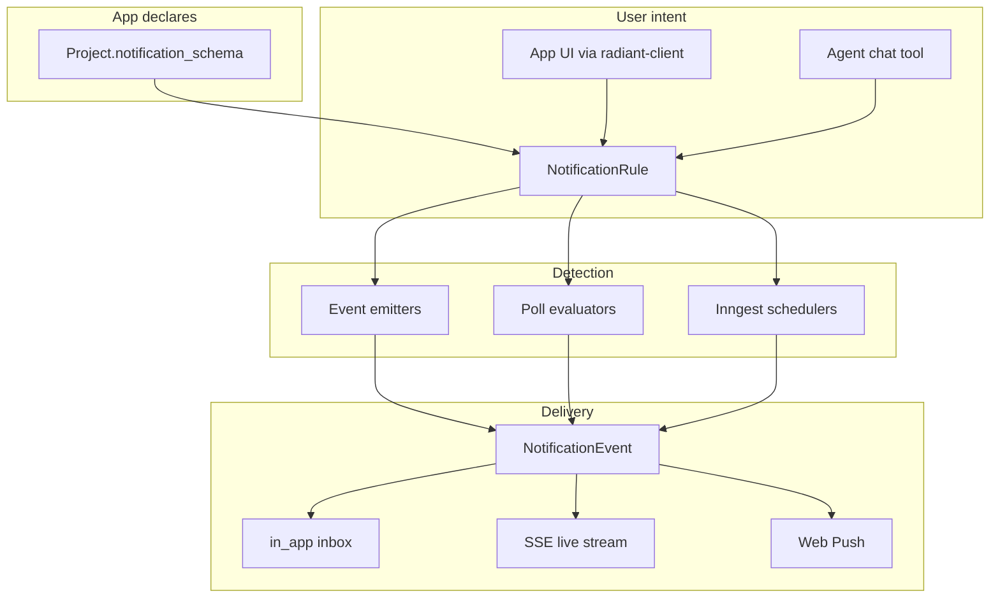

# Notifications platform — implementation TODO

Platform-wide notification system for Radiant: **any generated app** can declare alert types, users can set rules from **in-app UI** or **agent chat**, and delivery runs through a shared pipeline (**in-app inbox**, **SSE**, **Web Push**).

**Not flash-loan-specific.** Flash loan opportunity detection is **evaluator #1** (`deepbook.flash_loan_scanner`) — one consumer of the same API that price watchers, reminders, margin alerts, etc. will use later.

**Companion patterns**

- [app-builder-platform-TODO.md](./app-builder-platform-TODO.md) — projects, installations, `action_schema`, `radiant-client`
- [chat-memory-TODO.md](./chat-memory-TODO.md) — agent tools, session scope
- `backend/.agents/skills/inngest-radiant/SKILL.md` — durable delivery + poll evaluators + schedules

**North star:** User builds an app (or chats with the agent) → declares or selects a notification type → sets conditions → Radiant evaluates rules in the background → user gets alerted in-app and/or via OS push, even when the tab is closed.

---

## Product behavior

| Scenario                                                     | Expected behavior                                                                                      |
| ------------------------------------------------------------ | ------------------------------------------------------------------------------------------------------ |
| User builds a flash-loan dashboard with alert settings       | App calls `createNotificationRule()` from `radiant-client`; rule stored scoped to project/installation |
| User in chat: “Notify me when arb profit is above 0.5%”      | Agent calls `create_notification_rule` using pinned app’s `notification_schema`                        |
| User in chat: “Remind me tomorrow at 3pm to check positions” | Agent creates rule with `trigger_kind: schedule`, one-shot datetime                                    |
| User sets price alert in any generated app                   | Same API — app declares `price_crosses` type in `notification_schema`                                  |
| Opportunity detected while tab open                          | SSE pushes to client → toast + inbox entry + optional `Notification` API                               |
| Opportunity detected while tab closed                        | Web Push via service worker → click opens deep link into app                                           |
| User pauses or deletes an alert                              | Rule status → `paused` / deleted; evaluators skip it                                                   |
| Rate limit / quiet hours                                     | Delivery skipped with `skipped` status; no spam                                                        |

### Explicitly out of scope (v1)

- Email delivery (schema reserves `email` channel; implement later)
- SMS / Telegram / Discord webhooks
- Cross-user notifications (shared alerts) — v1 is per-user only
- User-defined arbitrary JavaScript evaluators in apps (server-side registry only)

---

## Design principles

1. **Separate intent from delivery** — `NotificationRule` = what to watch; `NotificationEvent` = what happened; `NotificationDelivery` = how it was sent.
2. **App-scoped, not domain-scoped** — every alert ties to `user_id` + optional `project_id` / `installation_id` (same as app actions and app data).
3. **Declarative types per app** — apps declare supported alert types in `Project.notification_schema` (parallel to `action_schema`).
4. **Multiple trigger models** — `event` (push-in), `poll` (Inngest cron + evaluator), `schedule` (one-shot / cron).
5. **Three delivery channels** — `in_app` inbox, SSE (live tab), `web_push` (tab closed / PWA).
6. **Pluggable evaluators** — flash loan scanner, price oracle, etc. register without schema migrations.

---

## Architecture

```text
┌─────────────────────────────────────────────────────────────────────────┐
│ Radiant (Next.js client + Express backend + Postgres + Inngest)         │
│                                                                         │
│  Entry points:                                                          │
│   • Generated app UI → radiant-client createNotificationRule()          │
│   • Agent chat → create_notification_rule tool                          │
│   • Platform settings → notification preferences + push subscribe       │
│                                                                         │
│  Detection:                                                             │
│   • Poll evaluators (Inngest cron) — flash loan, price, …               │
│   • Schedulers (Inngest sleep/cron) — reminders                         │
│   • Event emitters (internal API) — webhooks / future                   │
│                                                                         │
│  Delivery:                                                              │
│   • NotificationEvent → in_app inbox + SSE + web-push (web-push pkg)    │
└─────────────────────────────────────────────────────────────────────────┘
```



### Browser notification layers

| Layer                     | Tab state          | Mechanism                      | When to use                              |
| ------------------------- | ------------------ | ------------------------------ | ---------------------------------------- |
| In-app toasts + inbox     | Open               | REST + SSE                     | Live dashboard updates                   |
| Web Notifications API     | Open, backgrounded | `new Notification()` from page | Quick win before push infra              |
| Web Push + Service Worker | Closed / PWA       | Push API + VAPID + `sw.js`     | Time-sensitive alerts (flash loan, etc.) |

**Rule:** SSE/WebSocket when connection is active; Web Push when tab is closed. Push has higher latency — don’t use it as a substitute for live UI streaming.

### Permission UX (critical)

- **Never** call `Notification.requestPermission()` on page load.
- Use **double opt-in**: soft prompt (“Get alerted when…”) → user clicks → native browser prompt.
- Cold prompts ~5–15% acceptance; contextual prompts ~40–60%.

---

## Data model (Postgres / Prisma)

### New column on `Project`

| Column                | Type           | Notes                                                   |
| --------------------- | -------------- | ------------------------------------------------------- |
| `notification_schema` | JSONB nullable | App catalog of alert types — see TypeScript shape below |

### Enums

```prisma
enum NotificationChannelType {
  in_app
  web_push
  email
}

enum NotificationRuleStatus {
  active
  paused
  expired
  deleted
}

enum NotificationRuleSource {
  user
  agent
  app
  system
}

enum NotificationTriggerKind {
  event
  poll
  schedule
}

enum NotificationDeliveryStatus {
  pending
  sent
  failed
  skipped
  read
}
```

### `NotificationPushSubscription`

Web Push endpoint per browser/device.

| Column         | Type                 | Notes              |
| -------------- | -------------------- | ------------------ |
| `id`           | UUID PK              |                    |
| `user_id`      | FK → User            | CASCADE            |
| `endpoint`     | TEXT @unique         | Push service URL   |
| `p256dh`       | TEXT                 | Encryption key     |
| `auth`         | TEXT                 | Encryption secret  |
| `user_agent`   | TEXT nullable        |                    |
| `created_at`   | TIMESTAMPTZ          |                    |
| `last_used_at` | TIMESTAMPTZ nullable |                    |
| `revoked_at`   | TIMESTAMPTZ nullable | Soft revoke on 410 |

Index: `(user_id)`.

### `NotificationPreference`

Global per-user settings.

| Column              | Type                 | Notes                   |
| ------------------- | -------------------- | ----------------------- |
| `user_id`           | FK → User @id        |                         |
| `enabled`           | BOOLEAN default true | Master switch           |
| `timezone`          | TEXT default `UTC`   | Quiet hours             |
| `quiet_hours_start` | VARCHAR(5) nullable  | e.g. `22:00`            |
| `quiet_hours_end`   | VARCHAR(5) nullable  | e.g. `08:00`            |
| `max_per_hour`      | INT default 10       | Rate cap                |
| `default_channels`  | JSONB                | `["in_app","web_push"]` |
| `updated_at`        | TIMESTAMPTZ          |                         |

### `NotificationRule`

User intent — what to watch.

| Column                      | Type                  | Notes                                          |
| --------------------------- | --------------------- | ---------------------------------------------- |
| `id`                        | UUID PK               |                                                |
| `user_id`                   | FK → User             | Owner                                          |
| `project_id`                | UUID nullable         | Scope — mirrors AppData / app actions          |
| `installation_id`           | UUID nullable         | Installed app scope                            |
| `source`                    | ENUM                  | `user` \| `agent` \| `app` \| `system`         |
| `session_id`                | UUID nullable         | Provenance when created via chat               |
| `label`                     | VARCHAR(120) nullable | User-facing name                               |
| `notification_type`         | VARCHAR(120)          | Namespaced: `{app_id}.{type}`                  |
| `trigger_kind`              | ENUM                  | `event` \| `poll` \| `schedule`                |
| `condition`                 | JSONB                 | Validated against type’s `condition_schema`    |
| `schedule`                  | JSONB nullable        | For `schedule` trigger — see below             |
| `channels`                  | JSONB                 | `["in_app","web_push"]`                        |
| `status`                    | ENUM                  | `active` \| `paused` \| `expired` \| `deleted` |
| `cooldown_seconds`          | INT default 300       | Min gap between fires                          |
| `trigger_once`              | BOOLEAN default false | Auto-expire after first fire                   |
| `last_triggered_at`         | TIMESTAMPTZ nullable  |                                                |
| `expires_at`                | TIMESTAMPTZ nullable  |                                                |
| `created_at` / `updated_at` | TIMESTAMPTZ           |                                                |

Indexes:

- `(user_id, status)`
- `(project_id, notification_type, status)`
- `(installation_id, status)`
- `(notification_type, status, trigger_kind)`

### `NotificationEvent`

Immutable record of what happened.

| Column              | Type                           | Notes                                 |
| ------------------- | ------------------------------ | ------------------------------------- |
| `id`                | UUID PK                        |                                       |
| `user_id`           | FK → User                      |                                       |
| `rule_id`           | FK → NotificationRule nullable | Null = direct/system                  |
| `project_id`        | UUID nullable                  |                                       |
| `installation_id`   | UUID nullable                  |                                       |
| `notification_type` | VARCHAR(120)                   |                                       |
| `title`             | TEXT                           |                                       |
| `body`              | TEXT                           |                                       |
| `payload`           | JSONB                          | `deep_link`, `data`, `severity`, etc. |
| `idempotency_key`   | TEXT @unique nullable          | Dedupe                                |
| `created_at`        | TIMESTAMPTZ                    |                                       |

Indexes: `(user_id, created_at DESC)`, `(rule_id)`.

### `NotificationDelivery`

Per-channel delivery attempt.

| Column         | Type                   | Notes                                                  |
| -------------- | ---------------------- | ------------------------------------------------------ |
| `id`           | UUID PK                |                                                        |
| `event_id`     | FK → NotificationEvent |                                                        |
| `channel`      | ENUM                   | `in_app` \| `web_push` \| `email`                      |
| `status`       | ENUM                   | `pending` \| `sent` \| `failed` \| `skipped` \| `read` |
| `error`        | TEXT nullable          |                                                        |
| `external_ref` | TEXT nullable          | Push service message id                                |
| `sent_at`      | TIMESTAMPTZ nullable   |                                                        |
| `read_at`      | TIMESTAMPTZ nullable   |                                                        |

Indexes: `(event_id)`, `(status, channel)`.

---

## TypeScript contracts

File: `backend/src/services/notifications/notification-schema.types.ts`

### App notification catalog (`Project.notification_schema`)

```typescript
export const PROJECT_NOTIFICATION_SCHEMA_VERSION = 1 as const;

export type ProjectNotificationSchema = {
  schema_version: typeof PROJECT_NOTIFICATION_SCHEMA_VERSION;
  app_id: string;
  types: NotificationTypeDefinition[];
};

export type NotificationTypeDefinition = {
  /** Slug within app — full key: `${app_id}.${type}` */
  type: string;
  label: string;
  description: string;
  trigger_kind: "event" | "poll" | "schedule";
  condition_schema: AppActionParamField[]; // reuse from app-action.types
  default_channels: NotificationChannel[];
  poll_interval_seconds?: number;
  /** Backend registry key, e.g. "deepbook.flash_loan_scanner" */
  evaluator?: string;
  presentation?: {
    title_template?: string;
    body_template?: string;
    deep_link_template?: string;
  };
};

export type NotificationChannel = "in_app" | "web_push" | "email";
```

### Rule payloads

```typescript
export type NotificationRuleCondition = Record<string, unknown>;

export type NotificationSchedule =
  | { kind: "once"; at: string }
  | { kind: "cron"; expression: string; timezone: string }
  | { kind: "interval"; every_seconds: number; until?: string };

export type NotificationEventPayload = {
  deep_link?: string;
  data?: Record<string, unknown>;
  rule_id?: string;
  group_key?: string;
  severity?: "info" | "warning" | "critical";
};
```

### Full notification type key

```
{app_id}.{type}
```

Examples:

- `flash-arb-dashboard.opportunity_found`
- `price-watcher.price_crosses`
- `radiant.platform.agent_message` (platform registry — no project)

---

## Example app schemas

### Flash loan dashboard (evaluator #1 — not the platform)

```json
{
  "schema_version": 1,
  "app_id": "flash-arb-dashboard",
  "types": [
    {
      "type": "opportunity_found",
      "label": "Flash loan opportunity",
      "description": "Alert when a profitable flash loan path is detected",
      "trigger_kind": "poll",
      "poll_interval_seconds": 15,
      "evaluator": "deepbook.flash_loan_scanner",
      "default_channels": ["in_app", "web_push"],
      "condition_schema": [
        { "name": "min_profit_bps", "type": "number", "required": true },
        { "name": "pool_keys", "type": "array" },
        { "name": "max_gas_usd", "type": "number" }
      ],
      "presentation": {
        "title_template": "Flash arb {{profit_bps}} bps",
        "body_template": "{{route_summary}} — est. profit {{profit_usd}} USD",
        "deep_link_template": "/opportunities/{{opportunity_id}}"
      }
    }
  ]
}
```

### Generic price watcher

```json
{
  "schema_version": 1,
  "app_id": "price-watcher",
  "types": [
    {
      "type": "price_crosses",
      "label": "Price threshold",
      "trigger_kind": "poll",
      "evaluator": "price.oracle_watch",
      "default_channels": ["in_app", "web_push"],
      "condition_schema": [
        { "name": "asset", "type": "string", "required": true },
        { "name": "operator", "type": "string", "required": true },
        { "name": "price_usd", "type": "number", "required": true }
      ]
    }
  ]
}
```

### Agent chat → rule mapping

| User says                                       | Rule created                                                                                                   |
| ----------------------------------------------- | -------------------------------------------------------------------------------------------------------------- |
| “Notify me when flash arb profit is above 0.5%” | `notification_type: flash-arb-dashboard.opportunity_found`, `condition: { min_profit_bps: 50 }`                |
| “Remind me tomorrow at 3pm to check positions”  | `trigger_kind: schedule`, `schedule: { kind: "once", at: "..." }`                                              |
| “Alert me if SUI drops below $2”                | `notification_type: price-watcher.price_crosses`, `condition: { asset: "SUI", operator: "lte", price_usd: 2 }` |

---

## API surface

### User-facing REST

| Method | Path                                        | Purpose                                     |
| ------ | ------------------------------------------- | ------------------------------------------- |
| GET    | `/api/v1/notifications/preferences`         | User global settings                        |
| PATCH  | `/api/v1/notifications/preferences`         | Quiet hours, caps, default channels         |
| POST   | `/api/v1/notifications/push/subscribe`      | Save Web Push subscription                  |
| DELETE | `/api/v1/notifications/push/subscribe/:id`  | Unsubscribe                                 |
| GET    | `/api/v1/projects/:id/notifications/schema` | App notification catalog                    |
| GET    | `/api/v1/notifications/rules`               | List rules (filter by project/installation) |
| POST   | `/api/v1/notifications/rules`               | Create rule                                 |
| PATCH  | `/api/v1/notifications/rules/:id`           | Pause / update condition                    |
| DELETE | `/api/v1/notifications/rules/:id`           | Remove rule                                 |
| GET    | `/api/v1/notifications/events`              | In-app inbox                                |
| POST   | `/api/v1/notifications/events/:id/read`     | Mark read                                   |
| GET    | `/api/v1/notifications/stream`              | SSE for live tab updates                    |

Scoped variants (mirror app data / app actions):

- `POST /api/v1/projects/:id/notifications/rules`
- `POST /api/v1/installations/:id/notifications/rules`

### Internal (evaluators / Inngest only)

| Method | Path                                  | Purpose                                 |
| ------ | ------------------------------------- | --------------------------------------- |
| POST   | `/api/v1/internal/notifications/emit` | Idempotent emit → match rules → deliver |

Auth: service key or Inngest-only — not exposed to generated apps.

---

## `radiant-client` SDK additions

File: `backend/src/services/projects/radiant-client-template.ts`

```typescript
subscribeWebPush(): Promise<{ subscribed: boolean }>;

createNotificationRule(input: {
  notification_type: string;
  condition?: Record<string, unknown>;
  schedule?: NotificationSchedule;
  channels?: NotificationChannel[];
  label?: string;
  trigger_once?: boolean;
  expires_at?: string;
}): Promise<NotificationRule>;

listNotificationRules(): Promise<NotificationRule[]>;
deleteNotificationRule(ruleId: string): Promise<void>;
listNotifications(options?: { unread?: boolean; limit?: number }): Promise<NotificationEvent[]>;
markNotificationRead(eventId: string): Promise<void>;
```

Preview iframe: proxy notification API paths through existing `__RADIANT_PREVIEW_FETCH__` bridge (same as app data and actions).

Agent codegen prompt (add alongside `storeAppData` rules):

> Apps with user-configurable alerts MUST use `createNotificationRule()` / `listNotificationRules()` from `lib/radiant-client`. Declare types in the app’s `notification_schema` when generating. Never roll custom notification storage in `AppData` or `localStorage`.

---

## Agent tools

| Tool                       | Purpose                  |
| -------------------------- | ------------------------ |
| `create_notification_rule` | Chat: “notify me when…”  |
| `list_notification_rules`  | “What alerts do I have?” |
| `update_notification_rule` | Change threshold / pause |
| `delete_notification_rule` | Remove alert             |

Implementation notes:

- Validate input against `GET .../notifications/schema` for pinned app scope.
- Reuse `mergePinnedAppScopeIntoCallAppAction` pattern for `project_id` / `installation_id`.
- Set `source: agent`, `session_id` from chat context.

---

## Evaluator registry (backend, pluggable)

File: `backend/src/services/notifications/evaluators/registry.ts`

```typescript
export type NotificationEvaluator = {
  key: string;
  supported_types: string[];
  pollIntervalSeconds?: number;
  evaluate(
    activeRules: NotificationRule[],
  ): Promise<NotificationEmitCandidate[]>;
};

export type NotificationEmitCandidate = {
  rule_id: string;
  user_id: bigint;
  notification_type: string;
  title: string;
  body: string;
  payload: NotificationEventPayload;
  idempotency_key: string;
};
```

| Evaluator key                 | Types                                   | Notes                                      |
| ----------------------------- | --------------------------------------- | ------------------------------------------ |
| `deepbook.flash_loan_scanner` | `flash-arb-dashboard.opportunity_found` | **First consumer** — not platform-specific |
| `price.oracle_watch`          | `price-watcher.price_crosses`           | Future                                     |
| (platform)                    | `radiant.platform.*`                    | System alerts                              |

Inngest: `notification/evaluate-poll-rules` cron groups active `poll` rules by evaluator and calls `evaluate()`.

---

## Environment variables

```bash
# Web Push (Phase 3)
VAPID_PUBLIC_KEY=
VAPID_PRIVATE_KEY=
VAPID_SUBJECT=mailto:notifications@radiant.app

# Internal emit (Phase 2)
NOTIFICATIONS_INTERNAL_API_KEY=
```

---

## Suggested first milestone

Ship **Phase 0 + 1 + 2** first: schema + rule CRUD + in-app inbox + SSE. That unblocks agent chat (“notify me when…”) and in-app alerts without Web Push complexity. Then **Phase 3** (push) + **Phase 6** (flash loan evaluator).

---

## Implementation checklist

### Phase 0 — Schema & contracts

| Status | Task                   | Detail                                                      |
| ------ | ---------------------- | ----------------------------------------------------------- |
| [x]    | Prisma migration       | Add enums + tables above + `Project.notification_schema`    |
| [x]    | TypeScript types       | `notification-schema.types.ts`, Zod validators              |
| [x]    | Platform type registry | `radiant.platform.*` system types (server-only)             |
| [x]    | Condition validator    | Validate `rule.condition` against app `notification_schema` |
| [x]    | Unit tests             | Schema validation, type key parsing, schedule shapes        |

### Phase 1 — Rule CRUD (no push yet)

| Status | Task                                   | Detail                                                                        |
| ------ | -------------------------------------- | ----------------------------------------------------------------------------- |
| [x]    | `NotificationRuleService`              | create / list / update / delete with user + project + installation scope      |
| [x]    | `NotificationPreferenceService`        | get / patch defaults                                                          |
| [x]    | REST routes                            | `/api/v1/notifications/rules`, `/preferences`                                 |
| [x]    | Scoped routes                          | `/projects/:id/notifications/*`, `/installations/:id/notifications/*`         |
| [x]    | `GET .../notifications/schema`         | Return parsed `Project.notification_schema`                                   |
| [x]    | Agent tool: `create_notification_rule` | Chat entry point                                                              |
| [x]    | Agent tool: `list_notification_rules`  |                                                                               |
| [x]    | Agent tool: `update_notification_rule` | Pause, change condition                                                       |
| [x]    | Agent tool: `delete_notification_rule` |                                                                               |
| [x]    | Agent prompt                           | When user asks to be notified, use pinned app schema + tool — never hand-wave |
| [x]    | Pinned scope merge                     | Reuse pinned-app-scope helpers for project/installation ids                   |
| [x]    | Integration tests                      | CRUD, auth, scope isolation                                                   |

### Phase 2 — Delivery core (in-app + SSE)

| Status | Task                            | Detail                                                                                   |
| ------ | ------------------------------- | ---------------------------------------------------------------------------------------- |
| [x]    | `NotificationDeliveryService`   | Create event, fan out to channels                                                        |
| [x]    | In-app inbox API                | `GET /notifications/events`, unread filter                                               |
| [x]    | Mark read API                   | `POST /notifications/events/:id/read`                                                    |
| [x]    | SSE stream                      | `GET /notifications/stream` — reuse Redis pub/sub pattern from `agent-stream.service.ts` |
| [x]    | Rate limiting                   | `max_per_hour`, `cooldown_seconds`, quiet hours                                          |
| [x]    | Idempotency                     | `idempotency_key` on emit                                                                |
| [x]    | Inngest: `notification/deliver` | Triggered by `notification/emit` event                                                   |
| [x]    | Internal emit endpoint          | `POST /internal/notifications/emit` for evaluators                                       |
| [x]    | Delivery status logging         | `NotificationDelivery` rows per channel                                                  |
| [x]    | Unit tests                      | Cooldown, quiet hours, dedupe, skip when paused                                          |

### Phase 3 — Web Push

| Status | Task                        | Detail                                                   |
| ------ | --------------------------- | -------------------------------------------------------- |
| [ ]    | VAPID key generation script | Document in `.env.example`                               |
| [ ]    | Service worker              | `client/public/sw.js` — `push`, `notificationclick`      |
| [ ]    | SW registration             | Radiant shell — not generated apps (platform-owned)      |
| [ ]    | Soft opt-in UI              | Settings or first alert flow — no cold permission prompt |
| [ ]    | `subscribeWebPush()`        | Client helper + `POST /push/subscribe`                   |
| [ ]    | Push subscription CRUD      | `NotificationPushSubscription`                           |
| [ ]    | Server delivery             | `web-push` npm package, VAPID signing                    |
| [ ]    | Subscription cleanup        | Delete on 410/404 from push service                      |
| [ ]    | `pushsubscriptionchange`    | Re-subscribe in SW, POST new endpoint                    |
| [ ]    | Deep link on click          | Open `/app/projects/:id/run` or installation run URL     |

### Phase 4 — App integration (`radiant-client` + agent codegen)

| Status | Task                          | Detail                                                        |
| ------ | ----------------------------- | ------------------------------------------------------------- |
| [ ]    | SDK functions                 | Add to `radiant-client-template.ts`                           |
| [ ]    | E2B scaffold sync             | Mirror in `backend/docker/e2b/scaffold/lib/radiant-client.ts` |
| [ ]    | Preview proxy paths           | Notification routes in artifact preview bridge                |
| [ ]    | Agent runtime prompt          | Apps with alerts MUST use SDK (like `storeAppData` rule)      |
| [ ]    | `generate_app` / `edit_app`   | Agent can add notification settings UI wired to SDK           |
| [ ]    | Template example              | Flash loan dashboard includes alert panel                     |
| [ ]    | Template example              | Price watcher / reminder app patterns                         |
| [ ]    | Persist `notification_schema` | On project when agent generates alert-capable app             |

### Phase 5 — Schedules (time-based alerts)

| Status | Task               | Detail                                                 |
| ------ | ------------------ | ------------------------------------------------------ |
| [ ]    | Schedule validator | `once`, `cron`, `interval` shapes                      |
| [ ]    | Inngest scheduler  | Cron or `step.sleepUntil` for `trigger_kind: schedule` |
| [ ]    | One-shot reminders | Agent: “notify me at 3pm”                              |
| [ ]    | Recurring rules    | Daily summary / weekly digest                          |
| [ ]    | Auto-expire        | `trigger_once` → `status: expired` after fire          |
| [ ]    | Timezone           | Respect `NotificationPreference.timezone`              |

### Phase 6 — Poll evaluators (flash loan = first consumer)

| Status | Task                              | Detail                                                          |
| ------ | --------------------------------- | --------------------------------------------------------------- |
| [ ]    | Evaluator registry                | Register / lookup by `evaluator` key                            |
| [ ]    | Inngest cron                      | `notification/evaluate-poll-rules` — batch by evaluator         |
| [ ]    | **`deepbook.flash_loan_scanner`** | First evaluator — scans opportunities, matches rules            |
| [ ]    | Flash loan app schema             | Seed `notification_schema` on flash-arb template                |
| [ ]    | Presentation templates            | Title/body/deep_link from matched opportunity payload           |
| [ ]    | E2E test                          | Rule → scanner match → event → inbox (+ push when Phase 3 done) |

### Phase 7 — Event-driven evaluators (optional, high scale)

| Status | Task                  | Detail                                                  |
| ------ | --------------------- | ------------------------------------------------------- |
| [ ]    | `trigger_kind: event` | External emit with `notification_type`                  |
| [ ]    | Rule matcher          | Filter incoming events against active rules’ conditions |
| [ ]    | Webhook ingress       | Optional authenticated webhook → internal emit          |

### Phase 8 — Radiant shell UX

| Status | Task                          | Detail                                          |
| ------ | ----------------------------- | ----------------------------------------------- |
| [ ]    | Notification bell             | `AppShell` — unread badge                       |
| [ ]    | Inbox drawer                  | List events, mark read, click → deep link       |
| [ ]    | Notification preferences page | Quiet hours, disable push, max per hour         |
| [ ]    | Per-app settings              | Section in project run view or app preview      |
| [ ]    | Toast on SSE event            | Optional sound for critical severity            |
| [ ]    | `useNotificationStream` hook  | Client SSE subscriber (mirror `useAgentStream`) |

### Phase 9 — Hardening & compliance

| Status | Task                 | Detail                                                        |
| ------ | -------------------- | ------------------------------------------------------------- |
| [ ]    | Load tests           | Emit path under burst                                         |
| [ ]    | Observability        | Delivery success rate, evaluator latency, stale subscriptions |
| [ ]    | Account deletion     | Cascade notification data                                     |
| [ ]    | GDPR export          | Include rules + events in user data export                    |
| [ ]    | Email channel stub   | Enum + delivery handler placeholder                           |
| [ ]    | Safari iOS PWA notes | Document Add to Home Screen requirement for push              |

---

## How entry points converge

| Entry point           | Creates                                           | Uses                                     |
| --------------------- | ------------------------------------------------- | ---------------------------------------- |
| User in generated app | `NotificationRule` via `createNotificationRule()` | App’s `notification_schema`              |
| User in chat          | `NotificationRule` via agent tool                 | Pinned app scope + schema                |
| Backend evaluator     | `NotificationEvent` via internal emit             | Matches active rules by type + condition |
| Scheduled job         | `NotificationEvent` via Inngest                   | `schedule` on rule                       |

All paths hit the **same delivery pipeline** (`NotificationEvent` → channel handlers).

---

## File layout (target)

```text
backend/src/
├── services/notifications/
│   ├── notification-schema.types.ts
│   ├── notification-schema.service.ts
│   ├── notification-rule.service.ts
│   ├── notification-preference.service.ts
│   ├── notification-delivery.service.ts
│   ├── notification-push.service.ts
│   ├── notification-stream.service.ts
│   ├── evaluators/
│   │   ├── registry.ts
│   │   └── deepbook-flash-loan-scanner.evaluator.ts
│   └── tools/
│       ├── create-notification-rule.tool.ts
│       ├── list-notification-rules.tool.ts
│       ├── update-notification-rule.tool.ts
│       └── delete-notification-rule.tool.ts
├── api/routes/notifications/
│   └── notifications.router.ts
└── inngest/functions/
    ├── notification-deliver.ts
    ├── notification-evaluate-poll.ts
    └── notification-schedule.ts

client/src/
├── hooks/useNotificationStream.ts
├── components/app/NotificationBell.tsx
├── components/app/NotificationInbox.tsx
├── lib/notifications-api.ts
└── public/sw.js
```

---

## Related code (existing patterns to reuse)

| Pattern                            | Location                                             | Reuse for                       |
| ---------------------------------- | ---------------------------------------------------- | ------------------------------- |
| SSE + Redis pub/sub                | `backend/src/services/agent/agent-stream.service.ts` | Notification live stream        |
| App scope (project / installation) | `pinned-app-scope.types.ts`, app actions             | Rule scope + agent tools        |
| App catalog schema                 | `app-action-schema.types.ts`                         | `notification_schema` shape     |
| Platform client SDK                | `radiant-client-template.ts`                         | `createNotificationRule()` etc. |
| Preview API proxy                  | `artifact-preview-bridge.ts`                         | Iframe notification calls       |
| Inngest durable jobs               | `backend/src/inngest/functions/`                     | Deliver, poll, schedule         |
| Agent tools                        | `backend/src/services/agent/tools.ts`                | Register notification tools     |

---

## Security notes

- Store push subscriptions per authenticated user only.
- Encrypt all Web Push payloads (VAPID + `web-push` library).
- Never expose internal emit endpoint to generated apps.
- Rate-limit rule creation and emit per user.
- Log opt-in timestamps for compliance.
- CSRF-safe: cookie auth + same-origin for subscribe endpoints.

---

## Browser support reference

| Browser                 | Web Push           | Notes                                    |
| ----------------------- | ------------------ | ---------------------------------------- |
| Chrome / Edge / Firefox | Yes                | Full support                             |
| Safari desktop          | Yes                |                                          |
| Safari iOS              | PWA only           | Add to Home Screen since iOS 16.4        |
| Payload limit           | ~4KB (~2KB Safari) | Send IDs + summary; fetch details in-app |
