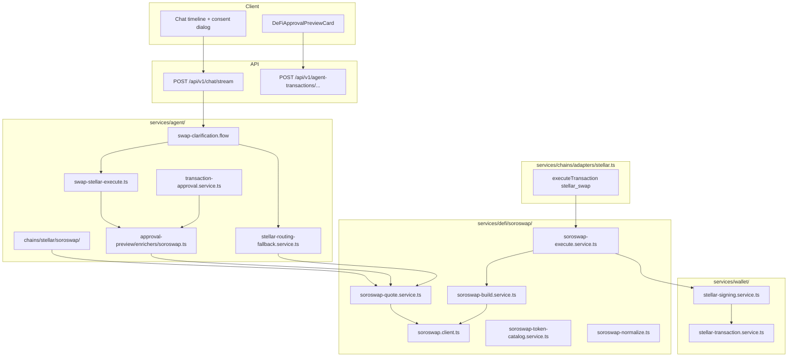

# Soroswap integration — Stellar same-chain swaps + routing fallback

Stellar **same-chain swap** provider via [Soroswap API](https://api.soroswap.finance/docs). Soroswap is the **only** swap venue for `chain_id: stellar` in v1. Agent tools stay unchanged (`query_chain`, `execute_transaction`); provider logic lives in `services/defi/soroswap/` and `services/agent/chains/stellar/`.

**References**

- Soroswap API: [api.soroswap.finance/docs](https://api.soroswap.finance/docs)
- Radiant Stellar adapter (Phase 0): `backend/src/infrastructure/stellar/`, `services/chains/adapters/stellar.ts`
- Privy Tier 2 Stellar signing: [docs.privy.io/recipes/use-tier-2](https://docs.privy.io/recipes/use-tier-2)
- Parent doc: [defi-providers-integration-TODO.md](./defi-providers-integration-TODO.md) § Phase 2
- Cross-chain fallback pattern (mirror): [squid-protocol-integration-TODO.md](./squid-protocol-integration-TODO.md)
- Error mapping pattern: `[squid.errors.ts](../backend/src/services/defi/squid/squid.errors.ts)`, `[cache.ts](../backend/src/services/defi/cache.ts)`
- Routing schema export: [swap-bridge-routing-schema.json](./swap-bridge-routing-schema.json)

**Design principles**

1. **REST-first** — Soroswap HTTP in `services/defi/soroswap/` only; no provider SDK in `src/api/`.
2. **Allowlist first** — reject out-of-scope tokens/chains before any Soroswap HTTP call (`supported-tokens.ts`).
3. **Same agent tools** — no `soroswap_*` top-level agent tools; use `stellar_swap_quote` / `stellar_swap` via chain plugin.
4. **Privy signing only** — server builds unsigned XDR (`POST /quote/build`); Privy `rawSign` + broadcast (mirror existing Stellar adapter).
5. **Stellar-only scope** — Soroswap does not bridge; `bridge_provider: null` on Stellar in v1.
6. **No silent cross-chain** — when user intent implies Stellar tokens on the wrong chain, offer a **Stellar swap fallback** with consent (mirror Squid `liquidity_fallback_offered`).
7. **Re-quote at approval** — cached quotes OK for `query_chain`; `execute_transaction` must refresh or verify `expires_at`.

**Network:** `mainnet` first; `testnet` via `SOROSWAP_NETWORK=testnet` + matching Horizon/Soroban env.

---

## Product behavior


| Scenario                                                                         | Expected behavior                                                                                                                                                                                                     |
| -------------------------------------------------------------------------------- | --------------------------------------------------------------------------------------------------------------------------------------------------------------------------------------------------------------------- |
| User asks “swap 50 XLM to USDC on Stellar”                                       | `token_resolve` → `stellar_swap_quote` (Soroswap) → approval → `stellar_swap` → Privy `rawSign` → Horizon/Soroban submit → stream steps                                                                               |
| User asks “swap 50 XLM to USDC” (chain unspecified; Stellar enabled)             | Clarification may ask network; if Stellar is chosen or only Stellar has both tokens → Soroswap primary path                                                                                                           |
| Same-chain Stellar swap; Soroswap returns quote                                  | Unchanged primary — quote → approval → execute → stream steps                                                                                                                                                         |
| Soroswap returns **no route** / empty pools (`SOROSWAP_ROUTE_NOT_FOUND`)         | User-facing: “No swap route on Stellar right now” — suggest different amount, slippage, or token pair; **no** silent retry on another Stellar DEX in v1 (Soroswap API already aggregates Soroswap / Phoenix / Aqua)   |
| User asks “swap 50 XLM to USDC on Base”                                          | `CROSS_ECOSYSTEM_NOT_SUPPORTED` at validation — **then** offer **Stellar routing fallback** if both tokens exist on Stellar (`stellar_routing_fallback_offered`)                                                      |
| User selects EVM network but input/output are Stellar-only (`getChainsForToken`) | Do **not** call Li-Fi/Sushi. Emit `stellar_routing_fallback_offered` → timeline **“Swap on Stellar?”** → consent dialog                                                                                               |
| Consent dialog copy (short)                                                      | “This swap isn’t available on {selected network}. Swap on Stellar instead?” **Yes / No** — do not name Soroswap in v1 copy                                                                                            |
| User taps **Yes** on Stellar routing fallback                                    | Backend calls `getSoroswapQuote` with `chain_id: stellar` → new approval dialog with pay/receive → execute                                                                                                            |
| User taps **No**                                                                 | Cancel cleanly; explain swap wasn’t submitted; no Soroswap API call                                                                                                                                                   |
| Swap intent fast path (`swap-clarification.flow`) with `chainId: stellar`        | Route to `executeResolvedStellarSwap` (mirror DeepBook / Li-Fi fast paths) — **not** generic “ask me to bridge” stub                                                                                                  |
| Bridge intent involving Stellar (e.g. “bridge XLM to Base”)                      | `CROSS_ECOSYSTEM_NOT_SUPPORTED` — explain Stellar has no Li-Fi bridge in v1; optionally offer same-token swap on Stellar only if user meant swap                                                                      |
| Cross-chain Li-Fi / Squid route includes Stellar leg                             | Squid may **quote** `stellar-mainnet` but `isSquidSdkExecuteSupported` blocks Stellar execute — do **not** offer Squid for Stellar; offer Soroswap for **Stellar-only** leg or honest “cross-ecosystem not available” |
| DeepBook / Sui / EVM same-chain swaps                                            | **Unchanged** — Soroswap never intercepts non-Stellar chains                                                                                                                                                          |
| Unfunded Stellar account / missing USDC trustline                                | Actionable errors before or at build/simulate — see [Stellar account prerequisites](#stellar-account-prerequisites-trustline-reserve-unfunded)                                                                        |


### Soroswap primary vs routing fallback


| Role                 | When                                                                             | Provider                                                                        |
| -------------------- | -------------------------------------------------------------------------------- | ------------------------------------------------------------------------------- |
| **Primary**          | `chain_id === "stellar"`, same-chain, both tokens allowlisted                    | Soroswap (`stellar-soroswap`)                                                   |
| **Routing fallback** | User selected wrong chain / cross-ecosystem mismatch, but both tokens on Stellar | Soroswap after user consent (`stellar_routing_fallback_offered`)                |
| **Not used**         | Cross-chain Stellar ↔ EVM/Sui/Solana                                             | Li-Fi / Squid only (Stellar excluded from Li-Fi; Squid Stellar execute blocked) |
| **Not used**         | Secondary aggregator if Soroswap fails                                           | v1 — user message only                                                          |


### UX: execution timeline states


| Step id (proposed)      | Label                    | When                                                 |
| ----------------------- | ------------------------ | ---------------------------------------------------- |
| `quote` / existing      | Resolving swap…          | Soroswap quote in progress                           |
| `stellar-routing-offer` | Checking Stellar option… | Waiting for user consent after wrong-chain detection |
| `soroswap-quote`        | Getting Stellar quote…   | After Yes; Soroswap `POST /quote` in progress        |
| `stellar-build`         | Building transaction…    | `POST /quote/build` + simulate                       |
| `stellar-sign`          | Awaiting signature…      | Privy approval dialog open                           |
| `stellar-submit`        | Submitted                | Post-approve broadcast                               |
| `stellar-confirm`       | Confirming…              | Poll Horizon / Soroban until success/fail            |
| `complete`              | Complete / Failed        | Terminal                                             |


---

## V1 supported corridors (Stellar allowlist)

Intersect Soroswap `/api/tokens` with Radiant allowlist in `supported-tokens.ts`:


| Symbol   | Kind                        | Soroswap input                              | Notes                                                   |
| -------- | --------------------------- | ------------------------------------------- | ------------------------------------------------------- |
| **XLM**  | native                      | Native / contract from catalog              | 7 decimals (stroops); reserve for fees + trustlines     |
| **USDC** | `stellar_classic` + Soroban | Classic `USDC:{issuer}` or Soroban contract | Default issuer `GA5ZSEJY…`; Soroban `CBBMHZEZ…` via env |


**Supported pairs (v1):** any combination of `{XLM, USDC}` on Stellar mainnet (both directions).

**Not in v1 allowlist:** arbitrary Soroban tokens from `/api/tokens` until added to `V1_ALLOWED_SYMBOLS.stellar` and `buildStellarToken()`.

### Relationship to Squid Stellar


| Aspect             | Squid                                                                   | Soroswap                                                         |
| ------------------ | ----------------------------------------------------------------------- | ---------------------------------------------------------------- |
| Stellar in Radiant | `SQUID_STELLAR_CHAIN_ID = "stellar-mainnet"` in `squid-chains.ts`       | `chain_id: "stellar"`                                            |
| Cross-chain quotes | May appear in Squid `getRoute` (dev/test corridors)                     | **No** — same-chain only                                         |
| Execute            | `isSquidSdkExecuteSupported` returns **false** for `stellar`            | **Yes** — primary Stellar execute path                           |
| User-facing        | Squid fallback copy is for Li-Fi liquidity on **non-Stellar** corridors | Stellar swaps always Soroswap; never “alternate route via Squid” |
| Bridge             | Squid may list Stellar in chain catalog                                 | Stellar `bridge_provider: null` — no bridge in v1                |


When a user accepts a Squid route that would require Stellar signing, block at execute with clear copy and point to Stellar-only Soroswap swap if applicable.

---

## Token schema integration points

Radiant routing is derived from these modules — Soroswap must use them consistently (never hardcode parallel token lists).


| Module                                 | Soroswap usage                                                                                                                                                                                                   |
| -------------------------------------- | ---------------------------------------------------------------------------------------------------------------------------------------------------------------------------------------------------------------- |
| `supported-tokens.ts`                  | `resolveTokenSymbol("stellar", symbol)` → `SupportedToken` with `stellar_asset_code`, `stellar_issuer`, Soroban `address`; `getSupportedChains()` → `swap_provider: "stellar-soroswap"`, `bridge_provider: null` |
| `token-capabilities.ts`                | Add `XLM` to `TOKEN_IDENTITIES` (`chain_native`, `default_receive: "prompt"`); USDC already `fungible_by_symbol`. Stellar excluded from `getBridgeKnownSymbols()` because `bridge_provider` is null              |
| `token-chain-affinity.ts`              | `getChainsForToken("XLM")` → `[{ chainId: "stellar", … }]`. Extend `detectCrossChainSwapIntent` **or** add `detectStellarRoutingFallback()` when tokens are Stellar-only but selected chain is not Stellar       |
| `swap-registry.ts`                     | `getProviderForSwap({ chain_id: "stellar" })` → `stellar-soroswap`; cross-chain with Stellar → `CROSS_ECOSYSTEM_NOT_SUPPORTED` unless Li-Fi pair (Stellar never is)                                              |
| `docs/swap-bridge-routing-schema.json` | `stellar` entry: `same_chain_swaps` with `stellar-soroswap`; `stellar_setup.gaps_for_agent_bridge` documents bridge null; re-export after token/schema changes                                                   |


**Validation rules before Soroswap HTTP:**

1. `validateTokenAllowed("stellar", symbol)` for both legs.
2. `assertCrossEcosystemSupported` — reject `stellar → evm` at API boundary.
3. Map `SupportedToken` → Soroswap asset id (classic code+issuer or Soroban contract).

---

## Stellar account prerequisites (trustline, reserve, unfunded)

Document in prompts, errors, and approval preview — not optional UX polish.


| Condition                     | Detection                                                 | User-facing behavior                                                                                                     |
| ----------------------------- | --------------------------------------------------------- | ------------------------------------------------------------------------------------------------------------------------ |
| **Unfunded account**          | Horizon `404` on account load; simulation `op_no_account` | “Fund your Stellar wallet with XLM first (minimum reserve applies).” Link to deposit dialog                              |
| **Base reserve**              | ~1 XLM minimum balance + ~0.5 XLM per trustline/subentry  | Warn when swap would leave balance below reserve; block if insufficient for fee                                          |
| **Missing USDC trustline**    | Simulation `op_no_trust` / `trustline_missing`            | “Open a USDC trustline on Stellar first.” Optional: Soroswap gasless trustline when `SOROSWAP_SPONSOR_SECRET` configured |
| **Insufficient XLM for fees** | Simulation / fee estimate                                 | `INSUFFICIENT_BALANCE` with stroops/fees in `details`                                                                    |
| **Destination trustline**     | N/A for agent wallet swaps (same account)                 | Document for future P2P sends                                                                                            |


**Amounts:** API uses **stroops** (1 XLM = 10^7 stroops). Display human XLM/USDC in approval UI; store atomic strings in execute params.

---

## Error handling (`soroswap.errors.ts`)

Mirror `[squid.errors.ts](../backend/src/services/defi/squid/squid.errors.ts)` and `[lifi.errors.ts](../backend/src/services/defi/lifi/lifi.errors.ts)`: one module maps Soroswap HTTP + build/simulate failures → Radiant `AppError`; execute path uses `mapSoroswapExecuteError` with fallback to `[mapAgentToolError](../backend/src/utils/agent-tool-errors.ts)`.

**Soroswap API sources**

- OpenAPI / interactive reference: [api.soroswap.finance/docs](https://api.soroswap.finance/docs) (ReDoc; spec is loaded client-side).
- Product docs: [docs.soroswap.finance/soroswap-api](https://docs.soroswap.finance/soroswap-api), [quickstart](https://docs.soroswap.finance/readme/getting-started/quickstart).
- SDK error shape (authoritative for HTTP bodies): `[@soroswap/sdk` `APIError](https://github.com/soroswap/sdk)` — `{ message, statusCode, timestamp, path? }`. The SDK rejects with `error.response.data` on 4xx/5xx; Radiant’s REST client should parse the same fields from `fetch` responses.

**Implementation notes**

- Export `SOROSWAP_ERROR_CODES` const array (mirror `SQUID_ERROR_CODES`).
- `sanitizeMessage()` — strip `Authorization` / API key fragments; cap at 500 chars (mirror Squid).
- `extractSoroswapErrorMessage(err)` — walk `response.data.message`, top-level `message`, axios-style `response.status`, plain `Error.message`.
- `mapSoroswapError(err)` — quote/catalog/health HTTP only.
- `mapSoroswapExecuteError(err)` — build, simulate, sign, submit; delegate Stellar RPC failures to `[mapStellarSimulationError](../backend/src/infrastructure/stellar/errors.ts)` / `mapStellarSubmitError` when not Soroswap HTTP.
- Extend `guidanceForErrorCode` in `[agent-tool-errors.ts](../backend/src/utils/agent-tool-errors.ts)` for every `SOROSWAP_*` code (mirror Squid/Li-Fi entries).
- Agent tool results use `toolErrorToModelContent` — **user-facing** `AppError.message` vs **agent-facing** `agent_instruction` from `guidanceForErrorCode`; never pass raw Soroswap JSON to the model.
- Client: strip provider noise in `[sanitize-tool-error.ts](../client/src/lib/sanitize-tool-error.ts)` (Phase 8.4).

### HTTP / API error → `AppError` mapping


| Soroswap signal                                | HTTP / body heuristic                                                                                               | Radiant code                                                                                  | HTTP status |
| ---------------------------------------------- | ------------------------------------------------------------------------------------------------------------------- | --------------------------------------------------------------------------------------------- | ----------- |
| No route / empty pools / cannot route          | `404`; message `/no route|route not found|no path|empty route/i`                                                    | `SOROSWAP_ROUTE_NOT_FOUND`                                                                    | 404         |
| Insufficient liquidity / amount too large      | `400` or `404`; message `/insufficient liquidity|not enough liquidity|reduce.*amount|price impact|amount exceeds/i` | `SOROSWAP_ROUTE_NOT_FOUND`                                                                    | 404         |
| Invalid / unknown token                        | `400`; message `/invalid token|unknown asset|asset not found|not supported/i`                                       | `SOROSWAP_VALIDATION_ERROR` or `SOROSWAP_ROUTE_NOT_FOUND` when clearly “token not in catalog” | 400 / 404   |
| Bad quote params (amount, slippage, tradeType) | `400`; message `/validation|invalid|required|must be/i` (and not liquidity/route)                                   | `SOROSWAP_VALIDATION_ERROR`                                                                   | 400         |
| Missing / invalid API key                      | `401`, `403`; message `/unauthorized|forbidden|invalid api key|api key/i`                                           | `SOROSWAP_UNAUTHORIZED`                                                                       | 401 / 403   |
| Rate limit                                     | `429`; message `/rate limit|too many requests/i`                                                                    | `SOROSWAP_RATE_LIMITED`                                                                       | 429         |
| Upstream / indexer down                        | `5xx`; no liquidity/route substring                                                                                 | `SOROSWAP_UNAVAILABLE`                                                                        | 503         |
| Timeout / network                              | `ETIMEDOUT`, `ECONNRESET`, fetch failed, no response body                                                           | `SOROSWAP_UNAVAILABLE`                                                                        | 503         |
| Expired or stale quote at build                | `400` on `POST /quote/build`; message `/expired|stale|quote.*invalid|quote not found/i`                             | `SOROSWAP_QUOTE_EXPIRED`                                                                      | 400         |
| Build failure (generic)                        | `400`/`422` on build without expired heuristic                                                                      | `SOROSWAP_VALIDATION_ERROR`                                                                   | 400         |


**Pre-HTTP Radiant validation** (no Soroswap call): allowlist miss → `VALIDATION_ERROR`; cross-ecosystem → `CROSS_ECOSYSTEM_NOT_SUPPORTED`; Soroswap disabled → `DEFI_ROUTE_NOT_FOUND` or dedicated config error.

### On-chain / simulate errors (build & execute)

These often surface **after** a successful quote, via Soroban simulation or Horizon — not in Soroswap HTTP JSON. Map in `mapSoroswapExecuteError` by delegating to Stellar helpers first:


| Stellar signal                                  | Radiant code           | Notes                                                                                                                                              |
| ----------------------------------------------- | ---------------------- | -------------------------------------------------------------------------------------------------------------------------------------------------- |
| `op_no_trust`, trustline missing                | `INSUFFICIENT_BALANCE` | User message from `[stellar/errors.ts](../backend/src/infrastructure/stellar/errors.ts)`; optional gasless trustline via `SOROSWAP_SPONSOR_SECRET` |
| Unfunded account (`op_no_account`, Horizon 404) | `INSUFFICIENT_BALANCE` | “Fund your Stellar wallet with XLM first…”                                                                                                         |
| Below base reserve / insufficient XLM for fees  | `INSUFFICIENT_BALANCE` | Include reserve hint in `details`                                                                                                                  |
| Slippage / min-out not met on simulate          | `SLIPPAGE_EXCEEDED`    | Re-quote; do not cache failed build                                                                                                                |
| `tx_failed`, auth, bad sequence                 | `TRANSACTION_FAILED`   | Excerpt in `details`; user message plain language                                                                                                  |


### User-facing vs agent-facing messages


| Code                               | User-facing (`AppError.message`)                                                       | Agent-facing (`guidanceForErrorCode`)                                                                                                                                      |
| ---------------------------------- | -------------------------------------------------------------------------------------- | -------------------------------------------------------------------------------------------------------------------------------------------------------------------------- |
| `SOROSWAP_ROUTE_NOT_FOUND`         | “No swap route on Stellar right now. Try a different amount, slippage, or token pair.” | Explain no Stellar liquidity for pair/amount; suggest smaller amount, adjust slippage, or confirm XLM/USDC on Stellar; **do not** call Li-Fi/Squid for Stellar same-chain. |
| `SOROSWAP_VALIDATION_ERROR`        | Sanitized API message or “Invalid swap request on Stellar.”                            | Re-run `stellar_swap_quote` with corrected stroops amount, allowlisted symbols, and `tradeType`.                                                                           |
| `SOROSWAP_UNAUTHORIZED`            | “Stellar swap service is misconfigured.” (no key details)                              | Operator issue — do not retry in a loop; suggest trying again later.                                                                                                       |
| `SOROSWAP_RATE_LIMITED`            | “Stellar quotes are temporarily rate limited; try again shortly.”                      | Wait a few seconds; retry `stellar_swap_quote` once.                                                                                                                       |
| `SOROSWAP_UNAVAILABLE`             | “Stellar swap service is temporarily unavailable.”                                     | Retry shortly; if persistent, stop and explain.                                                                                                                            |
| `SOROSWAP_QUOTE_EXPIRED`           | “This quote expired. Getting a fresh quote…” (enricher may auto re-quote)              | Re-run `stellar_swap_quote` before `stellar_swap`; never reuse stale `quote_id`.                                                                                           |
| `INSUFFICIENT_BALANCE` (trustline) | “Open a USDC trustline on Stellar first.”                                              | Explain trustline/reserve; link to funding/trustline UX if available.                                                                                                      |
| `INSUFFICIENT_BALANCE` (unfunded)  | “Fund your Stellar wallet with XLM first (minimum reserve applies).”                   | Suggest deposit dialog / minimum reserve.                                                                                                                                  |
| `SLIPPAGE_EXCEEDED`                | “Price moved too much for this swap. Try again with a fresh quote.”                    | Re-quote; optionally suggest higher slippage within guardrails.                                                                                                            |
| `CROSS_ECOSYSTEM_NOT_SUPPORTED`    | “Cross-ecosystem bridging isn’t available for this pair.”                              | If tokens exist on Stellar, backend may offer routing fallback — wait for user consent; do not call Soroswap until accepted.                                               |


### Fallback vs hard fail vs retry


| Condition                                                                                                    | Behavior                                                                                          | Timeline / outcome                                                |
| ------------------------------------------------------------------------------------------------------------ | ------------------------------------------------------------------------------------------------- | ----------------------------------------------------------------- |
| `CROSS_ECOSYSTEM_NOT_SUPPORTED` or wrong `chainId` with Stellar-only tokens (`detectStellarRoutingFallback`) | `**stellar_routing_fallback_offered`** — consent dialog; **no** Soroswap HTTP until user taps Yes | Step `stellar-routing-offer` → on Yes → `soroswap-quote`          |
| `SOROSWAP_ROUTE_NOT_FOUND` on **primary** Stellar path (`chain_id: stellar`)                                 | **Hard fail** — user message only; **no** Li-Fi/Squid secondary fallback in v1                    | Step `quote` → **Failed**; agent explains alternatives            |
| `SOROSWAP_ROUTE_NOT_FOUND` during fallback **after** user accepted Stellar routing                           | **Hard fail** — “No Stellar route either”                                                         | `soroswap-quote` → **Failed**                                     |
| `SOROSWAP_RATE_LIMITED` / transient `SOROSWAP_UNAVAILABLE`                                                   | **Retry** in `soroswap.client.ts` — exponential backoff, max 3 attempts, then surface error       | Step stays in progress during retries; fail terminal if exhausted |
| `SOROSWAP_UNAUTHORIZED`                                                                                      | **Hard fail** — operator/config; no user retry loop                                               | Failed; log alert                                                 |
| `SOROSWAP_QUOTE_EXPIRED` at approval/execute                                                                 | **Re-quote** (`resolveSoroswapQuoteForExecute`, approval enricher) — not routing fallback         | Enricher refresh → new approval countdown                         |
| Trustline / unfunded / slippage at build                                                                     | **Hard fail** with actionable copy; slippage may trigger silent re-quote once in enricher         | `stellar-build` → **Failed** or re-quote branch                   |
| User taps **No** on routing fallback                                                                         | **Clean cancel** — no Soroswap call                                                               | Skipped / cancelled                                               |


Mirror Squid `[isLiquidityFallbackEligible](../backend/src/services/defi/cross-chain/cross-chain-fallback.ts)`: implement `isStellarRoutingFallbackEligible(err)` — eligible for `**CROSS_ECOSYSTEM_NOT_SUPPORTED`** and chain/token mismatch only; **ineligible** for `SOROSWAP_RATE_LIMITED`, `SOROSWAP_UNAUTHORIZED`, `SOROSWAP_VALIDATION_ERROR`, `INSUFFICIENT_BALANCE`, `SLIPPAGE_EXCEEDED`, wallet errors.

**Clarification gaps** (Phase 9): when `getChainsForToken` returns only Stellar, `[swap-clarification-gaps.ts](../backend/src/services/agent/swap/swap-clarification-gaps.ts)` should surface Stellar in chain gap **before** a doomed EVM quote. Bridge gaps → `CROSS_ECOSYSTEM_NOT_SUPPORTED` copy, optional routing fallback offer in execute path (not in clarification JSON alone).

**Execution timeline failure states**


| Failed step                          | Typical code                                                          | Client label                    |
| ------------------------------------ | --------------------------------------------------------------------- | ------------------------------- |
| `quote` / `soroswap-quote`           | `SOROSWAP_*`, `DEFI_ROUTE_NOT_FOUND`                                  | Failed — no route / unavailable |
| `stellar-routing-offer`              | user rejected                                                         | Cancelled / skipped             |
| `stellar-build`                      | `SOROSWAP_QUOTE_EXPIRED`, `INSUFFICIENT_BALANCE`, `SLIPPAGE_EXCEEDED` | Failed — build blocked          |
| `stellar-sign`                       | `STELLAR_SIGNING_FAILED`                                              | Failed — signature              |
| `stellar-submit` / `stellar-confirm` | `TRANSACTION_FAILED`                                                  | Failed — on-chain               |


---

## Caching & singleflight (`soroswap-cache.ts` + `cache.ts`)

**Requirement:** Not every identical Soroswap request hits the network. The **first** request for a cache key performs HTTP and populates Redis (with TTL jitter); **concurrent** identical in-flight requests share one fetch (**singleflight**); **subsequent** requests within TTL read from cache.

Shared implementation: `[defiCachedFetch](../backend/src/services/defi/cache.ts)` — read cache → join in-flight `Promise` if present → else fetch → `cacheSet` on success. **Failed fetchers are never cached** (see `[defi-cache.test.ts](../backend/tests/unit/defi/defi-cache.test.ts)`).

Policy (documented in `cache.ts` header — Soroswap must obey):

- Cached quotes are OK for `**query_chain`** / read paths only.
- `**execute_transaction**` must re-quote or verify `expires_at` at approval time (`skipCache: true` or fresh quote).
- **Never** cache execution payloads (unsigned XDR, signed tx, build responses).

### Cache keys

Defined in `[soroswap-cache.ts](../backend/src/services/defi/soroswap/soroswap-cache.ts)` (mirror `[squid-cache.ts](../backend/src/services/defi/squid/squid-cache.ts)`):


| Key helper                      | Redis key pattern                        | Params included in hash                                                                                                                                                                                            |
| ------------------------------- | ---------------------------------------- | ------------------------------------------------------------------------------------------------------------------------------------------------------------------------------------------------------------------ |
| `soroswapTokensCacheKey()`      | `defi:soroswap:catalog:tokens:{network}` | `network` from `getSoroswapConfig()`                                                                                                                                                                               |
| `soroswapHealthCacheKey()`      | `defi:soroswap:catalog:health:{network}` | `network`                                                                                                                                                                                                          |
| `soroswapQuoteCacheKey(params)` | `defi:soroswap:quote:{hash}`             | Stable hash via `hashQuoteParams()` — include: `network`, normalized `assetIn`/`assetOut`, `amount` (stroops string), `tradeType`, `slippageBps`, `protocols` (sorted), `from` address if quote is wallet-specific |


`hashQuoteParams` uses sorted-key JSON + SHA-256 (first 16 hex chars) — same as Li-Fi/Squid dedupe.

**Separate from dedupe cache — quote store for execute:**


| Key helper                       | Pattern                         | Purpose                                                                                                                            |
| -------------------------------- | ------------------------------- | ---------------------------------------------------------------------------------------------------------------------------------- |
| `soroswapQuoteStoreKey(quoteId)` | `defi:soroswap:route:{quoteId}` | Full Soroswap quote blob + normalized `SwapQuote` for `POST /quote/build`; TTL ~60s aligned with `expires_at` / approval countdown |


Mirror Squid `storeSquidRoute` / `getStoredSquidRoute` — execute resolves by `route_id` prefix `soroswap:` or embedded `quote_id`.

### TTLs per endpoint type


| Endpoint / wrapper               | Function                            | Base TTL          | Config source                                                                                      |
| -------------------------------- | ----------------------------------- | ----------------- | -------------------------------------------------------------------------------------------------- |
| `GET /api/tokens`, `GET /health` | `soroswapCachedCatalogFetch`        | **600s** (10 min) | `DEFI_CATALOG_CACHE_TTL_SECONDS` via `[getDefiCacheConfig()](../backend/src/config/defi-cache.ts)` |
| `POST /quote` (read/dedupe)      | `soroswapCachedQuoteFetch`          | **5s** dedupe     | `DEFI_QUOTE_DEDUPE_TTL_SECONDS`; override env `SOROSWAP_QUOTE_CACHE_TTL_SECONDS` if set            |
| Quote store by `quoteId`         | `storeSoroswapQuote`                | **~60s**          | `SOROSWAP_QUOTE_TTL_MS` in normalize — align approval UI countdown                                 |
| `POST /quote/build`              | **not cached**                      | —                 | Always fresh at approval/execute; may `skipCache: true` on preceding re-quote                      |
| `POST /send`                     | **not cached**                      | —                 | Radiant prefers Horizon/Soroban submit via Stellar adapter                                         |
| Stellar routing fallback offer   | `stellar-routing-fallback-cache.ts` | **~10 min**       | Unrelated to Soroswap HTTP dedupe — consent state only                                             |


All TTLs pass through `applyTtlJitter()` (+0..`DEFI_CACHE_TTL_JITTER_SECONDS`, default 5s) to avoid synchronized expiry stampedes.

### Singleflight / concurrent dedupe

```text
Request A ──┐
Request B ──┼──► defiCachedFetch(key) ──► cache miss ──► single inFlight Promise ──► Soroswap HTTP once
Request C ──┘                                              │
                                                             ├──► cacheSet(key, result)
                                                             └──► all awaiters get same result
```

- In-process `inFlight` `Map` in `cache.ts` — concurrent misses within one Node process share one fetcher (test: “stampede protection” in `defi-cache.test.ts`).
- Cross-process dedupe relies on Redis: first writer sets key; others hit cache after first completes.
- `skipCache: true` still participates in singleflight for identical keys during execute re-quote storms.

### What is NOT cached


| Data                               | Reason                                                       |
| ---------------------------------- | ------------------------------------------------------------ |
| `POST /quote/build` response (XDR) | Must reflect latest ledger + quote; XDR is execution payload |
| Signed transaction bytes           | Security / one-time use                                      |
| Per-user rate-limit bucket state   | Lives in `soroswap-rate-limit.ts`, not quote cache           |
| Failed HTTP responses              | Prevents poisoning cache with transient errors               |
| Quotes past `expires_at`           | Execute path must reject or re-fetch even if dedupe key hit  |


### Cache invalidation


| Event                                      | Action                                                                              |
| ------------------------------------------ | ----------------------------------------------------------------------------------- |
| Successful Stellar swap (submit confirmed) | `invalidateDefiBalanceCache("stellar", address)`                                    |
| `SOROSWAP_NETWORK` / env change            | Keys include `network` — natural miss; optional `cacheDelete` prefix in deploy hook |
| Allowlist / USDC issuer contract change    | Bump catalog keys or TTL expiry; document manual flush `defi:soroswap:catalog:*`    |
| Operator flush                             | Redis `DEL` on `defi:soroswap:*` pattern (runbook)                                  |
| Tests                                      | `clearDefiCacheForTests()` clears memory + inFlight                                 |


### Outbound rate limit (separate from cache)

`consumeSoroswapQuoteQuota(privyUserId)` — token bucket **before** cache lookup (mirror Squid). Cache reduces Soroswap API volume; rate limit protects quota and fair use per user + global.

---

## Env contract


| Variable                                              | Purpose                                                                          |
| ----------------------------------------------------- | -------------------------------------------------------------------------------- |
| `SOROSWAP_API_BASE_URL`                               | Default `https://api.soroswap.finance`                                           |
| `SOROSWAP_API_KEY`                                    | Bearer token; required for production quotes                                     |
| `SOROSWAP_NETWORK`                                    | `mainnet` | `testnet` — must match `STELLAR_NETWORK`                             |
| `SOROSWAP_ENABLED`                                    | Master switch (suggest: `true` when API key set; mirror `SQUID_ENABLED` pattern) |
| `SOROSWAP_DEFAULT_SLIPPAGE`                           | e.g. `0.01` (1%)                                                                 |
| `SOROSWAP_DEFAULT_TRADE_TYPE`                         | `EXACT_IN` (default)                                                             |
| `SOROSWAP_RATE_LIMIT_CAPACITY`                        | Outbound token bucket                                                            |
| `SOROSWAP_RATE_LIMIT_REFILL_MS`                       | ↑                                                                                |
| `SOROSWAP_QUOTE_CACHE_TTL_SECONDS`                    | Dedupe quotes (~5s, align approval countdown)                                    |
| `SOROSWAP_SPONSOR_SECRET`                             | Optional — gasless trustline sponsor key (secrets manager)                       |
| `STELLAR_USDC_ISSUER`                                 | Classic USDC issuer override                                                     |
| `STELLAR_USDC_SOROBAN_CONTRACT`                       | Soroban USDC contract for aggregator                                             |
| `STELLAR_NETWORK` / `HORIZON_URL` / `SOROBAN_RPC_URL` | Must align with Soroswap network                                                 |


Existing config stub: `backend/src/config/soroswap.ts` (`getSoroswapConfig`, `isSoroswapEnabled`).

---

## Architecture




```text
Client (chat timeline, StellarRoutingFallbackDialog, approval modals)
    │
    ├── POST /api/v1/chat/stream              agent + stream steps
    └── POST /api/v1/agent-transactions/...   approve + stellar fallback accept/reject
            │
            ▼
services/agent/
    ├── swap/swap-clarification.flow.ts       → stellar fast path (replace non-sui stub)
    ├── swap/swap-stellar-execute.ts          NEW — mirror swap-execute.ts / swap-lifi-execute.ts
    ├── swap/token-chain-affinity.ts          → detectStellarRoutingFallback
    ├── chains/stellar/soroswap/              query + execute handlers
    └── transaction-approval.service.ts       → stellar_routing_fallback_offered outcome
            │
            ▼
services/defi/stellar-routing/                NEW (optional) — mirror cross-chain-fallback/
    ├── stellar-routing-fallback.service.ts   offer / accept / reject state machine
    └── stellar-routing-fallback-cache.ts     Redis TTL ~10 min
            │
            └── services/defi/soroswap/       REST client + quote/build/execute
            │
            ▼
services/wallet/stellar-signing.service.ts    Privy rawSign
services/chains/adapters/stellar.ts           stellar_swap action
```

---

## Implementation checklist

> **Rule:** Mark `[x]` only when the task is implemented **and** verified (unit test or manual test noted). Do not check boxes in advance.

---

### Phase 0 — Planning & dependencies


| Status | Task                                                                        | Owner     | Path / notes                                                                                       |
| ------ | --------------------------------------------------------------------------- | --------- | -------------------------------------------------------------------------------------------------- |
| [x]    | Obtain Soroswap **API key** (staging + production)                          | [Backend] | ops manual — [api.soroswap.finance](https://api.soroswap.finance/docs) — `POST /api-keys/generate` |
| [x]    | Confirm mainnet protocols (`soroswap`, `phoenix`, `aqua`) via `GET /health` | [Backend] | `backend/scripts/soroswap-health-smoke.ts` (requires `SOROSWAP_API_KEY`)                           |
| [x]    | Document env vars in `backend/.env.example`                                 | [Backend] | `SOROSWAP_`* block + Stellar USDC overrides                                                        |
| [x]    | Add link to this doc from `defi-providers-integration-TODO.md` § Phase 2    | [Docs]    | docs cross-link                                                                                    |
| [x]    | Verify Phase 0 Stellar adapter + Privy wallet provisioning complete         | [Backend] | `infrastructure/stellar/`, `services/chains/adapters/stellar.ts`, `PRIVY_STELLAR_POLICY_ID`        |


---

### Phase 1 — Config & shared types


| Status | Task                                                                             | Owner     | Path                                                  |
| ------ | -------------------------------------------------------------------------------- | --------- | ----------------------------------------------------- |
| [x]    | Extend `getSoroswapConfig()` — `enabled`, default slippage, trade type           | [Backend] | `backend/src/config/soroswap.ts`                      |
| [x]    | `isSoroswapEnabled()` — require API key + `SOROSWAP_ENABLED`                     | [Backend] | ↑                                                     |
| [x]    | `getSoroswapAllowedSymbols()` — delegate to `V1_ALLOWED_SYMBOLS.stellar`         | [Backend] | `backend/src/config/soroswap-chains.ts` (new)         |
| [x]    | `assertSoroswapTokenPair(from, to)` — both allowlisted, not identical            | [Backend] | ↑                                                     |
| [x]    | `DeFiProviderId` includes `"stellar-soroswap"`                                   | [Backend] | `backend/src/services/defi/types.ts` (exists)         |
| [x]    | Register `stellar-soroswap` in `swap-registry.ts`                                | [Backend] | `backend/src/services/defi/swap-registry.ts` (exists) |
| [x]    | Extend `SwapQuote` or add `StellarSwapQuote` with `quote_id`, `provider_payload` | [Backend] | `backend/src/services/defi/types.ts`                  |
| [x]    | Add `XLM` to `TOKEN_IDENTITIES` in `token-capabilities.ts`                       | [Backend] | `chain_native`, agent_note for Stellar-only           |
| [x]    | Unit tests: allowlist + pair validation                                          | [Tests]   | `backend/tests/unit/config/soroswap-chains.test.ts`   |


---

### Phase 2 — Soroswap HTTP module (`services/defi/soroswap/`)

Mirror `deepbook/` + `squid/` layout. Cache helpers exist: `soroswap-cache.ts`.

#### 2.1 Client


| Status | Task                                                                 | Owner     | Path                                                       |
| ------ | -------------------------------------------------------------------- | --------- | ---------------------------------------------------------- |
| [ ]    | `soroswap.client.ts` — Bearer auth, `?network=` query param, timeout | [Backend] | `backend/src/services/defi/soroswap/soroswap.client.ts`    |
| [ ]    | `soroswapRestFetch(path, init)` — JSON parse, no key in logs         | [Backend] | ↑                                                          |
| [ ]    | Timeout + 429 backoff (max 3) before `SOROSWAP_UNAVAILABLE`          | [Backend] | ↑                                                          |
| [ ]    | Unit tests with mocked fetch                                         | [Tests]   | `backend/tests/unit/defi/soroswap/soroswap.client.test.ts` |


#### 2.2 Types & errors


| Status | Task                                                                                          | Owner     | Path                                                       |
| ------ | --------------------------------------------------------------------------------------------- | --------- | ---------------------------------------------------------- |
| [ ]    | Zod schemas: quote, build, send, tokens, health                                               | [Backend] | `backend/src/services/defi/soroswap/soroswap.types.ts`     |
| [ ]    | `SOROSWAP_ERROR_CODES` export + `mapSoroswapError(err)` → `AppError`                          | [Backend] | `backend/src/services/defi/soroswap/soroswap.errors.ts`    |
| [ ]    | `mapSoroswapExecuteError(err)` — HTTP + `mapStellarSimulationError` / submit                  | [Backend] | ↑                                                          |
| [ ]    | `extractSoroswapErrorMessage` + `sanitizeMessage` (no API key in logs)                        | [Backend] | ↑                                                          |
| [ ]    | `SOROSWAP_UNAUTHORIZED` (401/403)                                                             | [Backend] | ↑                                                          |
| [ ]    | `SOROSWAP_ROUTE_NOT_FOUND` (404 / no route / insufficient liquidity heuristics)               | [Backend] | ↑                                                          |
| [ ]    | `SOROSWAP_VALIDATION_ERROR` (400 invalid token/params)                                        | [Backend] | ↑                                                          |
| [ ]    | `SOROSWAP_QUOTE_EXPIRED` (stale quote at build)                                               | [Backend] | ↑                                                          |
| [ ]    | `SOROSWAP_UNAVAILABLE` (5xx / timeout / network)                                              | [Backend] | ↑                                                          |
| [ ]    | `SOROSWAP_RATE_LIMITED` (429)                                                                 | [Backend] | ↑                                                          |
| [x]    | `isStellarRoutingFallbackEligible(err)` — mirror `isLiquidityFallbackEligible`                | [Backend] | `stellar-routing-fallback.ts`                              |
| [ ]    | Extend `guidanceForErrorCode` for all `SOROSWAP_*` codes                                      | [Backend] | `backend/src/utils/agent-tool-errors.ts`                   |
| [ ]    | Unit tests: HTTP status map, message heuristics, axios-shaped bodies, pass-through `AppError` | [Tests]   | `backend/tests/unit/defi/soroswap/soroswap.errors.test.ts` |
| [ ]    | Unit tests: execute path delegates trustline/unfunded to Stellar mappers                      | [Tests]   | ↑ + `stellar/errors` fixtures                              |


#### 2.3 Rate limit & cache


| Status | Task                                                                                    | Owner     | Path                                                        |
| ------ | --------------------------------------------------------------------------------------- | --------- | ----------------------------------------------------------- |
| [ ]    | `consumeSoroswapQuoteQuota(privyUserId)` — global + per-user bucket (before cache)      | [Backend] | `backend/src/services/defi/soroswap/soroswap-rate-limit.ts` |
| [ ]    | Wire `soroswapCachedCatalogFetch` for tokens + health                                   | [Backend] | `soroswap-cache.ts` (exists)                                |
| [ ]    | Wire `soroswapCachedQuoteFetch` in `getSoroswapQuote` — `hashQuoteParams` stable fields | [Backend] | `soroswap-quote.service.ts`                                 |
| [ ]    | `soroswapQuoteStoreKey` + `storeSoroswapQuote` / `getStoredSoroswapQuote` for execute   | [Backend] | `soroswap-cache.ts`                                         |
| [x]    | Execute / enricher: `skipCache: true` or verify `expires_at`; never cache build XDR     | [Backend] | `soroswap-execute.service.ts`, enricher                     |
| [x]    | `invalidateDefiBalanceCache("stellar", …)` after confirmed swap                         | [Backend] | `soroswap-execute.service.ts`                               |
| [ ]    | `SOROSWAP_QUOTE_TTL_MS` (~60s, align approval countdown)                                | [Backend] | `soroswap-normalize.ts`                                     |
| [ ]    | Unit tests: catalog + quote keys; quote store get/set TTL                               | [Tests]   | `backend/tests/unit/defi/soroswap/soroswap-cache.test.ts`   |
| [ ]    | Unit tests: concurrent `soroswapCachedQuoteFetch` invokes fetcher once (singleflight)   | [Tests]   | ↑ (mirror `defi-cache.test.ts` stampede test)               |
| [ ]    | Unit tests: failed quote fetch not written to cache                                     | [Tests]   | ↑                                                           |


#### 2.4 Token catalog & asset resolve


| Status | Task                                                                      | Owner     | Path                                                                   |
| ------ | ------------------------------------------------------------------------- | --------- | ---------------------------------------------------------------------- |
| [ ]    | `getSoroswapTokens(network)` — `GET /api/tokens`, filter to allowlist     | [Backend] | `backend/src/services/defi/soroswap/soroswap-token-catalog.service.ts` |
| [ ]    | `resolveSoroswapAsset(symbol)` — map `supported-tokens.ts` → API asset id | [Backend] | `backend/src/services/defi/soroswap/soroswap-asset-resolve.ts`         |
| [ ]    | Prefer Soroban contract address for USDC when API expects contract        | [Backend] | ↑                                                                      |
| [ ]    | `getSoroswapHealth()` — protocols list for quote `protocols` param        | [Backend] | `backend/src/services/defi/soroswap/soroswap-health.service.ts`        |
| [ ]    | Unit tests: XLM native + USDC issuer/contract round-trip                  | [Tests]   | `soroswap-asset-resolve.test.ts`                                       |


#### 2.5 Quote


| Status | Task                                                                                  | Owner     | Path                                                           |
| ------ | ------------------------------------------------------------------------------------- | --------- | -------------------------------------------------------------- |
| [ ]    | Zod input: `soroswapQuoteInputSchema`                                                 | [Backend] | `soroswap.types.ts`                                            |
| [ ]    | `getSoroswapQuote(privyUserId, input)` — `POST /quote`                                | [Backend] | `backend/src/services/defi/soroswap/soroswap-quote.service.ts` |
| [ ]    | Resolve wallet: Stellar agent address from Privy                                      | [Backend] | `soroswap-wallet-addresses.ts`                                 |
| [ ]    | `normalizeSoroswapQuote()` → `SwapQuote` + `quote_id` + `route_id` prefix `soroswap:` | [Backend] | `backend/src/services/defi/soroswap/soroswap-normalize.ts`     |
| [ ]    | Persist full quote blob for build step                                                | [Backend] | cache store                                                    |
| [ ]    | Unit tests: normalize fixture                                                         | [Tests]   | `soroswap-normalize.test.ts`                                   |


#### 2.6 Build


| Status | Task                                                                        | Owner     | Path                                                           |
| ------ | --------------------------------------------------------------------------- | --------- | -------------------------------------------------------------- |
| [ ]    | `buildSoroswapTransaction(quoteId, …)` — `POST /quote/build` → unsigned XDR | [Backend] | `backend/src/services/defi/soroswap/soroswap-build.service.ts` |
| [ ]    | Simulate via Soroban RPC before returning to agent                          | [Backend] | use `stellar-transaction.service.ts`                           |
| [ ]    | Map simulation failures → trustline / reserve / slippage errors             | [Backend] | `soroswap.errors.ts` + `stellar.errors.ts`                     |
| [ ]    | Optional: `gaslessTrustline` when sponsor configured                        | [Backend] | `soroswap-trustline.service.ts`                                |
| [ ]    | Unit tests: build input validation                                          | [Tests]   | `soroswap-build.service.test.ts`                               |


#### 2.7 Execute


| Status | Task                                                                   | Owner     | Path                                                             |
| ------ | ---------------------------------------------------------------------- | --------- | ---------------------------------------------------------------- |
| [x]    | `resolveSoroswapQuoteForExecute({ quoteId, routeId, snapshotParams })` | [Backend] | `soroswap-quote-store.service.ts`                                |
| [x]    | Re-quote if expired at approval time (mirror DeepBook / Li-Fi)         | [Backend] | ↑                                                                |
| [x]    | `executeSoroswapSwap(privyUserId, input)` — build → sign → submit      | [Backend] | `backend/src/services/defi/soroswap/soroswap-execute.service.ts` |
| [x]    | Sign via `signStellarTransaction` (Privy `rawSign`)                    | [Backend] | `stellar-signing.service.ts`                                     |
| [x]    | Submit via Horizon or Soroban RPC per tx type                          | [Backend] | `stellar-transaction.service.ts`                                 |
| [x]    | Return `{ hash, ledger, … }` compatible with agent execute result      | [Backend] | ↑                                                                |
| [x]    | Unit tests: execute validation (mock Privy + RPC)                      | [Tests]   | `soroswap-execute.service.test.ts`                               |


#### 2.8 Status & tracking (optional v1 — at minimum poll until confirmed)


| Status | Task                                                          | Owner     | Path                                                            |
| ------ | ------------------------------------------------------------- | --------- | --------------------------------------------------------------- |
| [x]    | `getSoroswapSwapStatus(txHash)` — Horizon tx + Soroban result | [Backend] | `backend/src/services/defi/soroswap/soroswap-status.service.ts` |
| [x]    | Map: success, failed, pending                                 | [Backend] | `soroswap-normalize.ts`                                         |
| [x]    | Optional Inngest `soroswap-track-swap` for long confirmation  | [Backend] | `inngest/functions/soroswap-track-*.ts` |
| [x]    | Unit tests: status mapping                                    | [Tests]   | `soroswap-status.test.ts`                                       |


---

### Phase 3 — Stellar routing fallback (mirror Squid liquidity fallback)


| Status | Task                                                                                      | Owner     | Path                                                                 |
| ------ | ----------------------------------------------------------------------------------------- | --------- | -------------------------------------------------------------------- |
| [x]    | `StellarRoutingFallbackOffer` type (mirror `LiquidityFallbackOffer`)                      | [Backend] | `backend/src/services/defi/stellar-routing/stellar-routing.types.ts` |
| [x]    | `StellarRoutingFallbackStatus`: `offered` | `accepted` | `rejected` | `expired`           | [Backend] | ↑                                                                    |
| [x]    | `detectStellarRoutingFallback(intent)` — tokens on Stellar only, wrong `chainId`          | [Backend] | `token-chain-affinity.ts` or dedicated detector                      |
| [x]    | `isStellarRoutingFallbackEligible(err)` — `CROSS_ECOSYSTEM_NOT_SUPPORTED`, token mismatch | [Backend] | `stellar-routing-fallback.ts`                                        |
| [x]    | `buildStellarRoutingFallbackOffer(privyUserId, intent, error?)`                           | [Backend] | `stellar-routing-fallback.service.ts`                                |
| [x]    | Redis store + TTL (~10 min)                                                               | [Backend] | `stellar-routing-fallback-cache.ts`                                  |
| [x]    | `acceptStellarRoutingFallback` → `getSoroswapQuote` → pending tx                          | [Backend] | ↑                                                                    |
| [x]    | `rejectStellarRoutingFallback`                                                            | [Backend] | ↑                                                                    |
| [x]    | API: accept/reject on agent transaction (mirror liquidity fallback endpoints)             | [Backend] | `api/v1/agent-transactions/...`                                      |
| [x]    | Unit tests: wrong-chain intent → offer; accept → mocked quote                             | [Tests]   | `backend/tests/unit/defi/stellar-routing/`                           |


---

### Phase 4 — Agent chain plugin (`chains/stellar/soroswap/`)

Replace `NOT_IMPLEMENTED` stubs in `chains/stellar/index.ts`.


| Status | Task                                                                                            | Owner     | Path                                                                   |
| ------ | ----------------------------------------------------------------------------------------------- | --------- | ---------------------------------------------------------------------- |
| [x]    | `stellar_swap_quote` query handler → `getSoroswapQuote`                                         | [Backend] | `backend/src/services/agent/chains/stellar/soroswap/query-handlers.ts` |
| [x]    | Return shape: quote fields + `route_id` + `expires_at`                                          | [Backend] | ↑                                                                      |
| [x]    | On `SOROSWAP_ROUTE_NOT_FOUND` at quote time → hard fail user message (**not** routing fallback) | [Backend] | ↑                                                                      |
| [ ]    | `stellar_pools` / `stellar_token_price` — defer or thin wrappers                                | [Backend] | optional Phase 4b                                                      |
| [x]    | Register handlers in `getStellarQueryHandler`                                                   | [Backend] | `chains/stellar/index.ts`                                              |
| [x]    | Unit tests: query handler happy path + no route                                                 | [Tests]   | `backend/tests/unit/agent/chains/stellar-soroswap-query.test.ts`       |


---

### Phase 5 — Execute transaction & approval


| Status | Task                                                                                        | Owner     | Path                                                                     |
| ------ | ------------------------------------------------------------------------------------------- | --------- | ------------------------------------------------------------------------ |
| [ ]    | `stellar_swap` execute action in Stellar adapter                                            | [Backend] | `services/chains/adapters/stellar.ts`                                    |
| [ ]    | Dispatch: `quote_id` / `route_id` / `transaction_xdr` paths                                 | [Backend] | `chains/stellar/soroswap/execute-actions.ts`                             |
| [ ]    | `matchSoroswapExecuteInput` + `enrichSoroswapExecuteInputForApproval`                       | [Backend] | `approval-preview/enrichers/soroswap.ts`                                 |
| [ ]    | Register enricher in `approval-preview/enrichers/registry.ts` **before** DeepBook catch-all | [Backend] | `registry.ts`                                                            |
| [ ]    | Re-quote on stale params at enrich time                                                     | [Backend] | enricher                                                                 |
| [ ]    | `applySoroswapQuoteToExecuteParams` (mirror `lifi-route-params.ts`)                         | [Backend] | `enrichers/soroswap-route-params.ts`                                     |
| [ ]    | Approval dialog: pay/receive, slippage min, stroops→display, countdown                      | [Backend] | `build-preview.ts`, `build-display.ts`                                   |
| [ ]    | `transaction-approval.service.ts` — outcome `stellar_routing_fallback_offered`              | [Backend] | mirror `liquidity_fallback_offered`                                      |
| [ ]    | Valuation / USD notional for Stellar swaps                                                  | [Backend] | `market/valuation.service.ts`                                            |
| [ ]    | Unit tests: approval enricher Soroswap path                                                 | [Tests]   | `backend/tests/unit/agent-transaction/approval-preview-soroswap.test.ts` |


---

### Phase 6 — Swap intent fast path


| Status | Task                                                                                    | Owner     | Path                                                    |
| ------ | --------------------------------------------------------------------------------------- | --------- | ------------------------------------------------------- |
| [ ]    | `isStellarSwapEligible(intent)` — `chainId: stellar`, both tokens on Stellar            | [Backend] | `swap-stellar-execute.ts`                               |
| [ ]    | `executeResolvedStellarSwap(privyUserId, intent, sessionId)` — mirror `swap-execute.ts` | [Backend] | ↑                                                       |
| [ ]    | Wire into `finishResolvedSwapIntent` **before** non-sui stub message                    | [Backend] | `swap-clarification.flow.ts`                            |
| [ ]    | On `SOROSWAP_ROUTE_NOT_FOUND` → user message (no Squid/Li-Fi fallback)                  | [Backend] | ↑                                                       |
| [ ]    | On wrong-chain detection → `buildStellarRoutingFallbackOffer` in outcome                | [Backend] | ↑                                                       |
| [ ]    | Integration test: “swap 50 XLM to USDC on Stellar” → quote → pending approval           | [Tests]   | `backend/tests/unit/agent/swap-stellar-execute.test.ts` |


---

### Phase 7 — Agent stream & backend events


| Status | Task                                                          | Owner     | Path                                                       |
| ------ | ------------------------------------------------------------- | --------- | ---------------------------------------------------------- |
| [ ]    | Stream step type: `stellar_routing_fallback_offered`          | [Backend] | `agent-stream.types.ts`                                    |
| [ ]    | Stream step type: `soroswap_quote`                            | [Backend] | ↑                                                          |
| [ ]    | Emit steps from swap execute + fallback accept                | [Backend] | `agent-stream-stellar.ts` (new) or extend execution stream |
| [ ]    | `inferStatusCategoryFromStep` — map to `defi` category        | [Client]  | `client/src/lib/chat-execution-steps.ts`                   |
| [ ]    | Prompt module `protocol:soroswap:env`                         | [Backend] | `prompts/protocols/soroswap/env.ts`                        |
| [ ]    | Prompt module `protocol:soroswap:swap`                        | [Backend] | `prompts/protocols/soroswap/swap.ts`                       |
| [ ]    | Prompt module `protocol:stellar:routing-fallback`             | [Backend] | mirror `protocols/cross-chain/fallback.ts`                 |
| [ ]    | Register triggers — keywords: stellar, soroswap, soroban, XLM | [Backend] | `module-triggers.ts`                                       |


**Prompt content (`soroswap/swap.ts`) must include**

- Call `stellar_swap_quote` before `stellar_swap`
- Amounts in stroops for API; human display for user
- `tradeType`: `EXACT_IN` default
- Trustline / reserve prerequisites for USDC
- Re-fetch quote after approval delay
- Stellar-only — never call for EVM/Sui destinations

---

### Phase 8 — Client UX

#### 8.1 Types & API


| Status | Task                                               | Owner    | Path                                         |
| ------ | -------------------------------------------------- | -------- | -------------------------------------------- |
| [ ]    | `StellarRoutingFallbackOffer` client type          | [Client] | `client/src/lib/stellar-routing-fallback.ts` |
| [ ]    | `acceptStellarRoutingFallback(offerId)` API helper | [Client] | ↑                                            |
| [ ]    | `rejectStellarRoutingFallback(offerId)` API helper | [Client] | ↑                                            |


#### 8.2 Consent dialog


| Status | Task                                                                           | Owner    | Path                                                         |
| ------ | ------------------------------------------------------------------------------ | -------- | ------------------------------------------------------------ |
| [ ]    | `StellarRoutingFallbackDialog` — short wrong-network message, Yes / No         | [Client] | `client/src/components/app/StellarRoutingFallbackDialog.tsx` |
| [ ]    | Wire to `pending_transaction.stellar_routing_fallback_offer` or stream payload | [Client] | `ChatView.tsx` or approval layer                             |
| [ ]    | On Yes: accept API → open Soroswap approval modal                              | [Client] | ↑                                                            |
| [ ]    | On No: dismiss + timeline cancelled/skipped                                    | [Client] | ↑                                                            |
| [ ]    | Prevent double-submit while quote loading                                      | [Client] | ↑                                                            |


#### 8.3 Execution timeline


| Status | Task                                                                  | Owner    | Path                                                 |
| ------ | --------------------------------------------------------------------- | -------- | ---------------------------------------------------- |
| [ ]    | Map `stellar_routing_fallback_offered` → `stellar-routing-offer` step | [Client] | `client/src/lib/chat-execution-steps.ts`             |
| [ ]    | Map `soroswap_quote` → “Getting Stellar quote…”                       | [Client] | ↑                                                    |
| [ ]    | Stellar submit/confirm step labels                                    | [Client] | `client/src/lib/stellar-execution-tracking.ts` (new) |
| [ ]    | Reuse or extend `RouteCountdownLabel` for Soroswap quote expiry       | [Client] | `client/src/components/app/`                         |
| [ ]    | Invalidate wallet assets for `stellar` after success                  | [Client] | existing `invalidateWalletAssetsForChain`            |


#### 8.4 Error sanitization


| Status | Task                                                  | Owner    | Path                                    |
| ------ | ----------------------------------------------------- | -------- | --------------------------------------- |
| [ ]    | Strip Soroswap API noise in client tool error display | [Client] | `client/src/lib/sanitize-tool-error.ts` |
| [ ]    | User-facing copy for trustline / reserve errors       | [Client] | ↑                                       |


---

### Phase 9 — Clarification gaps & guardrails


| Status | Task                                                                                    | Owner     | Path                                               |
| ------ | --------------------------------------------------------------------------------------- | --------- | -------------------------------------------------- |
| [ ]    | Swap clarification: Stellar chain option label “Stellar (Soroswap)”                     | [Backend] | `swap-clarification-gaps.ts` (exists)              |
| [ ]    | When only Stellar supports both tokens, suggest Stellar in chain gap                    | [Backend] | `token-chain-affinity.ts`                          |
| [ ]    | `core:defi-guardrails` — never call Soroswap when destination is EVM                    | [Backend] | `prompts/core/defi-guardrails.ts`                  |
| [ ]    | Bridge clarification: Stellar bridge requests → helpful `CROSS_ECOSYSTEM_NOT_SUPPORTED` | [Backend] | `bridge-clarification-gaps.ts`                     |
| [ ]    | `token_resolve` returns Stellar USDC classic + Soroban metadata                         | [Backend] | uses `supported-tokens.ts`                         |
| [ ]    | Acceptance tests: “swap XLM to USDC on Base” → fallback offer                           | [Tests]   | `backend/tests/unit/agent/defi-guardrails.test.ts` |


---

### Phase 10 — Schema export & docs


| Status | Task                                                                               | Owner     | Path                                   |
| ------ | ---------------------------------------------------------------------------------- | --------- | -------------------------------------- |
| [ ]    | Re-run `npx tsx scripts/export-swap-bridge-schema.ts` after Stellar fallback types | [Backend] | `docs/swap-bridge-routing-schema.json` |
| [ ]    | Add `stellar_routing_fallback` section to exported schema (optional)               | [Backend] | export script                          |
| [ ]    | Update `stellar_setup.gaps_for_agent_bridge` when bridge still null                | [Docs]    | JSON + this doc                        |
| [ ]    | `backend/AGENTS.md` — Soroswap + Stellar signing pattern                           | [Docs]    | backend                                |
| [ ]    | `client/AGENTS.md` — Stellar fallback dialog + timeline                            | [Docs]    | client                                 |
| [ ]    | Metrics: `stellar_swap_quote_total`, `stellar_routing_fallback_accepted_total`     | [Backend] | logger spans                           |


---

### Phase 11 — Tests (summary gate)


| Status | Task                                                                                     | Owner   | Path                                       |
| ------ | ---------------------------------------------------------------------------------------- | ------- | ------------------------------------------ |
| [ ]    | Config: `soroswap-chains.test.ts`                                                        | [Tests] | `backend/tests/unit/config/`               |
| [ ]    | Soroswap module unit tests (client, errors, cache singleflight, normalize, quote, build) | [Tests] | `backend/tests/unit/defi/soroswap/`        |
| [ ]    | Stellar routing fallback state machine tests                                             | [Tests] | `backend/tests/unit/defi/stellar-routing/` |
| [ ]    | Agent query handler tests                                                                | [Tests] | `backend/tests/unit/agent/chains/`         |
| [ ]    | Approval preview Soroswap test                                                           | [Tests] | `backend/tests/unit/agent-transaction/`    |
| [ ]    | Swap stellar execute fast path test                                                      | [Tests] | `backend/tests/unit/agent/`                |
| [ ]    | Client unit tests: execution steps mapping                                               | [Tests] | `client/tests/unit/`                       |
| [ ]    | Manual E2E checklist (below)                                                             | [Tests] | this doc § E2E                             |


---

## E2E manual test checklist


| Status | Step                                                                                        |
| ------ | ------------------------------------------------------------------------------------------- |
| [ ]    | Enable `SOROSWAP_API_KEY` + `ENABLED_CHAINS` includes `stellar`                             |
| [ ]    | Fund Stellar agent wallet with XLM (above base reserve)                                     |
| [ ]    | Open USDC trustline (or verify gasless path if sponsor configured)                          |
| [ ]    | Agent: “swap 10 XLM to USDC on Stellar” → quote → approval shows pay/receive                |
| [ ]    | Approve → stream shows Submitted → Confirming → Complete                                    |
| [ ]    | Transaction visible in history with `provider_id: stellar-soroswap`                         |
| [ ]    | Agent: “swap 10 XLM to USDC on Base” → **not** immediate hard error — Stellar routing offer |
| [ ]    | Consent **No** dismisses without Soroswap HTTP call                                         |
| [ ]    | Consent **Yes** → second approval with Stellar quote                                        |
| [ ]    | Soroswap no-route (tiny amount / illiquid) → clear message, no fallback loop                |
| [ ]    | Missing USDC trustline → actionable error before approval                                   |
| [ ]    | Unfunded account → fund prompt, no crash                                                    |
| [ ]    | Same flow from swap intent fast path (not only tool-first chat)                             |
| [ ]    | Soroswap 429 / unavailable → client retry then fail (timeline not stuck)                    |
| [ ]    | Concurrent identical quotes → single Soroswap HTTP (cache singleflight)                     |


---

## Explicitly out of scope (v1)

- Soroswap **liquidity provision** / LP management UI
- **Cross-chain** Stellar ↔ EVM via Soroswap (use Phase 8 cross-ecosystem planner + external bridges later)
- **Li-Fi or Squid** as fallback when Soroswap has no route
- **Squid execute** on Stellar (`isSquidSdkExecuteSupported` stays false)
- New top-level agent tools (`soroswap_quote`, etc.)
- Regex intent parsers for Soroswap — tool-first + swap clarification flow only
- Server-side private keys / non-Privy signing
- Arbitrary Soroban tokens not in `V1_ALLOWED_SYMBOLS.stellar`
- SDEX-only or Phoenix-direct integration bypassing Soroswap API
- Stellar **bridge** (`bridge_provider` remains null until external bridge integration)
- Bitcoin / non-Stellar assets on Stellar network

---

## Suggested implementation order

1. Phase 0 → 1 (config + types + token schema hooks)
2. Phase 2.1–2.5 (HTTP client + catalog + quote)
3. Phase 2.6–2.7 (build + execute + Privy signing) — enables manual quote→sign smoke test
4. Phase 4 (agent query handlers)
5. Phase 5 (approval enricher)
6. Phase 6 (swap intent fast path — unblocks “swap XLM to USDC” UX)
7. Phase 3 + 8.1–8.2 (routing fallback — can parallel after primary path works)
8. Phase 7 + 8.3 (stream + timeline polish)
9. Phase 9–11 (guardrails, schema export, tests)

---

## File tree (new / updated files)

```text
backend/src/config/soroswap-chains.ts
backend/src/services/defi/soroswap/
  soroswap.client.ts
  soroswap.types.ts
  soroswap.errors.ts
  soroswap-rate-limit.ts
  soroswap-cache.ts                    (exists)
  soroswap-asset-resolve.ts
  soroswap-token-catalog.service.ts
  soroswap-health.service.ts
  soroswap-quote.service.ts
  soroswap-build.service.ts
  soroswap-execute.service.ts
  soroswap-trustline.service.ts
  soroswap-normalize.ts
  soroswap-status.service.ts
  soroswap-wallet-addresses.ts
backend/src/services/defi/stellar-routing/
  stellar-routing.types.ts
  stellar-routing-fallback.ts
  stellar-routing-fallback.service.ts
  stellar-routing-fallback-cache.ts
backend/src/services/agent/
  swap/swap-stellar-execute.ts
  chains/stellar/soroswap/
    query-handlers.ts
    execute-actions.ts
  agent-stream-stellar.ts
  prompts/protocols/soroswap/{env,swap}.ts
  prompts/protocols/stellar/routing-fallback.ts
backend/src/services/agent-transaction/approval-preview/enrichers/
  soroswap.ts
  soroswap-route-params.ts
backend/src/inngest/functions/soroswap-track-swap.ts   (optional)
client/src/lib/stellar-routing-fallback.ts
client/src/lib/stellar-execution-tracking.ts
client/src/components/app/StellarRoutingFallbackDialog.tsx
```

---

## Quick reference: Soroswap API flow

1. **Quote** — `POST /quote` with `network`, `from`, `to`, `amount`, `tradeType`, optional `slippage`, `protocols`.
2. **Build** — `POST /quote/build` with quote id → unsigned XDR.
3. **Sign** — Privy `rawSign` on transaction hash (Tier 2).
4. **Submit** — Soroban RPC / Horizon (or optional `POST /quote/send` if Radiant delegates broadcast — prefer existing Stellar adapter for consistency).
5. **Confirm** — Poll Horizon / Soroban until `success` or `failed`.

---

## Link from main TODO

Add to [backend/docs/TODO.md](../backend/docs/TODO.md):

```markdown
## Soroswap (Stellar swaps)

> Full checklist: [docs/soroswap-integration-TODO.md](../../docs/soroswap-integration-TODO.md)

| Status | Task | Owner |
| ------ | ---- | ----- |
| [ ] | Phase 0–2 — Soroswap HTTP module + quote/build/execute | [Backend] |
| [x] | Phase 3 — Stellar routing fallback (wrong-chain consent) | [Backend] |
| [ ] | Phase 4–6 — Agent plugin + approval + swap fast path | [Backend] |
| [ ] | Phase 7–8 — Stream, client dialog, timeline | [Both] |
| [ ] | Phase 9–11 — Guardrails, schema export, tests | [Both] |
```

